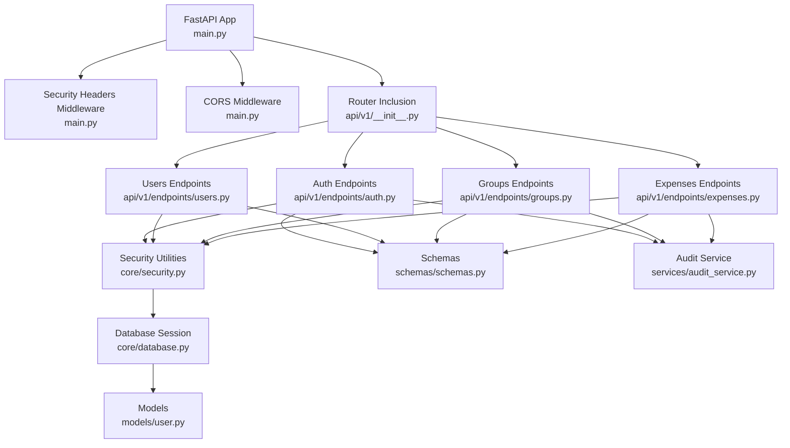
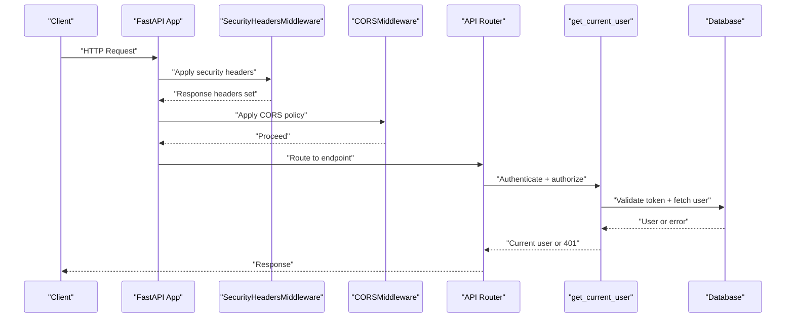
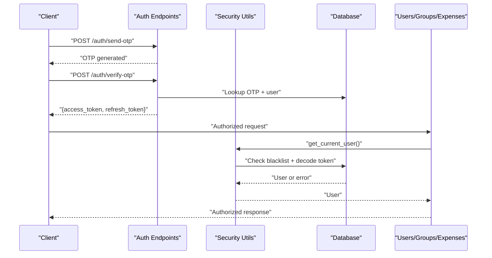
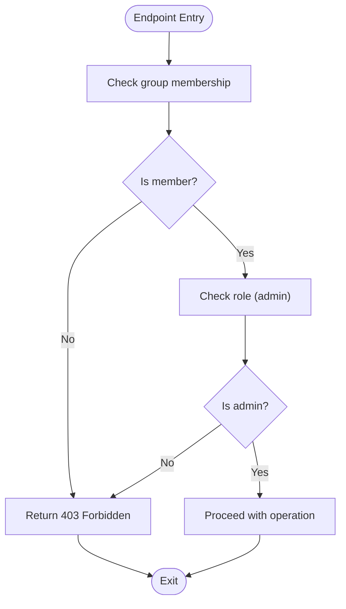
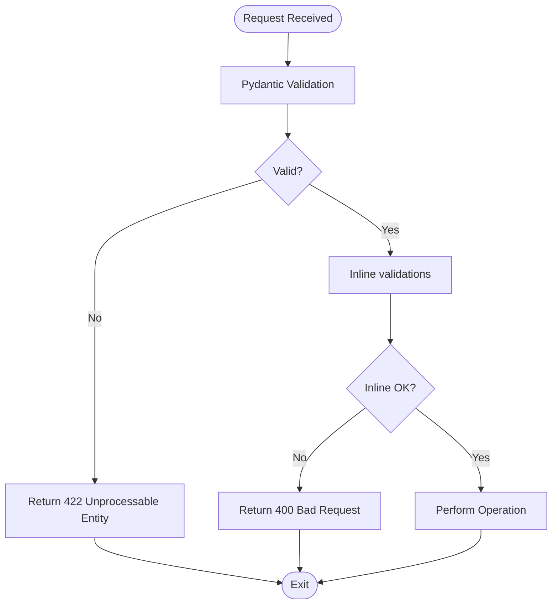
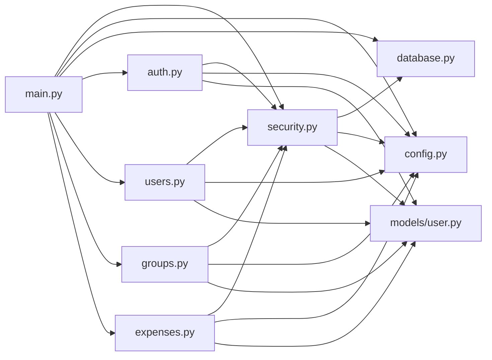
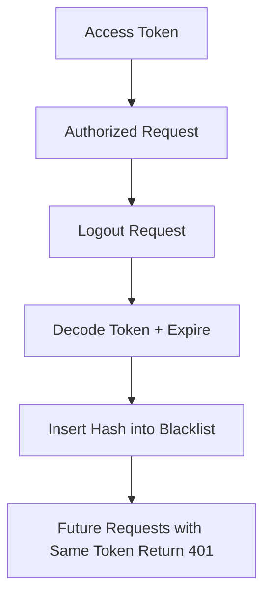

# API Security

<cite>
**Referenced Files in This Document**
- [main.py](file://backend/app/main.py)
- [security.py](file://backend/app/core/security.py)
- [config.py](file://backend/app/core/config.py)
- [database.py](file://backend/app/core/database.py)
- [auth.py](file://backend/app/api/v1/endpoints/auth.py)
- [users.py](file://backend/app/api/v1/endpoints/users.py)
- [groups.py](file://backend/app/api/v1/endpoints/groups.py)
- [expenses.py](file://backend/app/api/v1/endpoints/expenses.py)
- [schemas.py](file://backend/app/schemas/schemas.py)
- [audit_service.py](file://backend/app/services/audit_service.py)
- [user.py](file://backend/app/models/user.py)
- [requirements.txt](file://backend/requirements.txt)
</cite>

## Table of Contents
1. [Introduction](#introduction)
2. [Project Structure](#project-structure)
3. [Core Components](#core-components)
4. [Architecture Overview](#architecture-overview)
5. [Detailed Component Analysis](#detailed-component-analysis)
6. [Dependency Analysis](#dependency-analysis)
7. [Performance Considerations](#performance-considerations)
8. [Troubleshooting Guide](#troubleshooting-guide)
9. [Conclusion](#conclusion)
10. [Appendices](#appendices)

## Introduction
This document provides comprehensive API security documentation for SplitSure’s REST API. It covers CORS configuration, request validation, authorization patterns, HTTP security headers, FastAPI dependency injection for security, bearer token authentication, role-based access control, rate limiting, IP blocking, abuse prevention, endpoint protection strategies, parameter validation, error handling security, secure design patterns, middleware implementation, integration with external services, and security monitoring/logging practices.

## Project Structure
The backend is a FastAPI application with modularized components:
- Core security utilities and JWT helpers
- Configuration management for secrets, OTP, CORS, and app limits
- Database layer with dependency injection
- API v1 routers and endpoints for auth, users, groups, expenses, audit, and reports
- Pydantic schemas for request/response validation
- Services for audit logging and integrations

**Diagram sources**
- [main.py:16-56](file://backend/app/main.py#L16-L56)
- [__init__.py:1-12](file://backend/app/api/v1/__init__.py#L1-L12)
- [auth.py:1-147](file://backend/app/api/v1/endpoints/auth.py#L1-L147)
- [users.py:1-115](file://backend/app/api/v1/endpoints/users.py#L1-L115)
- [groups.py:1-350](file://backend/app/api/v1/endpoints/groups.py#L1-L350)
- [expenses.py:1-395](file://backend/app/api/v1/endpoints/expenses.py#L1-L395)
- [security.py:1-96](file://backend/app/core/security.py#L1-L96)
- [database.py:1-29](file://backend/app/core/database.py#L1-L29)
- [user.py:1-234](file://backend/app/models/user.py#L1-L234)
- [audit_service.py:1-32](file://backend/app/services/audit_service.py#L1-L32)

**Section sources**
- [main.py:1-96](file://backend/app/main.py#L1-L96)
- [__init__.py:1-12](file://backend/app/api/v1/__init__.py#L1-L12)

## Core Components
- Security headers middleware enforces safe defaults and HSTS in production
- CORS middleware configured via settings
- JWT-based bearer authentication with access/refresh tokens and token blacklisting
- Role-based access control (RBAC) for group membership and admin actions
- Pydantic-based request/response validation
- Rate limiting for OTP requests
- Immutable audit logs via database triggers
- Dependency injection for database sessions and current user retrieval

**Section sources**
- [main.py:25-46](file://backend/app/main.py#L25-L46)
- [security.py:1-96](file://backend/app/core/security.py#L1-L96)
- [config.py:1-71](file://backend/app/core/config.py#L1-L71)
- [schemas.py:1-432](file://backend/app/schemas/schemas.py#L1-L432)
- [auth.py:24-34](file://backend/app/api/v1/endpoints/auth.py#L24-L34)
- [audit_service.py:6-32](file://backend/app/services/audit_service.py#L6-L32)

## Architecture Overview
The API enforces security through layered middleware and endpoint guards:
- Global middleware sets HTTP security headers and applies CORS policy
- Endpoint dependencies enforce bearer token authentication and RBAC
- Validation occurs at schema boundaries and inline where needed
- Audit events are appended immutably to prevent tampering

**Diagram sources**
- [main.py:25-46](file://backend/app/main.py#L25-L46)
- [security.py:72-96](file://backend/app/core/security.py#L72-L96)
- [users.py:17-48](file://backend/app/api/v1/endpoints/users.py#L17-L48)
- [groups.py:30-41](file://backend/app/api/v1/endpoints/groups.py#L30-L41)

## Detailed Component Analysis

### CORS Configuration
- Origins, methods, and headers are configured via settings
- Middleware applied globally to control cross-origin requests
- Recommendations:
  - Restrict ALLOWED_ORIGINS to trusted domains only
  - Avoid wildcard origins in production
  - Align exposed headers/methods with client needs

**Section sources**
- [config.py:38-44](file://backend/app/core/config.py#L38-L44)
- [main.py:40-46](file://backend/app/main.py#L40-L46)

### HTTP Security Headers Implementation
- X-Content-Type-Options: nosniff
- X-Frame-Options: DENY
- X-XSS-Protection: 1; mode=block
- Referrer-Policy: strict-origin-when-cross-origin
- HSTS: max-age=31536000; includeSubDomains (only in production)
- Middleware order ensures headers are set before response is finalized

**Section sources**
- [main.py:25-34](file://backend/app/main.py#L25-L34)
- [main.py:32-33](file://backend/app/main.py#L32-L33)

### Bearer Token Authentication and Authorization Patterns
- JWT-based access/refresh tokens with HS256
- Access token validation and blacklisting
- Logout endpoint adds token to blacklist
- Current user dependency validates token and loads user
- RBAC enforced via group membership and roles

**Diagram sources**
- [auth.py:58-115](file://backend/app/api/v1/endpoints/auth.py#L58-L115)
- [security.py:47-96](file://backend/app/core/security.py#L47-L96)
- [users.py:17-19](file://backend/app/api/v1/endpoints/users.py#L17-L19)

**Section sources**
- [security.py:17-30](file://backend/app/core/security.py#L17-L30)
- [security.py:33-41](file://backend/app/core/security.py#L33-L41)
- [security.py:47-69](file://backend/app/core/security.py#L47-L69)
- [security.py:72-96](file://backend/app/core/security.py#L72-L96)
- [auth.py:139-146](file://backend/app/api/v1/endpoints/auth.py#L139-L146)

### Role-Based Access Control (RBAC)
- Membership checks for all protected group endpoints
- Admin-only operations enforced via role checks
- Non-admin users receive 403 for privileged actions

**Diagram sources**
- [groups.py:30-41](file://backend/app/api/v1/endpoints/groups.py#L30-L41)
- [expenses.py:30-32](file://backend/app/api/v1/endpoints/expenses.py#L30-L32)

**Section sources**
- [groups.py:30-41](file://backend/app/api/v1/endpoints/groups.py#L30-L41)
- [expenses.py:327-336](file://backend/app/api/v1/endpoints/expenses.py#L327-L336)

### Request Validation and Parameter Sanitization
- Pydantic models define strict validation for all request bodies
- Inline validations for sensitive operations (e.g., search length)
- File uploads validated by content-type and size limits
- OTP rate limiting prevents brute force attempts

**Diagram sources**
- [schemas.py:10-44](file://backend/app/schemas/schemas.py#L10-L44)
- [schemas.py:223-255](file://backend/app/schemas/schemas.py#L223-L255)
- [users.py:51-83](file://backend/app/api/v1/endpoints/users.py#L51-L83)
- [expenses.py:182-216](file://backend/app/api/v1/endpoints/expenses.py#L182-L216)
- [auth.py:24-34](file://backend/app/api/v1/endpoints/auth.py#L24-L34)

**Section sources**
- [schemas.py:10-44](file://backend/app/schemas/schemas.py#L10-L44)
- [schemas.py:223-255](file://backend/app/schemas/schemas.py#L223-L255)
- [users.py:51-83](file://backend/app/api/v1/endpoints/users.py#L51-L83)
- [expenses.py:182-216](file://backend/app/api/v1/endpoints/expenses.py#L182-L216)
- [auth.py:24-34](file://backend/app/api/v1/endpoints/auth.py#L24-L34)

### Token Blacklisting and Logout
- On logout, the access token is decoded to extract expiration
- Token hash stored in blacklisted_tokens with cleanup of expired entries
- Subsequent requests with blacklisted tokens receive 401 Unauthorized

**Section sources**
- [auth.py:139-146](file://backend/app/api/v1/endpoints/auth.py#L139-L146)
- [security.py:47-69](file://backend/app/core/security.py#L47-L69)
- [user.py:81-87](file://backend/app/models/user.py#L81-L87)

### Audit Logging and Immutable Logs
- Audit events appended with actor, entity, and JSON diffs
- PostgreSQL trigger enforces append-only semantics for audit_logs
- Audit service encapsulates creation and flush behavior

**Section sources**
- [audit_service.py:6-32](file://backend/app/services/audit_service.py#L6-L32)
- [user.py:184-199](file://backend/app/models/user.py#L184-L199)
- [main.py:68-85](file://backend/app/main.py#L68-L85)

### Rate Limiting and Abuse Prevention
- OTP requests limited per phone per hour using database counts
- Application-level limits for uploads and attachments
- Recommendations:
  - Introduce IP-based rate limiting for OTP endpoints
  - Add sliding window counters for stricter enforcement
  - Consider external rate limiting (e.g., Redis) for distributed systems

**Section sources**
- [auth.py:24-34](file://backend/app/api/v1/endpoints/auth.py#L24-L34)
- [config.py:46-51](file://backend/app/core/config.py#L46-L51)
- [expenses.py:360-370](file://backend/app/api/v1/endpoints/expenses.py#L360-L370)

### Dependency Injection for Security
- Database session factory with async lifecycle
- get_current_user dependency resolves authenticated user
- Centralized settings management for secrets and policies

**Section sources**
- [database.py:23-29](file://backend/app/core/database.py#L23-L29)
- [security.py:72-96](file://backend/app/core/security.py#L72-L96)
- [config.py:6-71](file://backend/app/core/config.py#L6-L71)

### Secure API Design Patterns
- Enforce HTTPS/HSTS in production via security headers
- Use bearer tokens with short-lived access tokens and refresh tokens
- Apply RBAC at endpoint boundaries
- Validate and sanitize all inputs using Pydantic
- Log immutable audit trails for sensitive operations
- Avoid exposing internal secrets in responses

**Section sources**
- [main.py:25-34](file://backend/app/main.py#L25-L34)
- [security.py:17-30](file://backend/app/core/security.py#L17-L30)
- [schemas.py:10-44](file://backend/app/schemas/schemas.py#L10-L44)
- [audit_service.py:6-32](file://backend/app/services/audit_service.py#L6-L32)

### Middleware Implementation for Security Checks
- SecurityHeadersMiddleware sets safe defaults and HSTS in production
- CORSMiddleware configured centrally via settings
- Middleware ordering ensures headers are applied before CORS

**Section sources**
- [main.py:25-46](file://backend/app/main.py#L25-L46)

### Integration with External Security Services
- OTP delivery via external provider (configured via settings)
- File storage abstraction supports local or S3
- Recommendations:
  - Integrate with WAF/CDN for DDoS protection
  - Use managed secrets stores for rotating keys
  - Add centralized logging and SIEM ingestion

**Section sources**
- [auth.py:39-56](file://backend/app/api/v1/endpoints/auth.py#L39-L56)
- [users.py:70-78](file://backend/app/api/v1/endpoints/users.py#L70-L78)
- [config.py:16-28](file://backend/app/core/config.py#L16-L28)

## Dependency Analysis

**Diagram sources**
- [security.py:1-96](file://backend/app/core/security.py#L1-L96)
- [database.py:1-29](file://backend/app/core/database.py#L1-L29)
- [config.py:1-71](file://backend/app/core/config.py#L1-L71)
- [user.py:1-234](file://backend/app/models/user.py#L1-L234)
- [auth.py:1-147](file://backend/app/api/v1/endpoints/auth.py#L1-L147)
- [users.py:1-115](file://backend/app/api/v1/endpoints/users.py#L1-L115)
- [groups.py:1-350](file://backend/app/api/v1/endpoints/groups.py#L1-L350)
- [expenses.py:1-395](file://backend/app/api/v1/endpoints/expenses.py#L1-L395)
- [main.py:1-96](file://backend/app/main.py#L1-L96)

**Section sources**
- [requirements.txt:1-19](file://backend/requirements.txt#L1-L19)

## Performance Considerations
- Asynchronous database sessions reduce latency
- Efficient SQL queries with selectinload for related entities
- Audit logs are appended without heavy transformations
- Recommendations:
  - Index frequently queried columns (e.g., user phone, OTP hash)
  - Use connection pooling tuned to workload
  - Cache infrequent reads (e.g., app limits) with TTL

[No sources needed since this section provides general guidance]

## Troubleshooting Guide
- 401 Unauthorized during logout:
  - Verify token decoding and blacklist insertion succeeded
  - Confirm cleanup of expired blacklisted tokens ran
- 403 Forbidden on group operations:
  - Ensure caller is a group member and admin for privileged actions
- 429 Too Many Requests for OTP:
  - Check hourly OTP count and reset timing
- Search errors:
  - Ensure search query length does not exceed limits
- File upload failures:
  - Confirm content type and size constraints are met

**Section sources**
- [security.py:47-69](file://backend/app/core/security.py#L47-L69)
- [groups.py:30-41](file://backend/app/api/v1/endpoints/groups.py#L30-L41)
- [auth.py:24-34](file://backend/app/api/v1/endpoints/auth.py#L24-L34)
- [expenses.py:209-212](file://backend/app/api/v1/endpoints/expenses.py#L209-L212)
- [users.py:58-64](file://backend/app/api/v1/endpoints/users.py#L58-L64)

## Conclusion
SplitSure’s API employs robust security controls: bearer token authentication with JWT, token blacklisting, RBAC, strict input validation, immutable audit logs, and production-hardened HTTP security headers. To further strengthen defenses, integrate IP-based rate limiting, WAF/CDN protections, centralized logging/SIEM, and rotate secrets regularly.

[No sources needed since this section summarizes without analyzing specific files]

## Appendices

### Security Headers Summary
- X-Content-Type-Options: nosniff
- X-Frame-Options: DENY
- X-XSS-Protection: 1; mode=block
- Referrer-Policy: strict-origin-when-cross-origin
- HSTS: max-age=31536000; includeSubDomains (production only)

**Section sources**
- [main.py:25-34](file://backend/app/main.py#L25-L34)

### CORS Policy Summary
- Origins: configured via settings
- Methods: GET, POST, PATCH, DELETE, OPTIONS
- Headers: Content-Type, Authorization, Accept

**Section sources**
- [config.py:38-44](file://backend/app/core/config.py#L38-L44)
- [main.py:40-46](file://backend/app/main.py#L40-L46)

### Token Lifecycle and Logout Flow

**Diagram sources**
- [auth.py:139-146](file://backend/app/api/v1/endpoints/auth.py#L139-L146)
- [security.py:47-69](file://backend/app/core/security.py#L47-L69)