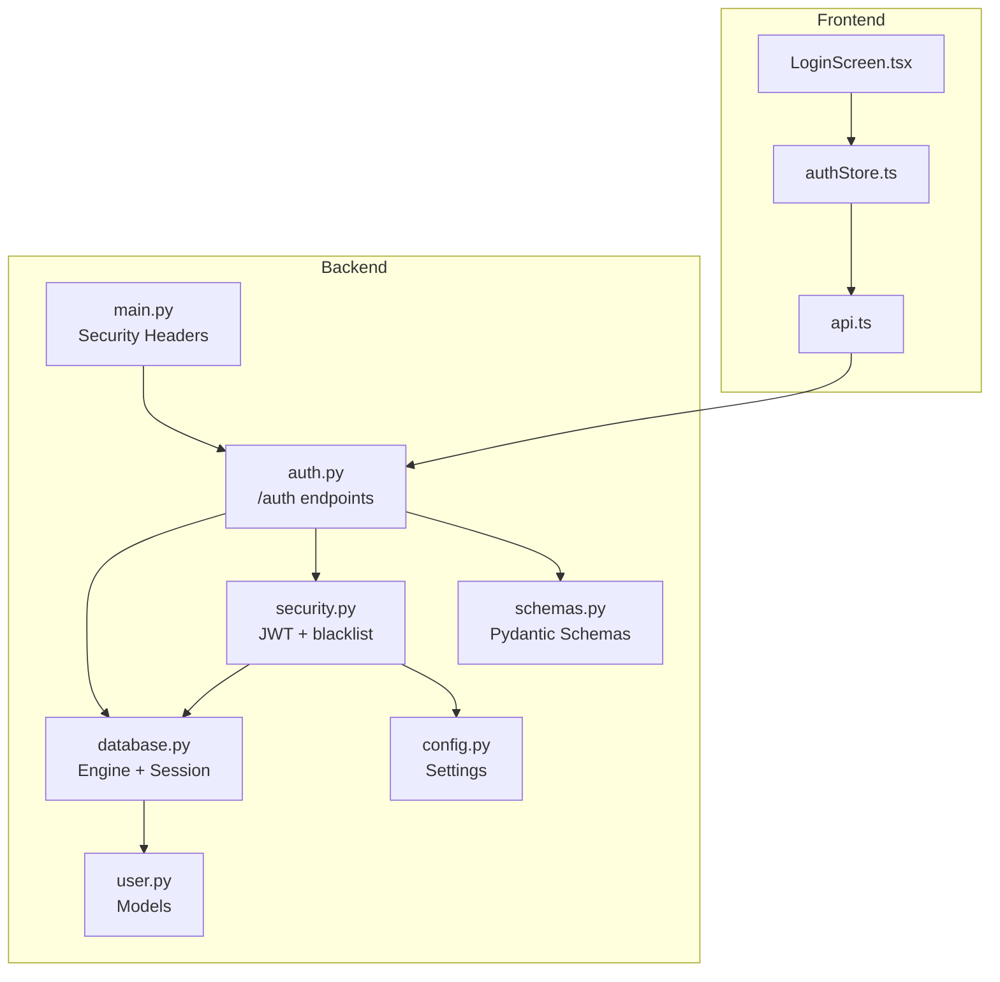
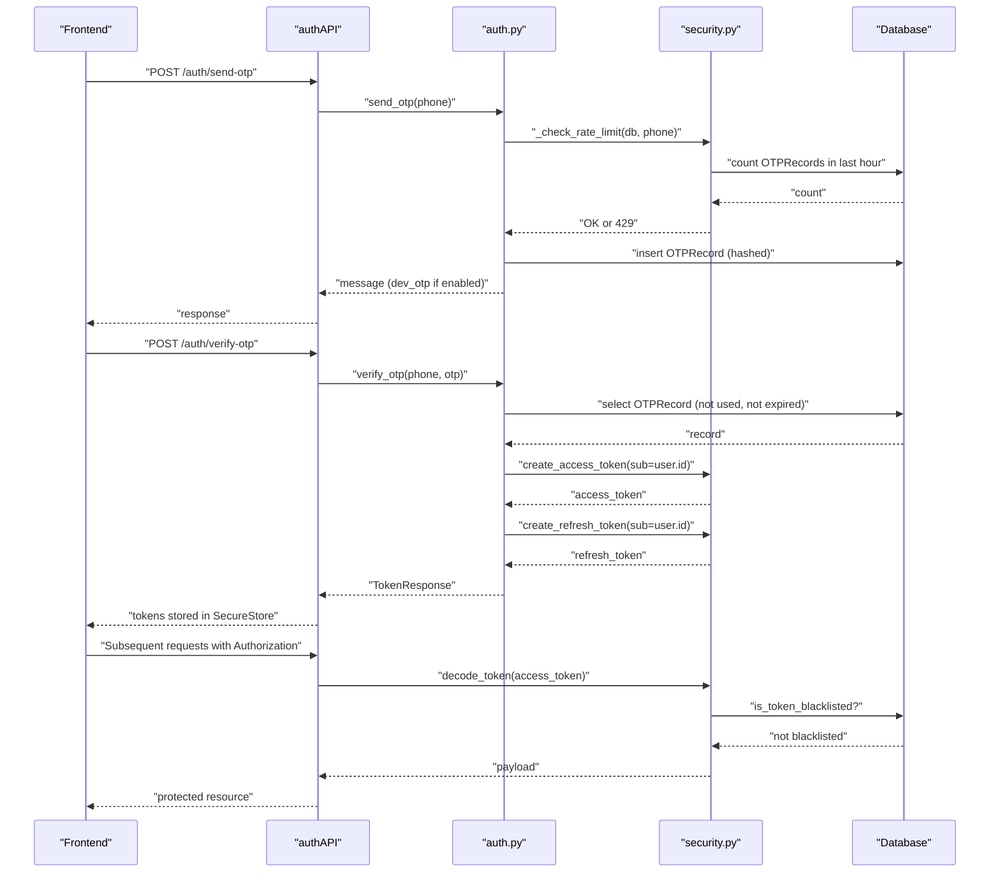
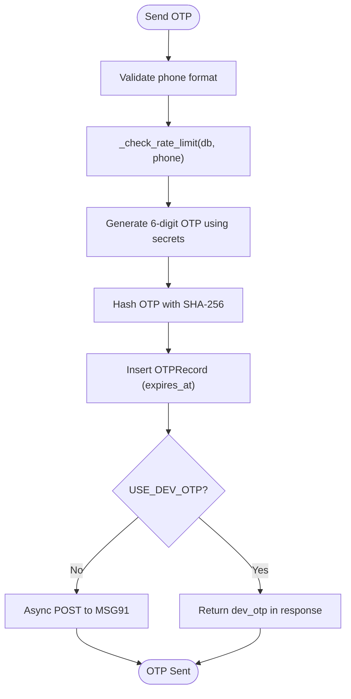
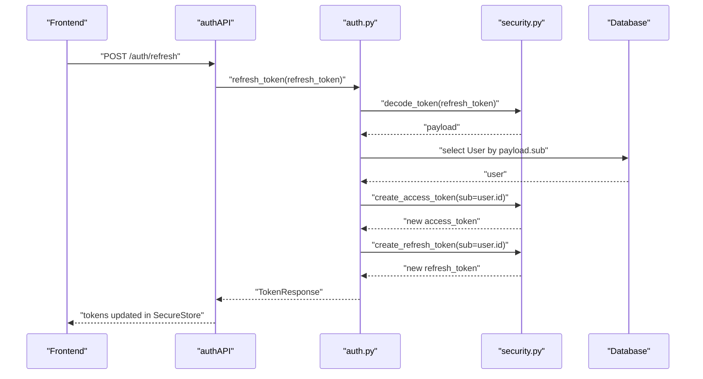
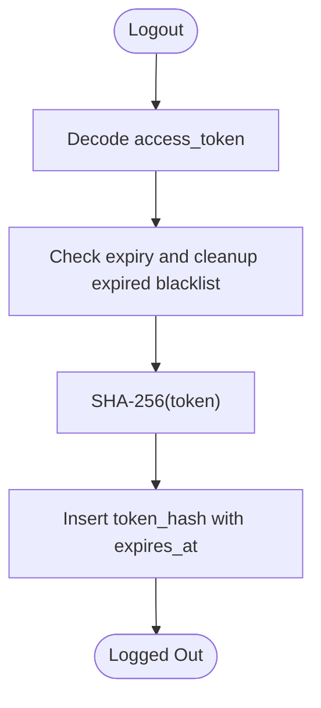
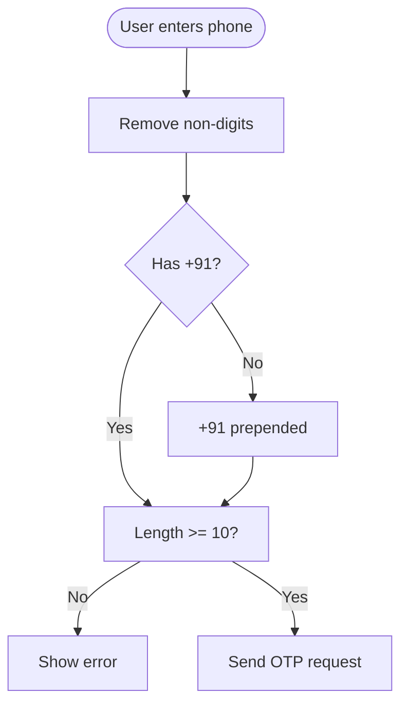
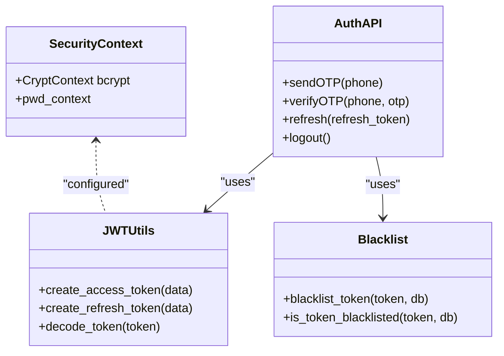
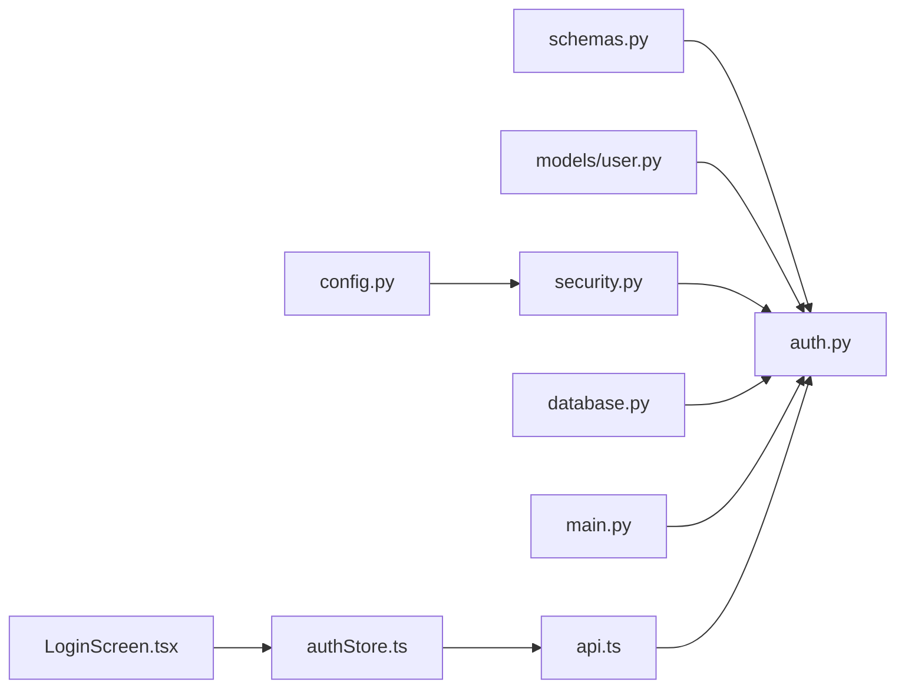

# Authentication Security

<cite>
**Referenced Files in This Document**
- [auth.py](file://backend/app/api/v1/endpoints/auth.py)
- [security.py](file://backend/app/core/security.py)
- [user.py](file://backend/app/models/user.py)
- [schemas.py](file://backend/app/schemas/schemas.py)
- [config.py](file://backend/app/core/config.py)
- [database.py](file://backend/app/core/database.py)
- [main.py](file://backend/app/main.py)
- [001_initial.py](file://backend/alembic/versions/001_initial.py)
- [002_add_push_token.py](file://backend/alembic/versions/002_add_push_token.py)
- [api.ts](file://frontend/src/services/api.ts)
- [authStore.ts](file://frontend/src/store/authStore.ts)
- [LoginScreen.tsx](file://frontend/src/screens/LoginScreen.tsx)
</cite>

## Table of Contents
1. [Introduction](#introduction)
2. [Project Structure](#project-structure)
3. [Core Components](#core-components)
4. [Architecture Overview](#architecture-overview)
5. [Detailed Component Analysis](#detailed-component-analysis)
6. [Dependency Analysis](#dependency-analysis)
7. [Performance Considerations](#performance-considerations)
8. [Troubleshooting Guide](#troubleshooting-guide)
9. [Conclusion](#conclusion)

## Introduction
This document details the authentication security implementation in SplitSure, focusing on OTP-based authentication, JWT token lifecycle management, token blacklisting for logout, and session management patterns. It explains secure OTP generation using Python's secrets module, OTP validation mechanisms, rate limiting to prevent brute force attacks, JWT access/refresh token creation and validation, token blacklist system, and phone number validation. Implementation examples are provided from the actual codebase, along with security best practices and considerations for OTP delivery channels and multi-factor authentication enhancements.

## Project Structure
The authentication system spans backend endpoints, core security utilities, database models, configuration, and frontend integration:
- Backend endpoints define the OTP and token flows (/auth/*).
- Core security utilities implement JWT encoding/decoding, token blacklisting, and current user resolution.
- Database models define OTP records, users, and blacklisted tokens.
- Configuration centralizes security parameters (JWT expiry, OTP expiry, rate limits).
- Frontend integrates OTP submission, token storage, and automatic refresh.

**Diagram sources**
- [auth.py:1-147](file://backend/app/api/v1/endpoints/auth.py#L1-L147)
- [security.py:1-96](file://backend/app/core/security.py#L1-L96)
- [user.py:1-234](file://backend/app/models/user.py#L1-L234)
- [schemas.py:1-431](file://backend/app/schemas/schemas.py#L1-L431)
- [config.py:1-71](file://backend/app/core/config.py#L1-L71)
- [database.py:1-29](file://backend/app/core/database.py#L1-L29)
- [main.py:1-96](file://backend/app/main.py#L1-L96)
- [api.ts:1-271](file://frontend/src/services/api.ts#L1-L271)
- [authStore.ts:1-116](file://frontend/src/store/authStore.ts#L1-L116)
- [LoginScreen.tsx:1-402](file://frontend/src/screens/LoginScreen.tsx#L1-L402)

**Section sources**
- [auth.py:1-147](file://backend/app/api/v1/endpoints/auth.py#L1-L147)
- [security.py:1-96](file://backend/app/core/security.py#L1-L96)
- [user.py:1-234](file://backend/app/models/user.py#L1-L234)
- [schemas.py:1-431](file://backend/app/schemas/schemas.py#L1-L431)
- [config.py:1-71](file://backend/app/core/config.py#L1-L71)
- [database.py:1-29](file://backend/app/core/database.py#L1-L29)
- [main.py:1-96](file://backend/app/main.py#L1-L96)
- [api.ts:1-271](file://frontend/src/services/api.ts#L1-L271)
- [authStore.ts:1-116](file://frontend/src/store/authStore.ts#L1-L116)
- [LoginScreen.tsx:1-402](file://frontend/src/screens/LoginScreen.tsx#L1-L402)

## Core Components
- OTP-based authentication:
  - Secure OTP generation using Python's secrets module.
  - OTP hashing with SHA-256 for storage and comparison.
  - Rate limiting per phone number per hour.
  - SMS delivery via MSG91 with async HTTP client.
  - Frontend OTP input and dev-mode OTP exposure.
- JWT token lifecycle:
  - Access token creation with short expiry.
  - Refresh token creation with longer expiry.
  - Token decoding with type validation and expiration handling.
  - Automatic refresh on 401 Unauthorized with queued retry.
- Token blacklist system:
  - Blacklist insertion with digest of token and expiry cleanup.
  - Current user resolver checks blacklist before allowing access.
  - Logout endpoint adds current token to blacklist.
- Phone number validation:
  - Pydantic validators enforce E.164-like formatting and length.
  - Frontend enforces 10-digit numeric input.
- Session management:
  - Secure storage of tokens in device secure store.
  - Request interceptor attaches Authorization header.
  - Response interceptor handles token refresh and failure.

**Section sources**
- [auth.py:58-147](file://backend/app/api/v1/endpoints/auth.py#L58-L147)
- [security.py:17-96](file://backend/app/core/security.py#L17-L96)
- [schemas.py:10-56](file://backend/app/schemas/schemas.py#L10-L56)
- [config.py:30-36](file://backend/app/core/config.py#L30-L36)
- [api.ts:76-140](file://frontend/src/services/api.ts#L76-L140)
- [authStore.ts:29-116](file://frontend/src/store/authStore.ts#L29-L116)
- [LoginScreen.tsx:43-81](file://frontend/src/screens/LoginScreen.tsx#L43-L81)

## Architecture Overview
The authentication flow integrates frontend and backend securely:
- Frontend collects phone number, sends OTP, receives tokens, stores them, and attaches Authorization headers.
- Backend validates OTP against hashed records, creates JWT pair, and supports refresh and logout.
- Security headers and middleware protect transport and content policies.

**Diagram sources**
- [auth.py:58-115](file://backend/app/api/v1/endpoints/auth.py#L58-L115)
- [security.py:17-96](file://backend/app/core/security.py#L17-L96)
- [api.ts:142-169](file://frontend/src/services/api.ts#L142-L169)
- [authStore.ts:29-47](file://frontend/src/store/authStore.ts#L29-L47)

## Detailed Component Analysis

### OTP-Based Authentication
- Secure OTP generation:
  - Uses secrets.randbelow to generate cryptographically strong 6-digit OTP.
  - Hashed with SHA-256 before storage to prevent plaintext exposure.
- OTP validation:
  - Validates phone and OTP via Pydantic schemas.
  - Checks OTPRecord existence, not-used flag, and non-expired status.
  - Marks OTP as used upon successful verification.
- Rate limiting:
  - Enforces maximum OTP requests per hour per phone number.
  - Raises HTTP 429 when exceeded.
- Delivery channel:
  - Async HTTP POST to MSG91 OTP API.
  - Dev mode returns OTP in response without sending SMS.
- Frontend integration:
  - Collects phone, cleans digits, and triggers send OTP.
  - OTP input boxes auto-focus and submit on completion.
  - Stores tokens in SecureStore and navigates to main tabs.

**Diagram sources**
- [auth.py:58-80](file://backend/app/api/v1/endpoints/auth.py#L58-L80)
- [auth.py:24-34](file://backend/app/api/v1/endpoints/auth.py#L24-L34)
- [schemas.py:10-44](file://backend/app/schemas/schemas.py#L10-L44)

**Section sources**
- [auth.py:58-80](file://backend/app/api/v1/endpoints/auth.py#L58-L80)
- [auth.py:24-34](file://backend/app/api/v1/endpoints/auth.py#L24-L34)
- [schemas.py:10-44](file://backend/app/schemas/schemas.py#L10-L44)
- [LoginScreen.tsx:43-81](file://frontend/src/screens/LoginScreen.tsx#L43-L81)

### JWT Token Lifecycle Management
- Access token creation:
  - Encodes subject (user.id) with access expiry and type marker.
  - Uses HS256 algorithm and SECRET_KEY from settings.
- Refresh token creation:
  - Encodes subject with refresh expiry and type marker.
  - Longer-lived token for rotation.
- Token decoding and validation:
  - Decodes JWT and handles expired signature and invalid token errors.
  - Validates token type and payload presence.
- Refresh endpoint:
  - Validates refresh token type and user existence.
  - Issues new access/refresh pair on successful validation.

**Diagram sources**
- [auth.py:118-136](file://backend/app/api/v1/endpoints/auth.py#L118-L136)
- [security.py:17-30](file://backend/app/core/security.py#L17-L30)

**Section sources**
- [security.py:17-30](file://backend/app/core/security.py#L17-L30)
- [auth.py:118-136](file://backend/app/api/v1/endpoints/auth.py#L118-L136)

### Token Blacklist System for Logout and Session Invalidation
- Blacklist insertion:
  - Decode token to extract expiry timestamp.
  - Cleanup expired entries before insert.
  - Insert token hash with expiry if not present.
- Blacklist check:
  - Cleanup expired entries before lookup.
  - Return whether token hash exists in blacklist.
- Current user resolver:
  - Rejects requests with blacklisted tokens.
- Logout endpoint:
  - Adds current access token to blacklist.

**Diagram sources**
- [auth.py:139-147](file://backend/app/api/v1/endpoints/auth.py#L139-L147)
- [security.py:47-69](file://backend/app/core/security.py#L47-L69)

**Section sources**
- [auth.py:139-147](file://backend/app/api/v1/endpoints/auth.py#L139-L147)
- [security.py:47-69](file://backend/app/core/security.py#L47-L69)

### Phone Number Validation and Frontend UX
- Backend validation:
  - Pydantic validators normalize phone numbers to E.164-like format and enforce length.
  - OTPRequest and OTPVerify schemas validate phone and OTP fields.
- Frontend validation:
  - Cleans phone input to digits only.
  - Requires 10 digits before sending OTP.
  - OTP input boxes accept single digits and auto-focus next box.

**Diagram sources**
- [schemas.py:10-44](file://backend/app/schemas/schemas.py#L10-L44)
- [LoginScreen.tsx:43-47](file://frontend/src/screens/LoginScreen.tsx#L43-L47)

**Section sources**
- [schemas.py:10-44](file://backend/app/schemas/schemas.py#L10-L44)
- [LoginScreen.tsx:43-47](file://frontend/src/screens/LoginScreen.tsx#L43-L47)

### Password Hashing, Credential Verification, and Session Management Patterns
- Password hashing:
  - bcrypt hashing context configured via passlib.
  - Not currently used in OTP flow; available for future password-based authentication.
- Credential verification:
  - OTP-based flow verifies hashed OTP against stored hash.
  - No password verification in current implementation.
- Session management:
  - Tokens stored in SecureStore.
  - Request interceptor attaches Authorization header.
  - Response interceptor refreshes tokens on 401 and queues concurrent requests.

**Diagram sources**
- [security.py:14-15](file://backend/app/core/security.py#L14-L15)
- [api.ts:142-169](file://frontend/src/services/api.ts#L142-L169)
- [security.py:17-69](file://backend/app/core/security.py#L17-L69)

**Section sources**
- [security.py:14-15](file://backend/app/core/security.py#L14-L15)
- [api.ts:76-140](file://frontend/src/services/api.ts#L76-L140)

## Dependency Analysis
- Backend dependencies:
  - auth.py depends on security.py for JWT utilities and blacklist operations.
  - auth.py depends on schemas.py for request/response validation.
  - auth.py depends on database models for OTPRecord and User persistence.
  - security.py depends on config.py for JWT settings and cryptography.
  - main.py applies security headers middleware globally.
- Frontend dependencies:
  - api.ts manages interceptors and token refresh logic.
  - authStore.ts persists tokens and orchestrates logout.
  - LoginScreen.tsx drives OTP flow and displays errors.

**Diagram sources**
- [config.py:1-71](file://backend/app/core/config.py#L1-L71)
- [security.py:1-96](file://backend/app/core/security.py#L1-L96)
- [schemas.py:1-431](file://backend/app/schemas/schemas.py#L1-L431)
- [user.py:1-234](file://backend/app/models/user.py#L1-L234)
- [database.py:1-29](file://backend/app/core/database.py#L1-L29)
- [main.py:1-96](file://backend/app/main.py#L1-L96)
- [api.ts:1-271](file://frontend/src/services/api.ts#L1-L271)
- [authStore.ts:1-116](file://frontend/src/store/authStore.ts#L1-L116)
- [LoginScreen.tsx:1-402](file://frontend/src/screens/LoginScreen.tsx#L1-L402)

**Section sources**
- [config.py:1-71](file://backend/app/core/config.py#L1-L71)
- [security.py:1-96](file://backend/app/core/security.py#L1-L96)
- [schemas.py:1-431](file://backend/app/schemas/schemas.py#L1-L431)
- [user.py:1-234](file://backend/app/models/user.py#L1-L234)
- [database.py:1-29](file://backend/app/core/database.py#L1-L29)
- [main.py:1-96](file://backend/app/main.py#L1-L96)
- [api.ts:1-271](file://frontend/src/services/api.ts#L1-L271)
- [authStore.ts:1-116](file://frontend/src/store/authStore.ts#L1-L116)
- [LoginScreen.tsx:1-402](file://frontend/src/screens/LoginScreen.tsx#L1-L402)

## Performance Considerations
- OTP generation:
  - secrets module ensures cryptographic randomness without blocking I/O.
- Database operations:
  - Indexes on phone and token hash improve lookup performance.
  - Cleanup of expired blacklist entries prevents growth.
- Network:
  - Async HTTP client avoids blocking during SMS delivery.
- Frontend:
  - Queued retry on token refresh prevents redundant requests.
  - SecureStore minimizes risk of token leakage compared to insecure storage.

[No sources needed since this section provides general guidance]

## Troubleshooting Guide
- OTP not received:
  - Verify USE_DEV_OTP setting and MSG91 credentials.
  - Check rate limit threshold and error messages.
- Invalid/expired OTP:
  - Ensure OTP is 6 digits and not expired.
  - Confirm OTPRecord is not marked as used.
- 401 Unauthorized:
  - Triggered by invalid token type, missing payload, or blacklisted token.
  - Auto-refresh should occur; otherwise clear tokens and re-authenticate.
- Logout not effective:
  - Confirm blacklist insertion and that subsequent requests check blacklist.
- Phone validation errors:
  - Ensure phone number meets backend schema requirements and frontend digit cleaning.

**Section sources**
- [auth.py:39-56](file://backend/app/api/v1/endpoints/auth.py#L39-L56)
- [auth.py:82-96](file://backend/app/api/v1/endpoints/auth.py#L82-L96)
- [security.py:33-41](file://backend/app/core/security.py#L33-L41)
- [security.py:72-96](file://backend/app/core/security.py#L72-L96)
- [schemas.py:10-44](file://backend/app/schemas/schemas.py#L10-L44)
- [api.ts:97-140](file://frontend/src/services/api.ts#L97-L140)

## Conclusion
SplitSure’s authentication system combines robust OTP-based login with secure JWT token lifecycle management and a token blacklist for immediate session invalidation. The implementation leverages cryptographic randomness for OTP generation, strict validation and rate limiting to mitigate brute force attacks, and resilient frontend token handling with automatic refresh. Phone number validation and secure storage practices further strengthen security. These components work together to provide a secure, user-friendly authentication flow suitable for production deployment with appropriate environment configuration.