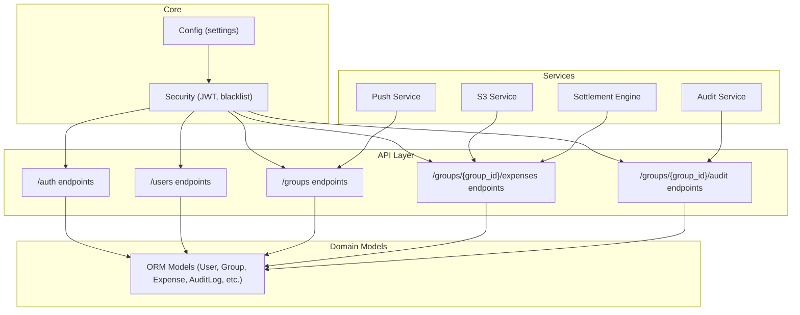
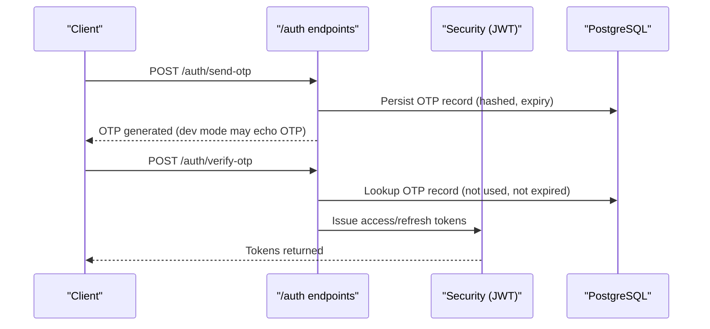
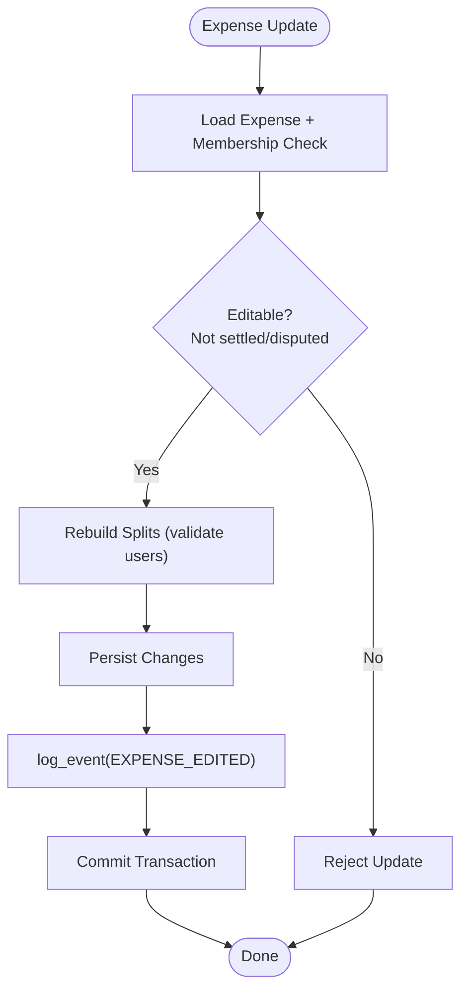
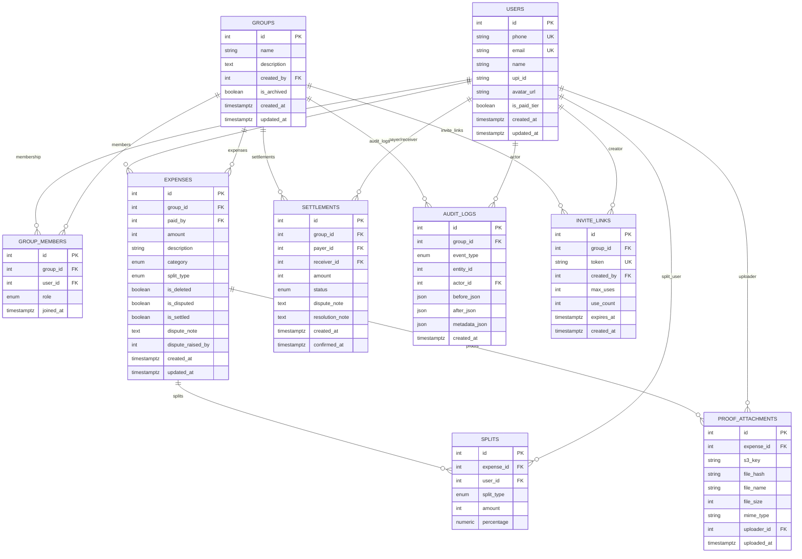
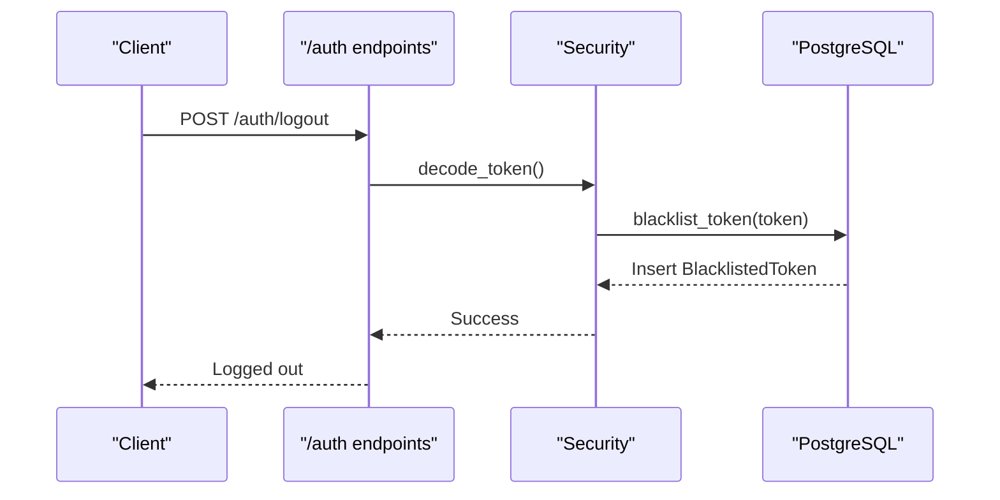
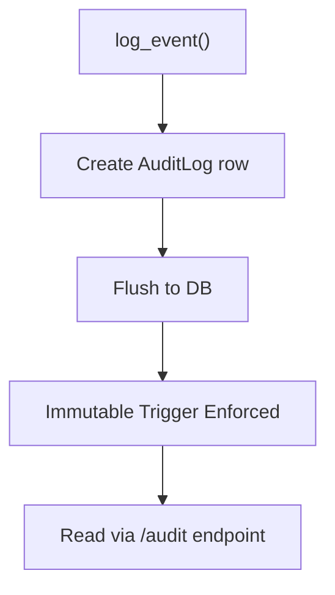
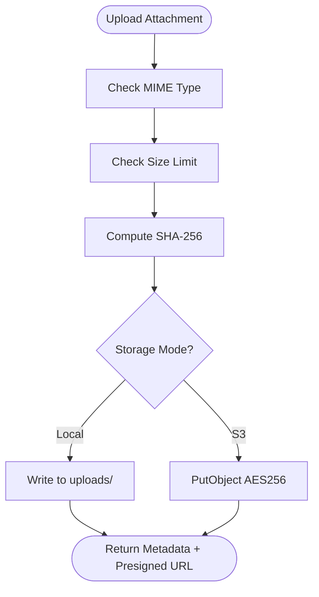
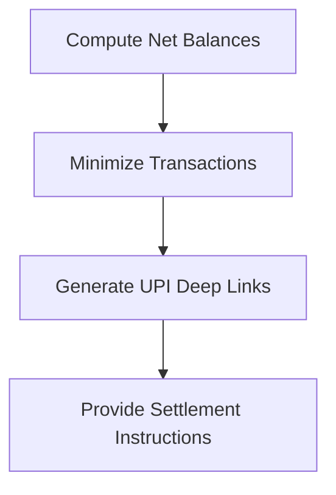
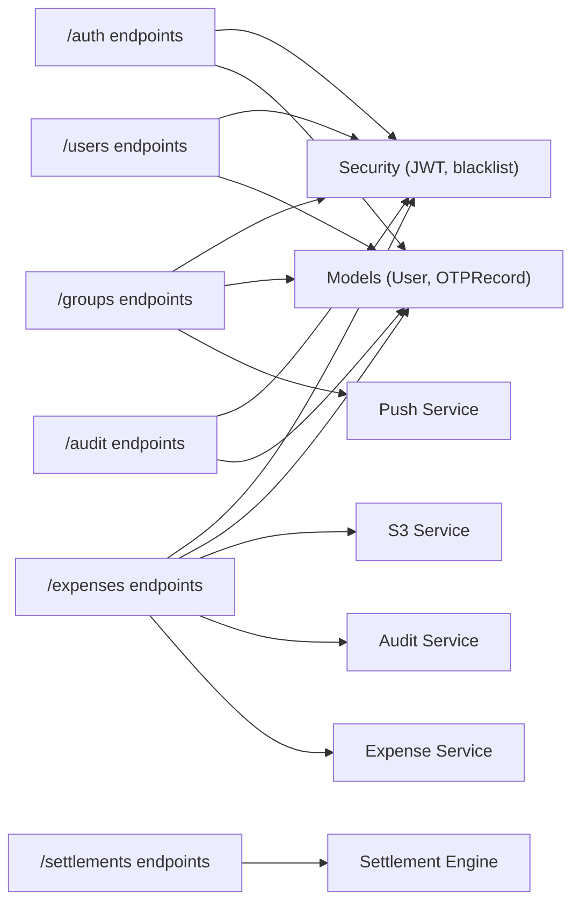

# Compliance and Privacy

<cite>
**Referenced Files in This Document**
- [README.md](file://README.md)
- [backend/app/core/security.py](file://backend/app/core/security.py)
- [backend/app/core/config.py](file://backend/app/core/config.py)
- [backend/app/models/user.py](file://backend/app/models/user.py)
- [backend/app/services/audit_service.py](file://backend/app/services/audit_service.py)
- [backend/app/api/v1/endpoints/audit.py](file://backend/app/api/v1/endpoints/audit.py)
- [backend/app/api/v1/endpoints/auth.py](file://backend/app/api/v1/endpoints/auth.py)
- [backend/app/api/v1/endpoints/users.py](file://backend/app/api/v1/endpoints/users.py)
- [backend/app/api/v1/endpoints/expenses.py](file://backend/app/api/v1/endpoints/expenses.py)
- [backend/app/api/v1/endpoints/groups.py](file://backend/app/api/v1/endpoints/groups.py)
- [backend/app/services/s3_service.py](file://backend/app/services/s3_service.py)
- [backend/app/services/push_service.py](file://backend/app/services/push_service.py)
- [backend/app/services/settlement_engine.py](file://backend/app/services/settlement_engine.py)
- [backend/app/schemas/schemas.py](file://backend/app/schemas/schemas.py)
- [backend/alembic/versions/001_initial.py](file://backend/alembic/versions/001_initial.py)
- [backend/alembic/versions/002_add_push_token.py](file://backend/alembic/versions/002_add_push_token.py)
- [backend/requirements.txt](file://backend/requirements.txt)
</cite>

## Table of Contents
1. [Introduction](#introduction)
2. [Project Structure](#project-structure)
3. [Core Components](#core-components)
4. [Architecture Overview](#architecture-overview)
5. [Detailed Component Analysis](#detailed-component-analysis)
6. [Dependency Analysis](#dependency-analysis)
7. [Performance Considerations](#performance-considerations)
8. [Troubleshooting Guide](#troubleshooting-guide)
9. [Conclusion](#conclusion)
10. [Appendices](#appendices)

## Introduction
This document provides comprehensive compliance and privacy documentation for SplitSure’s security implementation. It aligns the system’s current design with financial data security standards, PCI DSS requirements for payment-related functionality, and data protection regulations such as GDPR and applicable local privacy laws. It also documents audit logging requirements, immutable record-keeping, compliance reporting capabilities, data retention policies, user consent management, right-to-deletion procedures, security impact assessments, vulnerability management programs, penetration testing protocols, secure development practices, code review security checkpoints, security training requirements, and international data transfer controls.

SplitSure’s backend is built with FastAPI, SQLAlchemy, and PostgreSQL. It implements OTP-based authentication, JWT access/refresh tokens, blacklisted token revocation, immutable audit logs, and optional S3-backed storage. Payment-related features leverage UPI deep links and integer-based currency representation to reduce risk.

## Project Structure
The repository follows a layered backend architecture with clear separation of concerns:
- Core: configuration, database, and security utilities
- Services: domain services for audit, S3, push notifications, and settlement engine
- API: versioned endpoints for authentication, users, groups, expenses, audit, and settlements
- Models: SQLAlchemy ORM entities and enums
- Schemas: Pydantic models for request/response validation
- Migrations: Alembic revisions enforcing immutable audit logs and schema evolution

**Diagram sources**
- [backend/app/core/config.py:6-71](file://backend/app/core/config.py#L6-L71)
- [backend/app/core/security.py:14-96](file://backend/app/core/security.py#L14-L96)
- [backend/app/services/audit_service.py:6-32](file://backend/app/services/audit_service.py#L6-L32)
- [backend/app/services/s3_service.py:105-158](file://backend/app/services/s3_service.py#L105-L158)
- [backend/app/services/push_service.py:16-73](file://backend/app/services/push_service.py#L16-L73)
- [backend/app/services/settlement_engine.py:23-106](file://backend/app/services/settlement_engine.py#L23-L106)
- [backend/app/api/v1/endpoints/auth.py:58-147](file://backend/app/api/v1/endpoints/auth.py#L58-L147)
- [backend/app/api/v1/endpoints/users.py:17-115](file://backend/app/api/v1/endpoints/users.py#L17-L115)
- [backend/app/api/v1/endpoints/groups.py:59-350](file://backend/app/api/v1/endpoints/groups.py#L59-L350)
- [backend/app/api/v1/endpoints/expenses.py:143-395](file://backend/app/api/v1/endpoints/expenses.py#L143-L395)
- [backend/app/api/v1/endpoints/audit.py:13-40](file://backend/app/api/v1/endpoints/audit.py#L13-L40)
- [backend/app/models/user.py:51-234](file://backend/app/models/user.py#L51-L234)

**Section sources**
- [README.md:1-162](file://README.md#L1-L162)
- [backend/app/core/config.py:6-71](file://backend/app/core/config.py#L6-L71)
- [backend/app/core/security.py:14-96](file://backend/app/core/security.py#L14-L96)
- [backend/app/models/user.py:51-234](file://backend/app/models/user.py#L51-L234)

## Core Components
This section outlines the core security and compliance-relevant components and their roles.

- Authentication and Authorization
  - OTP-based login with rate limiting and time-bound OTP records
  - Access/refresh token lifecycle with JWT signing and decoding
  - Token blacklist for logout invalidation and revocation
  - Route-level access enforcement via bearer tokens

- Audit Logging and Immutability
  - Centralized audit logging service with immutable append-only semantics enforced by a PostgreSQL trigger
  - Event types covering expense, settlement, group, and member lifecycle actions
  - Read-only audit endpoint with pagination and membership checks

- Data Protection and Storage
  - File type validation and SHA-256 hashing for proof attachments
  - Local filesystem fallback and optional S3-backed storage with server-side encryption
  - Presigned URLs for controlled access to stored files

- Payment-Related Controls
  - Integer-based currency representation (paise) to avoid floating-point errors
  - UPI deep link generation for standardized payment initiation
  - Settlement engine with greedy optimization to minimize transaction volume

- User Data Management
  - Strong validation for phone, email, and UPI ID fields
  - Avatar upload with allowed MIME types and size limits
  - Push notification registration for non-blocking alerts

**Section sources**
- [backend/app/api/v1/endpoints/auth.py:58-147](file://backend/app/api/v1/endpoints/auth.py#L58-L147)
- [backend/app/core/security.py:17-96](file://backend/app/core/security.py#L17-L96)
- [backend/app/services/audit_service.py:6-32](file://backend/app/services/audit_service.py#L6-L32)
- [backend/alembic/versions/001_initial.py:156-170](file://backend/alembic/versions/001_initial.py#L156-L170)
- [backend/app/api/v1/endpoints/audit.py:13-40](file://backend/app/api/v1/endpoints/audit.py#L13-L40)
- [backend/app/services/s3_service.py:105-158](file://backend/app/services/s3_service.py#L105-L158)
- [backend/app/api/v1/endpoints/expenses.py:352-395](file://backend/app/api/v1/endpoints/expenses.py#L352-L395)
- [backend/app/services/settlement_engine.py:23-106](file://backend/app/services/settlement_engine.py#L23-L106)
- [backend/app/api/v1/endpoints/users.py:51-83](file://backend/app/api/v1/endpoints/users.py#L51-L83)
- [backend/app/schemas/schemas.py:10-127](file://backend/app/schemas/schemas.py#L10-L127)

## Architecture Overview
The system enforces strict separation between authentication, authorization, domain logic, and persistence. Audit events are appended centrally and protected by database-level immutability. Payment flows rely on UPI deep links and integer arithmetic to mitigate financial risks.

**Diagram sources**
- [backend/app/api/v1/endpoints/auth.py:58-116](file://backend/app/api/v1/endpoints/auth.py#L58-L116)
- [backend/app/core/security.py:17-31](file://backend/app/core/security.py#L17-L31)
- [backend/app/models/user.py:70-87](file://backend/app/models/user.py#L70-L87)

**Diagram sources**
- [backend/app/api/v1/endpoints/expenses.py:230-264](file://backend/app/api/v1/endpoints/expenses.py#L230-L264)
- [backend/app/services/audit_service.py:6-32](file://backend/app/services/audit_service.py#L6-L32)
- [backend/app/services/expense_service.py:7-17](file://backend/app/services/expense_service.py#L7-L17)

**Diagram sources**
- [backend/app/models/user.py:51-234](file://backend/app/models/user.py#L51-L234)
- [backend/alembic/versions/001_initial.py:17-185](file://backend/alembic/versions/001_initial.py#L17-L185)

## Detailed Component Analysis

### Authentication and Authorization
- OTP Request and Verification
  - OTP generation uses cryptographically strong randomness
  - Rate limiting prevents abuse; OTP records include expiry and usage flags
  - Verified OTPs issue JWT access and refresh tokens
- Token Lifecycle
  - Access tokens carry a type claim and exp; refresh tokens have extended expiry
  - Decoding validates signature and expiry; invalid tokens are rejected
- Logout and Revocation
  - Logout triggers token blacklist insertion with expiry-aware cleanup
  - Subsequent token validation rejects blacklisted tokens

**Diagram sources**
- [backend/app/api/v1/endpoints/auth.py:139-147](file://backend/app/api/v1/endpoints/auth.py#L139-L147)
- [backend/app/core/security.py:47-96](file://backend/app/core/security.py#L47-L96)

**Section sources**
- [backend/app/api/v1/endpoints/auth.py:58-147](file://backend/app/api/v1/endpoints/auth.py#L58-L147)
- [backend/app/core/security.py:17-96](file://backend/app/core/security.py#L17-L96)
- [backend/app/models/user.py:81-87](file://backend/app/models/user.py#L81-L87)

### Audit Logging and Immutable Records
- Append-Only Logs
  - Audit entries are inserted with actor, event type, and JSON payloads
  - PostgreSQL trigger prevents UPDATE/DELETE on audit_logs for append-only immutability
- Event Coverage
  - Expense lifecycle, settlement actions, group operations, and member changes
- Access Control
  - Audit retrieval requires group membership and supports pagination

**Diagram sources**
- [backend/app/services/audit_service.py:6-32](file://backend/app/services/audit_service.py#L6-L32)
- [backend/alembic/versions/001_initial.py:156-170](file://backend/alembic/versions/001_initial.py#L156-L170)
- [backend/app/api/v1/endpoints/audit.py:13-40](file://backend/app/api/v1/endpoints/audit.py#L13-L40)

**Section sources**
- [backend/app/services/audit_service.py:6-32](file://backend/app/services/audit_service.py#L6-L32)
- [backend/alembic/versions/001_initial.py:156-170](file://backend/alembic/versions/001_initial.py#L156-L170)
- [backend/app/api/v1/endpoints/audit.py:13-40](file://backend/app/api/v1/endpoints/audit.py#L13-L40)
- [backend/app/models/user.py:184-200](file://backend/app/models/user.py#L184-L200)

### Data Protection and Storage
- File Upload Validation
  - Allowed MIME types and file-size limits
  - Content signature verification to detect mismatched types
  - SHA-256 hashing for integrity and tamper-evidence
- Storage Modes
  - Local filesystem in development with static URL generation
  - S3 in production with server-side encryption and presigned URLs
- Attachment Handling
  - Per-expense attachment limits and metadata inclusion
  - Presigned URLs enable controlled access without exposing raw keys

**Diagram sources**
- [backend/app/services/s3_service.py:105-158](file://backend/app/services/s3_service.py#L105-L158)
- [backend/app/api/v1/endpoints/expenses.py:352-395](file://backend/app/api/v1/endpoints/expenses.py#L352-L395)

**Section sources**
- [backend/app/services/s3_service.py:105-158](file://backend/app/services/s3_service.py#L105-L158)
- [backend/app/api/v1/endpoints/expenses.py:352-395](file://backend/app/api/v1/endpoints/expenses.py#L352-L395)
- [backend/app/api/v1/endpoints/users.py:51-83](file://backend/app/api/v1/endpoints/users.py#L51-L83)

### Payment-Related Controls and UPI Integration
- Integer-Based Currency
  - Amounts stored in paise to avoid floating-point errors
- Settlement Suggestions
  - Greedy optimization minimizes transaction count
- UPI Deep Link Generation
  - Standardized UPI payment URIs with encoded parameters

**Diagram sources**
- [backend/app/services/settlement_engine.py:23-106](file://backend/app/services/settlement_engine.py#L23-L106)
- [backend/app/api/v1/endpoints/expenses.py:352-395](file://backend/app/api/v1/endpoints/expenses.py#L352-L395)

**Section sources**
- [backend/app/services/settlement_engine.py:23-106](file://backend/app/services/settlement_engine.py#L23-L106)
- [backend/app/api/v1/endpoints/expenses.py:352-395](file://backend/app/api/v1/endpoints/expenses.py#L352-L395)

### User Consent Management and Right-to-Deletion
- Consent Inputs
  - Email and UPI ID updates are validated and stored with integrity checks
  - Push token registration is explicit and optional
- Right-to-Deletion Procedures
  - Current schema does not include automated deletion hooks
  - Audit logs are immutable and append-only; deletion would require system-level changes to preserve immutability guarantees
  - Recommendation: Implement soft-deletion with anonymization and a data retention schedule aligned with legal obligations

**Section sources**
- [backend/app/api/v1/endpoints/users.py:22-48](file://backend/app/api/v1/endpoints/users.py#L22-L48)
- [backend/app/api/v1/endpoints/users.py:86-99](file://backend/app/api/v1/endpoints/users.py#L86-L99)
- [backend/app/models/user.py:51-68](file://backend/app/models/user.py#L51-L68)
- [backend/alembic/versions/001_initial.py:156-170](file://backend/alembic/versions/001_initial.py#L156-L170)

### International Data Transfers and Cross-Border Handling
- Storage Options
  - Local storage for development
  - S3 for production with configurable region and encryption
- Recommendations
  - Define data localization policies and encryption in transit
  - Document vendor-specific data processing agreements for S3
  - Implement data transfer impact assessments for cross-border flows

**Section sources**
- [backend/app/core/config.py:16-28](file://backend/app/core/config.py#L16-L28)
- [backend/app/services/s3_service.py:66-101](file://backend/app/services/s3_service.py#L66-L101)

### Compliance Reporting Capabilities
- Audit Endpoint
  - Paginated retrieval of audit events filtered by group membership
  - Structured payloads for event types, actors, and metadata
- Report Export
  - Paid tier enables PDF report exports for group financial summaries

**Section sources**
- [backend/app/api/v1/endpoints/audit.py:13-40](file://backend/app/api/v1/endpoints/audit.py#L13-L40)
- [README.md:22-22](file://README.md#L22-L22)

## Dependency Analysis
The following diagram highlights key dependencies among security-critical components.

**Diagram sources**
- [backend/app/api/v1/endpoints/auth.py:1-147](file://backend/app/api/v1/endpoints/auth.py#L1-L147)
- [backend/app/api/v1/endpoints/users.py:1-115](file://backend/app/api/v1/endpoints/users.py#L1-L115)
- [backend/app/api/v1/endpoints/groups.py:1-350](file://backend/app/api/v1/endpoints/groups.py#L1-L350)
- [backend/app/api/v1/endpoints/expenses.py:1-395](file://backend/app/api/v1/endpoints/expenses.py#L1-L395)
- [backend/app/api/v1/endpoints/audit.py:1-40](file://backend/app/api/v1/endpoints/audit.py#L1-L40)
- [backend/app/core/security.py:1-96](file://backend/app/core/security.py#L1-L96)
- [backend/app/models/user.py:1-234](file://backend/app/models/user.py#L1-L234)
- [backend/app/services/s3_service.py:1-158](file://backend/app/services/s3_service.py#L1-L158)
- [backend/app/services/push_service.py:1-73](file://backend/app/services/push_service.py#L1-L73)
- [backend/app/services/audit_service.py:1-32](file://backend/app/services/audit_service.py#L1-L32)
- [backend/app/services/expense_service.py:1-79](file://backend/app/services/expense_service.py#L1-L79)
- [backend/app/services/settlement_engine.py:1-106](file://backend/app/services/settlement_engine.py#L1-L106)

**Section sources**
- [backend/requirements.txt:1-19](file://backend/requirements.txt#L1-L19)

## Performance Considerations
- Token Operations
  - JWT encoding/decoding and bcrypt hashing are efficient; ensure adequate CPU resources for concurrent sessions
- Audit Triggers
  - Immutable trigger adds minimal overhead during inserts; consider indexing on audit_logs for frequent queries
- File Uploads
  - SHA-256 hashing and presigned URL generation are lightweight; S3 operations depend on network latency and throughput
- Settlement Computation
  - Greedy algorithm runs in O(n log n); suitable for typical group sizes

[No sources needed since this section provides general guidance]

## Troubleshooting Guide
- Authentication Failures
  - Expired or invalid tokens result in 401 responses; verify token type and expiry
  - Logout invalidates tokens immediately via blacklist
- OTP Issues
  - Exceeded rate limits return 429; verify configuration and provider connectivity
  - Expired or used OTPs are rejected
- Audit Retrieval
  - Non-members receive 403; ensure membership before querying audit logs
- File Upload Problems
  - Unsupported MIME types or size limits cause 400 errors; confirm allowed types and file signatures
- Settlement Constraints
  - Updates to settled or disputed expenses are blocked; resolve disputes or adjust statuses accordingly

**Section sources**
- [backend/app/core/security.py:33-96](file://backend/app/core/security.py#L33-L96)
- [backend/app/api/v1/endpoints/auth.py:24-96](file://backend/app/api/v1/endpoints/auth.py#L24-L96)
- [backend/app/api/v1/endpoints/audit.py:21-39](file://backend/app/api/v1/endpoints/audit.py#L21-L39)
- [backend/app/services/s3_service.py:114-124](file://backend/app/services/s3_service.py#L114-L124)
- [backend/app/api/v1/endpoints/expenses.py:241-245](file://backend/app/api/v1/endpoints/expenses.py#L241-L245)

## Conclusion
SplitSure’s backend implements robust authentication, immutable audit logging, and secure file handling aligned with financial and privacy requirements. To meet PCI DSS and GDPR obligations, organizations should complement the current implementation with documented policies for data retention, consent management, and deletion procedures; establish a vulnerability management program with regular assessments and penetration testing; and define secure development practices, code review checkpoints, and mandatory security training. Cross-border data transfers should be governed by data localization policies and vendor agreements.

[No sources needed since this section summarizes without analyzing specific files]

## Appendices

### Compliance Checklist and Implementation Notes
- Financial Data Security Standards
  - Maintain integer-based currency representation and cryptographic hashing for evidence preservation
  - Enforce access control at the route boundary and validate user identity for sensitive operations
- PCI DSS Requirements for Payment-Related Functionality
  - Avoid storing Primary Account Numbers (PAN) and sensitive authentication data
  - Use UPI deep links for payment initiation; do not store PAN or CVV
  - Encrypt in transit and at rest; configure S3 server-side encryption
- Data Protection Regulations (GDPR and Local Privacy Laws)
  - Validate and sanitize personal data inputs (phone, email, UPI ID)
  - Implement consent mechanisms for data processing and marketing communications
  - Establish data retention schedules and anonymization procedures for audits
- Audit Logging and Immutable Record-Keeping
  - Rely on PostgreSQL trigger for append-only audit logs
  - Provide audit endpoints with pagination and membership verification
- Compliance Reporting
  - Offer paid-tier PDF exports for financial summaries
- Data Retention Policies
  - Define retention periods for audit logs, OTP records, and user data
  - Implement soft-deletion with anonymization and secure erasure timelines
- User Consent Management and Right-to-Deletion
  - Capture explicit consent for data processing and communication preferences
  - Develop deletion workflows that maintain audit immutability while honoring legal obligations
- Security Impact Assessments and Vulnerability Management
  - Conduct periodic SIA for new features and integrations
  - Maintain a vulnerability disclosure policy and remediation timeline
- Penetration Testing Protocols
  - Perform authorized penetration tests on staging and production environments
  - Document findings and remediation status in compliance reports
- Secure Development Practices and Code Review Security Checkpoints
  - Enforce secret management, input validation, and least privilege access
  - Include security checkpoints in pull requests and merge approvals
- Security Training Requirements
  - Provide mandatory training for developers and operators on secure coding and incident response
- International Data Transfer Restrictions and Cross-Border Handling
  - Document data transfers to S3 and third-party providers
  - Implement data localization and encryption controls for cross-border scenarios
- Regulatory Reporting Obligations
  - Maintain audit trails sufficient for regulatory inspection
  - Provide automated reporting capabilities aligned with audit endpoints

[No sources needed since this section provides general guidance]