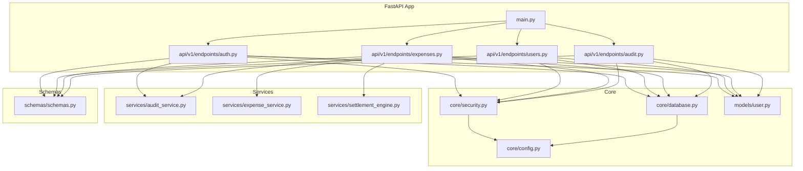
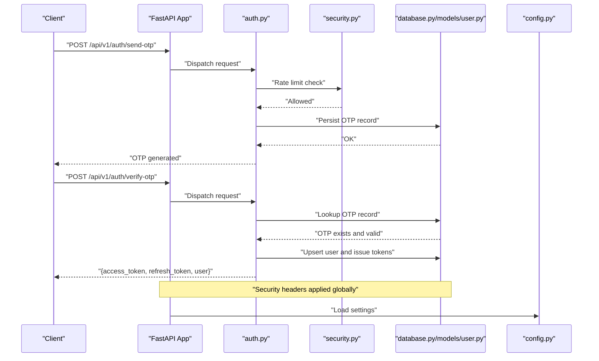
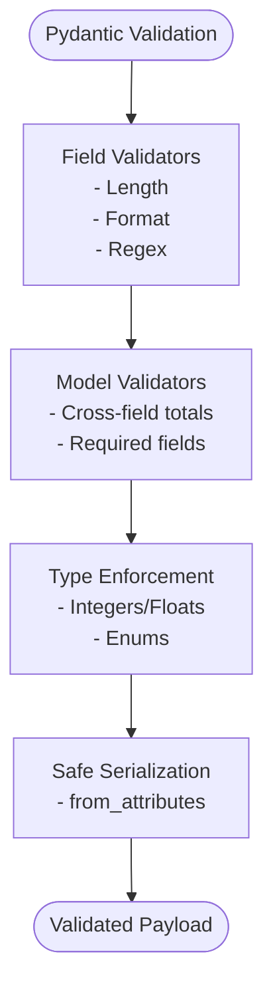
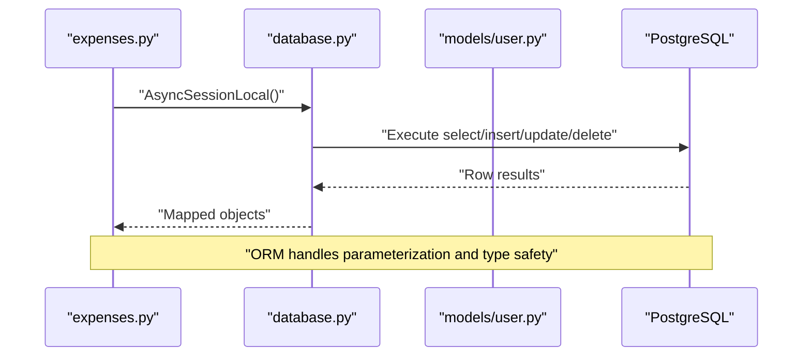
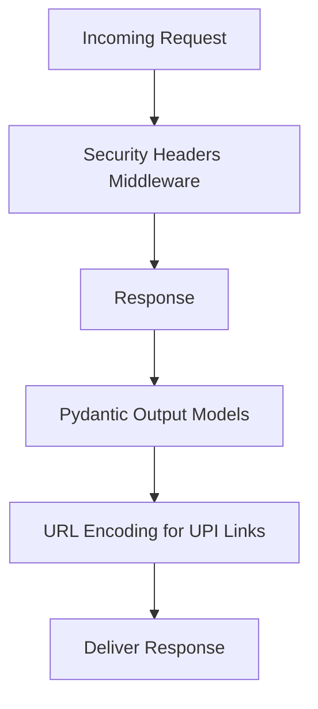
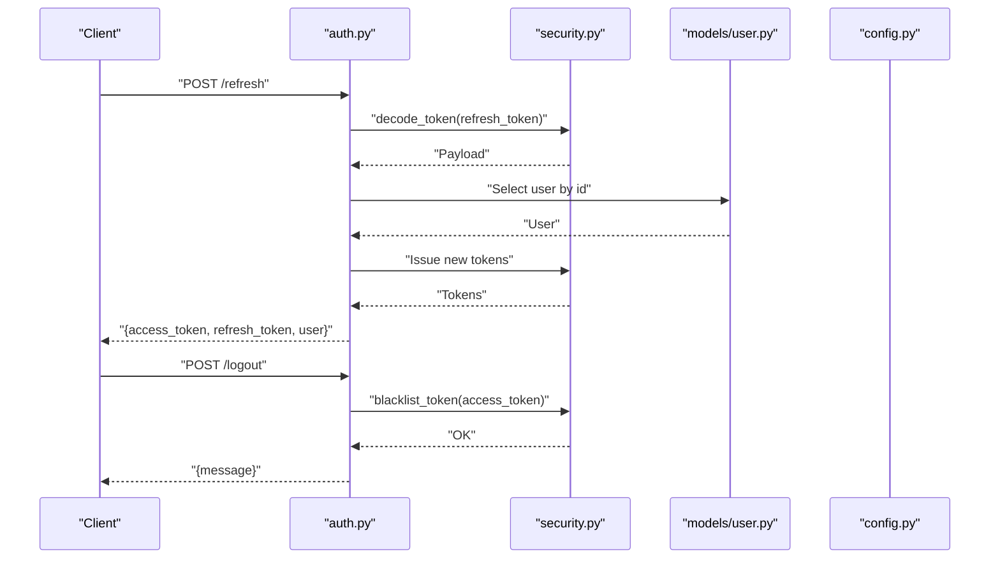
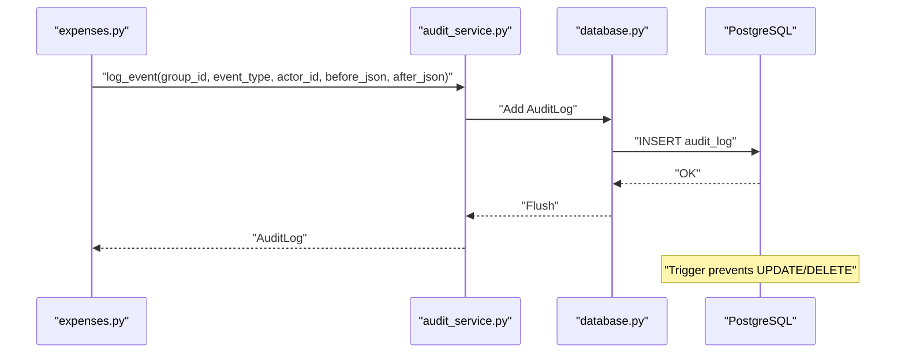
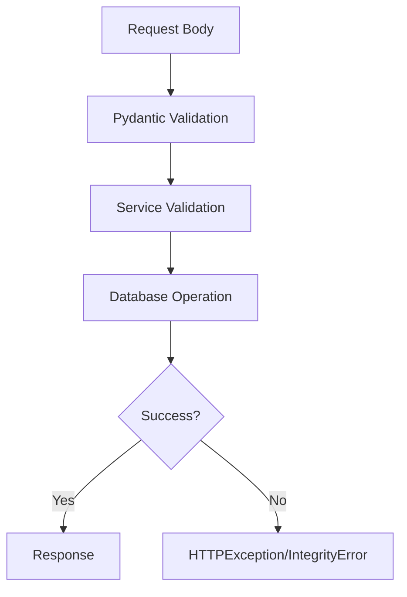
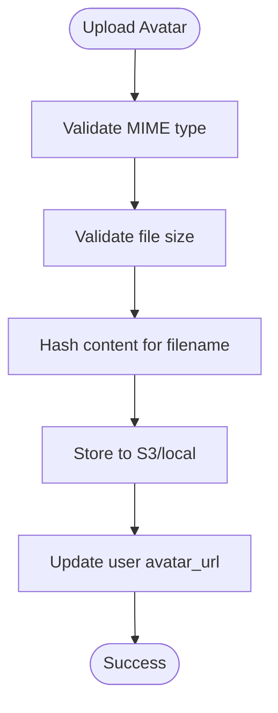
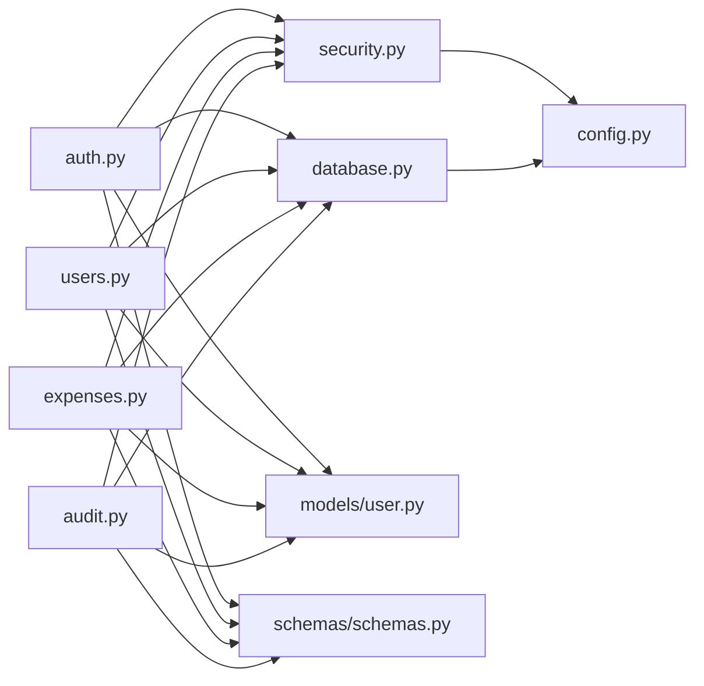

# Data Protection

<cite>
**Referenced Files in This Document**
- [schemas.py](file://backend/app/schemas/schemas.py)
- [security.py](file://backend/app/core/security.py)
- [user.py](file://backend/app/models/user.py)
- [database.py](file://backend/app/core/database.py)
- [main.py](file://backend/app/main.py)
- [auth.py](file://backend/app/api/v1/endpoints/auth.py)
- [expenses.py](file://backend/app/api/v1/endpoints/expenses.py)
- [users.py](file://backend/app/api/v1/endpoints/users.py)
- [audit.py](file://backend/app/api/v1/endpoints/audit.py)
- [audit_service.py](file://backend/app/services/audit_service.py)
- [config.py](file://backend/app/core/config.py)
- [expense_service.py](file://backend/app/services/expense_service.py)
- [settlement_engine.py](file://backend/app/services/settlement_engine.py)
- [test_schema_validation.py](file://backend/tests/test_schema_validation.py)
</cite>

## Table of Contents
1. [Introduction](#introduction)
2. [Project Structure](#project-structure)
3. [Core Components](#core-components)
4. [Architecture Overview](#architecture-overview)
5. [Detailed Component Analysis](#detailed-component-analysis)
6. [Dependency Analysis](#dependency-analysis)
7. [Performance Considerations](#performance-considerations)
8. [Troubleshooting Guide](#troubleshooting-guide)
9. [Conclusion](#conclusion)
10. [Appendices](#appendices)

## Introduction
This document provides comprehensive data protection guidance for the SplitSure application. It covers input sanitization, output encoding, validation strategies, Pydantic schema validation, SQL injection prevention via SQLAlchemy ORM, XSS mitigation, encryption at rest and in transit, secure storage of sensitive data, compliance considerations, and privacy safeguards for financial and user information. It also documents audit trail immutability and error handling patterns.

## Project Structure
The backend is organized around FastAPI with asynchronous SQLAlchemy ORM, modular endpoints, and service layers. Security and validation are centralized in schemas, security utilities, and middleware.

**Diagram sources**
- [main.py:16-56](file://backend/app/main.py#L16-L56)
- [auth.py:17-147](file://backend/app/api/v1/endpoints/auth.py#L17-L147)
- [users.py:14-115](file://backend/app/api/v1/endpoints/users.py#L14-L115)
- [expenses.py:20-395](file://backend/app/api/v1/endpoints/expenses.py#L20-L395)
- [audit.py:10-40](file://backend/app/api/v1/endpoints/audit.py#L10-L40)
- [security.py:14-96](file://backend/app/core/security.py#L14-L96)
- [database.py:5-29](file://backend/app/core/database.py#L5-L29)
- [user.py:51-234](file://backend/app/models/user.py#L51-L234)
- [audit_service.py:6-32](file://backend/app/services/audit_service.py#L6-L32)
- [expense_service.py:7-79](file://backend/app/services/expense_service.py#L7-L79)
- [settlement_engine.py:100-106](file://backend/app/services/settlement_engine.py#L100-L106)
- [schemas.py:10-432](file://backend/app/schemas/schemas.py#L10-L432)
- [config.py:6-71](file://backend/app/core/config.py#L6-L71)

**Section sources**
- [main.py:16-56](file://backend/app/main.py#L16-L56)
- [config.py:6-71](file://backend/app/core/config.py#L6-L71)

## Core Components
- Pydantic schemas define strict field-level validation, custom validators, and data type enforcement for all request/response payloads.
- Security utilities handle JWT lifecycle, token blacklisting, and access control.
- SQLAlchemy ORM enforces data typing and prevents raw SQL misuse.
- Middleware applies security headers and controls CORS.
- Services encapsulate business logic and maintain immutability of audit logs.

Key responsibilities:
- Input sanitization and validation via Pydantic validators and service-level checks.
- SQL injection prevention through ORM usage and parameterized queries.
- XSS mitigation via security headers and controlled output generation.
- Encryption in transit via HTTPS/HSTS and secure token signing.
- Data at rest via S3 storage and hashed identifiers; sensitive keys configured via environment.
- Audit trail immutability enforced by database triggers and ORM write restrictions.

**Section sources**
- [schemas.py:10-432](file://backend/app/schemas/schemas.py#L10-L432)
- [security.py:14-96](file://backend/app/core/security.py#L14-L96)
- [user.py:51-234](file://backend/app/models/user.py#L51-L234)
- [main.py:25-34](file://backend/app/main.py#L25-L34)
- [audit_service.py:6-32](file://backend/app/services/audit_service.py#L6-L32)

## Architecture Overview
The system enforces data protection at multiple layers: schema validation, middleware, endpoint handlers, ORM, and database constraints.

**Diagram sources**
- [auth.py:58-116](file://backend/app/api/v1/endpoints/auth.py#L58-L116)
- [security.py:17-41](file://backend/app/core/security.py#L17-L41)
- [database.py:5-29](file://backend/app/core/database.py#L5-L29)
- [user.py:70-87](file://backend/app/models/user.py#L70-L87)
- [config.py:6-71](file://backend/app/core/config.py#L6-L71)
- [main.py:25-34](file://backend/app/main.py#L25-L34)

## Detailed Component Analysis

### Pydantic Schema Validation and Data Type Enforcement
- Field-level validators enforce length, format, and content rules for phone numbers, emails, UPI IDs, names, descriptions, and amounts.
- Model-level validators ensure cross-field invariants (e.g., split totals equal expense amount, percentages sum to 100).
- Strict typing ensures numeric fields are integers or floats, and enums constrain categorical values.
- Output models use from_attributes to safely serialize ORM objects.

Examples of protections:
- Phone normalization and validation for OTP requests and invites.
- Email and UPI ID regex validation.
- Amount positivity checks and description presence.
- Split validation ensuring EXACT and PERCENTAGE invariants.

**Diagram sources**
- [schemas.py:13-44](file://backend/app/schemas/schemas.py#L13-L44)
- [schemas.py:230-255](file://backend/app/schemas/schemas.py#L230-L255)
- [schemas.py:265-288](file://backend/app/schemas/schemas.py#L265-L288)
- [schemas.py:336-341](file://backend/app/schemas/schemas.py#L336-L341)
- [schemas.py:373-378](file://backend/app/schemas/schemas.py#L373-L378)
- [schemas.py:400-416](file://backend/app/schemas/schemas.py#L400-L416)

**Section sources**
- [schemas.py:10-432](file://backend/app/schemas/schemas.py#L10-L432)

### SQL Injection Prevention via SQLAlchemy ORM
- All database interactions use SQLAlchemy ORM with parameterized queries, avoiding raw SQL concatenation.
- Queries leverage typed relationships and filters to prevent injection.
- Database-level immutability for audit logs via PostgreSQL triggers.

**Diagram sources**
- [expenses.py:144-179](file://backend/app/api/v1/endpoints/expenses.py#L144-L179)
- [expenses.py:230-263](file://backend/app/api/v1/endpoints/expenses.py#L230-L263)
- [database.py:5-29](file://backend/app/core/database.py#L5-L29)
- [user.py:124-147](file://backend/app/models/user.py#L124-L147)

**Section sources**
- [expenses.py:144-179](file://backend/app/api/v1/endpoints/expenses.py#L144-L179)
- [expenses.py:230-263](file://backend/app/api/v1/endpoints/expenses.py#L230-L263)
- [user.py:124-147](file://backend/app/models/user.py#L124-L147)
- [main.py:68-86](file://backend/app/main.py#L68-L86)

### XSS Prevention and Output Encoding
- Global security headers middleware sets X-Content-Type-Options, X-Frame-Options, X-XSS-Protection, Referrer-Policy, and HSTS in production.
- Output serialization uses Pydantic models with from_attributes to avoid accidental template rendering of raw ORM attributes.
- UPI deep links are URL-encoded to prevent injection in URIs.

**Diagram sources**
- [main.py:25-34](file://backend/app/main.py#L25-L34)
- [settlement_engine.py:100-106](file://backend/app/services/settlement_engine.py#L100-L106)
- [schemas.py:313-331](file://backend/app/schemas/schemas.py#L313-L331)

**Section sources**
- [main.py:25-34](file://backend/app/main.py#L25-L34)
- [settlement_engine.py:100-106](file://backend/app/services/settlement_engine.py#L100-L106)

### Authentication, Authorization, and Token Management
- JWT access and refresh tokens with expiration and signing.
- Token blacklisting with hashed tokens and expiry cleanup.
- Access guard validates token type, revocation, and user existence.

**Diagram sources**
- [auth.py:118-136](file://backend/app/api/v1/endpoints/auth.py#L118-L136)
- [auth.py:139-146](file://backend/app/api/v1/endpoints/auth.py#L139-L146)
- [security.py:17-96](file://backend/app/core/security.py#L17-L96)
- [user.py:51-63](file://backend/app/models/user.py#L51-L63)
- [config.py:10-14](file://backend/app/core/config.py#L10-L14)

**Section sources**
- [auth.py:118-136](file://backend/app/api/v1/endpoints/auth.py#L118-L136)
- [auth.py:139-146](file://backend/app/api/v1/endpoints/auth.py#L139-L146)
- [security.py:17-96](file://backend/app/core/security.py#L17-L96)

### Audit Trail Immutability and Data Integrity
- Audit events are logged with before/after snapshots and metadata.
- PostgreSQL trigger enforces append-only semantics on audit_logs.
- ORM-level immutability is enforced by disallowing UPDATE/DELETE on audit records.

**Diagram sources**
- [expenses.py:172-176](file://backend/app/api/v1/endpoints/expenses.py#L172-L176)
- [audit_service.py:6-32](file://backend/app/services/audit_service.py#L6-L32)
- [main.py:72-85](file://backend/app/main.py#L72-L85)

**Section sources**
- [audit_service.py:6-32](file://backend/app/services/audit_service.py#L6-L32)
- [main.py:72-85](file://backend/app/main.py#L72-L85)

### Data Validation Strategies and Error Management
- Endpoint handlers validate group membership, settle conditions (e.g., not settled/disputed), and enforce business rules.
- Service-level validators ensure split user sets are valid and unique, and split totals match.
- Integrity errors are handled gracefully with appropriate HTTP responses.

**Diagram sources**
- [expenses.py:144-179](file://backend/app/api/v1/endpoints/expenses.py#L144-L179)
- [expense_service.py:7-17](file://backend/app/services/expense_service.py#L7-L17)
- [users.py:22-48](file://backend/app/api/v1/endpoints/users.py#L22-L48)

**Section sources**
- [expenses.py:144-179](file://backend/app/api/v1/endpoints/expenses.py#L144-L179)
- [expense_service.py:7-17](file://backend/app/services/expense_service.py#L7-L17)
- [users.py:22-48](file://backend/app/api/v1/endpoints/users.py#L22-L48)

### Secure Data Handling Patterns
- OTP generation and hashing with expiry; rate limiting to prevent abuse.
- Avatar uploads restricted by MIME type and size; hashed filenames for obfuscation.
- Presigned URLs for S3 attachments; optional local static file serving in development.
- UPI deep links built with URL encoding to avoid injection.

**Diagram sources**
- [users.py:51-83](file://backend/app/api/v1/endpoints/users.py#L51-L83)

**Section sources**
- [auth.py:58-116](file://backend/app/api/v1/endpoints/auth.py#L58-L116)
- [users.py:51-83](file://backend/app/api/v1/endpoints/users.py#L51-L83)
- [expenses.py:352-394](file://backend/app/api/v1/endpoints/expenses.py#L352-L394)
- [settlement_engine.py:100-106](file://backend/app/services/settlement_engine.py#L100-L106)

### Privacy Considerations and Compliance
- Financial data: stored as integers in smallest units; UPI-related fields are optional and sanitized.
- User information: PII is minimal; phone/email validated and normalized; UPI IDs are optional and validated.
- Audit logs: immutable, tamper-evident; supports compliance by preserving change history.
- Transport security: HSTS enabled in production; HTTPS enforced by middleware and external deployment.
- At-rest storage: S3 bucket configured; local storage for development only.

**Section sources**
- [user.py:124-147](file://backend/app/models/user.py#L124-L147)
- [schemas.py:313-331](file://backend/app/schemas/schemas.py#L313-L331)
- [main.py:32-33](file://backend/app/main.py#L32-L33)
- [config.py:23-28](file://backend/app/core/config.py#L23-L28)

## Dependency Analysis
The system exhibits strong separation of concerns:
- Endpoints depend on security utilities and services.
- Services depend on schemas and models.
- Security utilities depend on configuration and database sessions.
- Middleware depends on configuration.

**Diagram sources**
- [auth.py:17-147](file://backend/app/api/v1/endpoints/auth.py#L17-L147)
- [users.py:14-115](file://backend/app/api/v1/endpoints/users.py#L14-L115)
- [expenses.py:20-395](file://backend/app/api/v1/endpoints/expenses.py#L20-L395)
- [audit.py:10-40](file://backend/app/api/v1/endpoints/audit.py#L10-L40)
- [security.py:14-96](file://backend/app/core/security.py#L14-L96)
- [database.py:5-29](file://backend/app/core/database.py#L5-L29)
- [user.py:51-234](file://backend/app/models/user.py#L51-L234)
- [schemas.py:10-432](file://backend/app/schemas/schemas.py#L10-L432)
- [config.py:6-71](file://backend/app/core/config.py#L6-L71)

**Section sources**
- [auth.py:17-147](file://backend/app/api/v1/endpoints/auth.py#L17-L147)
- [users.py:14-115](file://backend/app/api/v1/endpoints/users.py#L14-L115)
- [expenses.py:20-395](file://backend/app/api/v1/endpoints/expenses.py#L20-L395)
- [audit.py:10-40](file://backend/app/api/v1/endpoints/audit.py#L10-L40)
- [security.py:14-96](file://backend/app/core/security.py#L14-L96)
- [database.py:5-29](file://backend/app/core/database.py#L5-L29)
- [user.py:51-234](file://backend/app/models/user.py#L51-L234)
- [schemas.py:10-432](file://backend/app/schemas/schemas.py#L10-L432)
- [config.py:6-71](file://backend/app/core/config.py#L6-L71)

## Performance Considerations
- Asynchronous ORM sessions reduce blocking and improve throughput.
- Select-in-load strategies minimize N+1 queries for related entities.
- Database connection pooling and async engine tuning support concurrency.
- Avoid heavy computations in request handlers; offload to services.

[No sources needed since this section provides general guidance]

## Troubleshooting Guide
Common issues and resolutions:
- Validation errors: Review Pydantic validator messages for phone, email, UPI, amounts, and split totals.
- Integrity errors: Duplicate email or constraint violations; endpoint handlers return conflict or internal server errors.
- Token errors: Expired or revoked tokens; ensure blacklist cleanup runs and tokens are refreshed appropriately.
- Audit immutability: Attempted modifications to audit logs are blocked by database triggers.

**Section sources**
- [schemas.py:13-44](file://backend/app/schemas/schemas.py#L13-L44)
- [users.py:37-48](file://backend/app/api/v1/endpoints/users.py#L37-L48)
- [security.py:33-41](file://backend/app/core/security.py#L33-L41)
- [main.py:72-85](file://backend/app/main.py#L72-L85)

## Conclusion
SplitSure’s backend implements robust data protection through layered validation, secure token management, ORM-driven SQL safety, global security headers, immutable audit trails, and careful handling of sensitive data. Adhering to these patterns ensures confidentiality, integrity, and compliance across financial and user data.

[No sources needed since this section summarizes without analyzing specific files]

## Appendices

### Secure Coding Checklist
- Always validate inputs with Pydantic validators and service-level checks.
- Use SQLAlchemy ORM and avoid raw SQL.
- Enforce security headers via middleware.
- Log immutable audit events with before/after snapshots.
- Hash and sanitize identifiers; use presigned URLs for file access.
- Enforce transport security with HTTPS/HSTS.
- Keep secrets in environment variables and rotate regularly.

[No sources needed since this section provides general guidance]