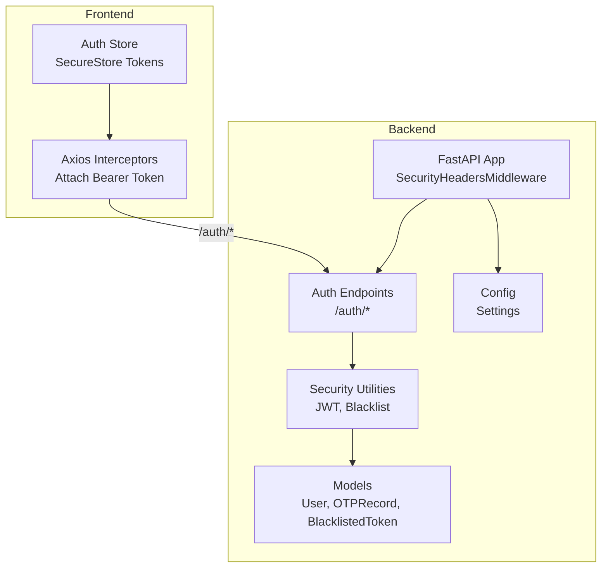
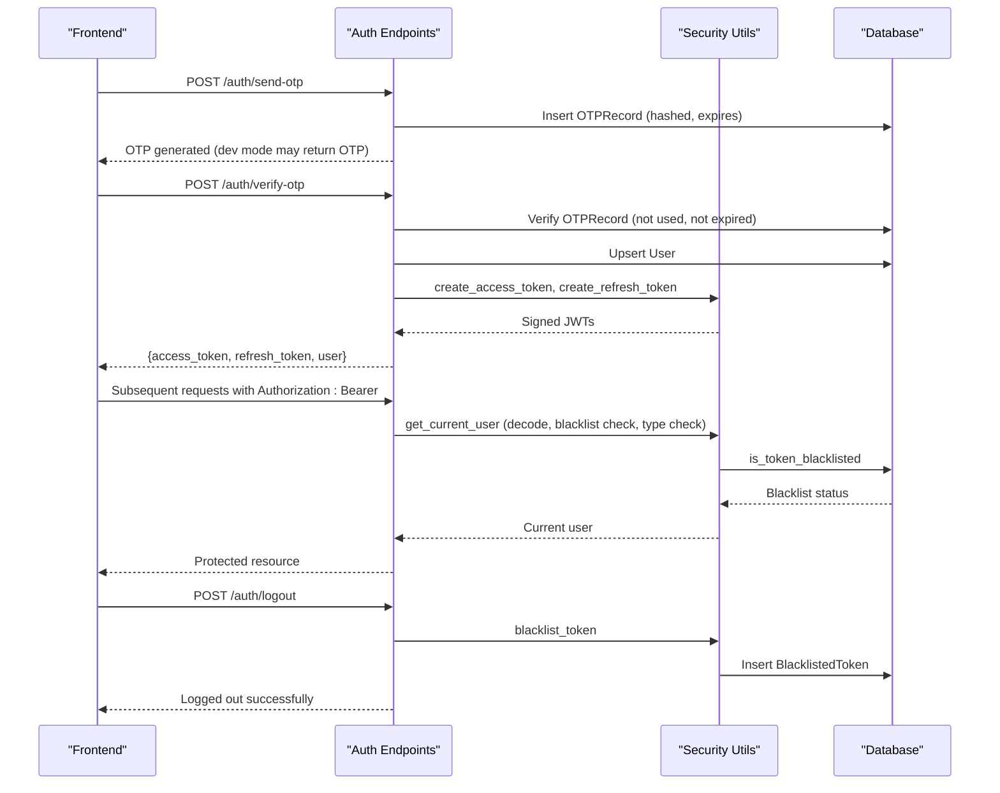
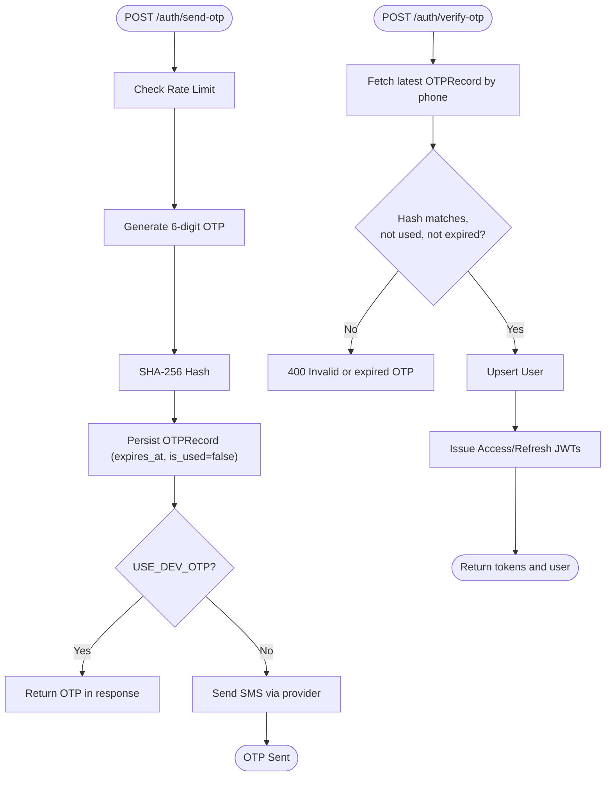
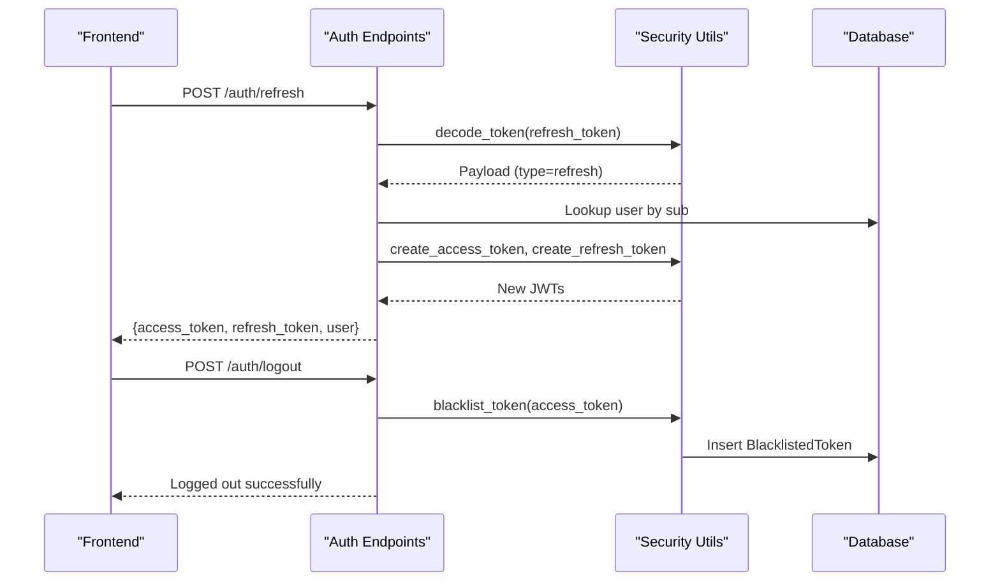
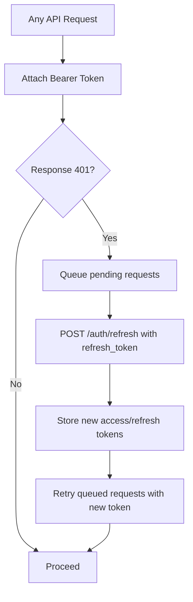
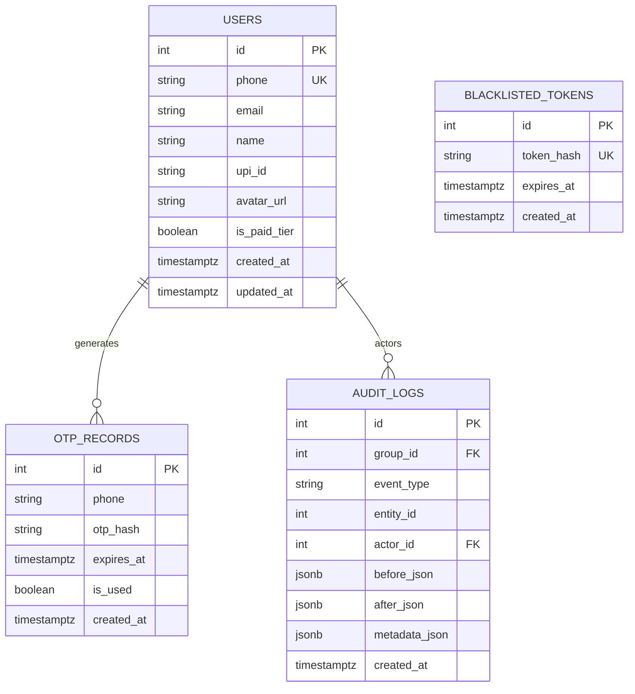
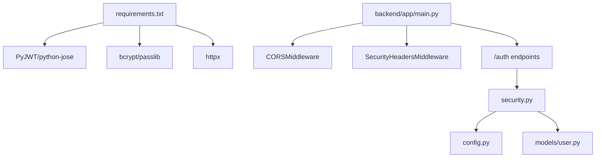

# Security Implementation

<cite>
**Referenced Files in This Document**
- [backend/app/main.py](file://backend/app/main.py)
- [backend/app/core/security.py](file://backend/app/core/security.py)
- [backend/app/core/config.py](file://backend/app/core/config.py)
- [backend/app/api/v1/endpoints/auth.py](file://backend/app/api/v1/endpoints/auth.py)
- [backend/app/models/user.py](file://backend/app/models/user.py)
- [backend/app/schemas/schemas.py](file://backend/app/schemas/schemas.py)
- [backend/alembic/versions/001_initial.py](file://backend/alembic/versions/001_initial.py)
- [backend/alembic/versions/002_add_push_token.py](file://backend/alembic/versions/002_add_push_token.py)
- [backend/requirements.txt](file://backend/requirements.txt)
- [docker-compose.yml](file://docker-compose.yml)
- [frontend/src/services/api.ts](file://frontend/src/services/api.ts)
- [frontend/src/store/authStore.ts](file://frontend/src/store/authStore.ts)
</cite>

## Table of Contents
1. [Introduction](#introduction)
2. [Project Structure](#project-structure)
3. [Core Components](#core-components)
4. [Architecture Overview](#architecture-overview)
5. [Detailed Component Analysis](#detailed-component-analysis)
6. [Dependency Analysis](#dependency-analysis)
7. [Performance Considerations](#performance-considerations)
8. [Troubleshooting Guide](#troubleshooting-guide)
9. [Conclusion](#conclusion)
10. [Appendices](#appendices)

## Introduction
This document provides comprehensive security documentation for the SplitSure application. It covers authentication and authorization mechanisms, token lifecycle management, session handling, data protection, input validation, CORS configuration, security headers, HTTPS enforcement, and operational controls. It also outlines compliance considerations for financial data handling, privacy, and regulatory adherence, along with secure development practices, vulnerability assessment, security monitoring, testing approaches, and incident response protocols.

## Project Structure
The security implementation spans the backend FastAPI application, shared configuration, database models, and the mobile frontend. The backend enforces security headers, CORS, JWT-based authentication, OTP-based login with rate limiting, and token blacklisting. The frontend securely stores tokens and handles token refresh and logout.

**Diagram sources**
- [backend/app/main.py:25-46](file://backend/app/main.py#L25-L46)
- [backend/app/api/v1/endpoints/auth.py:17-147](file://backend/app/api/v1/endpoints/auth.py#L17-L147)
- [backend/app/core/security.py:17-96](file://backend/app/core/security.py#L17-L96)
- [backend/app/models/user.py:51-88](file://backend/app/models/user.py#L51-L88)
- [backend/app/core/config.py:6-71](file://backend/app/core/config.py#L6-L71)
- [frontend/src/services/api.ts:76-140](file://frontend/src/services/api.ts#L76-L140)
- [frontend/src/store/authStore.ts:29-111](file://frontend/src/store/authStore.ts#L29-L111)

**Section sources**
- [backend/app/main.py:16-56](file://backend/app/main.py#L16-L56)
- [backend/app/api/v1/endpoints/auth.py:17-147](file://backend/app/api/v1/endpoints/auth.py#L17-L147)
- [backend/app/core/security.py:17-96](file://backend/app/core/security.py#L17-L96)
- [backend/app/models/user.py:51-88](file://backend/app/models/user.py#L51-L88)
- [backend/app/core/config.py:6-71](file://backend/app/core/config.py#L6-L71)
- [frontend/src/services/api.ts:76-140](file://frontend/src/services/api.ts#L76-L140)
- [frontend/src/store/authStore.ts:29-111](file://frontend/src/store/authStore.ts#L29-L111)

## Core Components
- Authentication and Authorization
  - OTP-based login with secure generation and hashing, rate limiting, and automatic user provisioning.
  - JWT access and refresh tokens with strict validation and type checks.
  - Token blacklisting for logout invalidation.
  - Protected endpoints using bearer token extraction and user resolution.
- Data Protection
  - OTP records stored as hashed values with expiry and usage tracking.
  - Audit logs enforced append-only via database triggers.
  - File attachments hashed and validated; S3 integration for production.
- Input Validation and Sanitization
  - Pydantic validators for phone numbers, OTP codes, emails, UPI IDs, and business rules.
  - Request/response schemas enforce data integrity and constraints.
- CORS and Security Headers
  - Configurable allowed origins and headers.
  - Security headers middleware: X-Content-Type-Options, X-Frame-Options, X-XSS-Protection, Referrer-Policy, and HSTS in production.
- Session Handling
  - Frontend stores tokens in SecureStore and attaches Authorization header automatically.
  - Automatic refresh flow on 401 with queueing concurrent requests.

**Section sources**
- [backend/app/api/v1/endpoints/auth.py:58-147](file://backend/app/api/v1/endpoints/auth.py#L58-L147)
- [backend/app/core/security.py:17-96](file://backend/app/core/security.py#L17-L96)
- [backend/app/models/user.py:70-88](file://backend/app/models/user.py#L70-L88)
- [backend/app/schemas/schemas.py:10-56](file://backend/app/schemas/schemas.py#L10-L56)
- [backend/app/main.py:25-46](file://backend/app/main.py#L25-L46)
- [frontend/src/services/api.ts:76-140](file://frontend/src/services/api.ts#L76-L140)
- [frontend/src/store/authStore.ts:29-111](file://frontend/src/store/authStore.ts#L29-L111)

## Architecture Overview
The authentication flow integrates frontend token storage, backend JWT validation, OTP generation and verification, and token blacklisting for logout.

**Diagram sources**
- [backend/app/api/v1/endpoints/auth.py:58-147](file://backend/app/api/v1/endpoints/auth.py#L58-L147)
- [backend/app/core/security.py:72-96](file://backend/app/core/security.py#L72-L96)
- [backend/app/models/user.py:70-88](file://backend/app/models/user.py#L70-L88)

## Detailed Component Analysis

### OTP-Based Authentication
- Secure OTP Generation
  - Random 6-digit numeric code generated using a secure random source.
  - OTP stored as SHA-256 hash with expiry and uniqueness per phone.
- Rate Limiting
  - Hourly request count capped by configuration; prevents brute force and abuse.
- Verification and User Provisioning
  - Validates OTP against hash, expiry, and usage flag.
  - Creates user if not exists; issues JWT pair on success.
- Dev Mode Behavior
  - In development, OTP is returned in response instead of SMS.

**Diagram sources**
- [backend/app/api/v1/endpoints/auth.py:58-116](file://backend/app/api/v1/endpoints/auth.py#L58-L116)
- [backend/app/core/config.py:30-37](file://backend/app/core/config.py#L30-L37)

**Section sources**
- [backend/app/api/v1/endpoints/auth.py:58-116](file://backend/app/api/v1/endpoints/auth.py#L58-L116)
- [backend/app/core/config.py:30-37](file://backend/app/core/config.py#L30-L37)

### JWT Token Security
- Secret Key Management
  - Secret key configured via settings with minimum length validator.
  - Environment variable override in compose for production.
- Token Validation
  - Decoding validates algorithm and signature; expiration and token type checks enforced.
- Refresh Token Rotation
  - Refresh endpoint decodes token, verifies type, resolves user, and issues new JWT pair.
- Logout Invalidation
  - Logout endpoint adds current access token to blacklist; subsequent requests rejected.

**Diagram sources**
- [backend/app/api/v1/endpoints/auth.py:118-147](file://backend/app/api/v1/endpoints/auth.py#L118-L147)
- [backend/app/core/security.py:26-61](file://backend/app/core/security.py#L26-L61)

**Section sources**
- [backend/app/core/security.py:17-61](file://backend/app/core/security.py#L17-L61)
- [backend/app/api/v1/endpoints/auth.py:118-147](file://backend/app/api/v1/endpoints/auth.py#L118-L147)
- [backend/app/core/config.py:10-14](file://backend/app/core/config.py#L10-L14)
- [docker-compose.yml:43-44](file://docker-compose.yml#L43-L44)

### Token Lifecycle Management and Session Handling
- Frontend Token Storage
  - Access and refresh tokens stored in SecureStore; Authorization header attached automatically.
- Automatic Refresh on 401
  - Concurrent requests queued while refreshing; retry with new token.
- Logout
  - Calls logout endpoint and clears local tokens.

**Diagram sources**
- [frontend/src/services/api.ts:76-140](file://frontend/src/services/api.ts#L76-L140)
- [frontend/src/store/authStore.ts:49-60](file://frontend/src/store/authStore.ts#L49-L60)

**Section sources**
- [frontend/src/services/api.ts:76-140](file://frontend/src/services/api.ts#L76-L140)
- [frontend/src/store/authStore.ts:29-60](file://frontend/src/store/authStore.ts#L29-L60)

### Data Protection Measures
- OTP Records
  - Stored as hashes with expiry and usage flags; indexed by phone for efficient lookup.
- Token Blacklist
  - Stores token hash with expiry; cleanup removes expired entries.
- Audit Logs
  - Append-only enforced via database trigger preventing updates/deletes.
- File Attachments
  - SHA-256 hashing and metadata stored; S3 integration for production.

**Diagram sources**
- [backend/app/models/user.py:51-88](file://backend/app/models/user.py#L51-L88)
- [backend/alembic/versions/001_initial.py:17-170](file://backend/alembic/versions/001_initial.py#L17-L170)

**Section sources**
- [backend/app/models/user.py:70-88](file://backend/app/models/user.py#L70-L88)
- [backend/alembic/versions/001_initial.py:156-169](file://backend/alembic/versions/001_initial.py#L156-L169)

### Input Validation, Output Encoding, and Data Integrity
- Phone Numbers
  - Normalized to E.164 format; validation ensures minimum length and proper prefix.
- OTP Codes
  - Strict 6-digit numeric validation.
- Emails and UPI IDs
  - Regex-based validation with normalization (lowercase, strip).
- Business Rules
  - Amounts must be positive; expense split totals validated per split type.
- Output Encoding
  - Pydantic serialization ensures safe JSON representation; sensitive fields excluded from public schemas.

**Section sources**
- [backend/app/schemas/schemas.py:10-56](file://backend/app/schemas/schemas.py#L10-L56)
- [backend/app/schemas/schemas.py:203-236](file://backend/app/schemas/schemas.py#L203-L236)
- [backend/app/schemas/schemas.py:58-99](file://backend/app/schemas/schemas.py#L58-L99)

### CORS Configuration and Request Validation
- CORS
  - Origins, methods, and headers configurable; credentials allowed.
- Request Validation
  - Pydantic models validate request bodies; schema errors propagate as HTTP 422.
- Authorization Patterns
  - Bearer token required; current user resolved via decoded subject; blacklist checked.

**Section sources**
- [backend/app/main.py:40-46](file://backend/app/main.py#L40-L46)
- [backend/app/api/v1/endpoints/auth.py:72-95](file://backend/app/api/v1/endpoints/auth.py#L72-L95)
- [backend/app/core/security.py:72-95](file://backend/app/core/security.py#L72-L95)

### Security Headers and HTTPS Enforcement
- Security Headers Middleware
  - Adds X-Content-Type-Options, X-Frame-Options, X-XSS-Protection, and Referrer-Policy to all responses.
- HTTPS Enforcement (HSTS)
  - HSTS header included when not in dev OTP mode; production deployment recommended.

**Section sources**
- [backend/app/main.py:25-34](file://backend/app/main.py#L25-L34)

### Compliance and Privacy Considerations
- Financial Data Handling
  - Monetary amounts stored in smallest units with integer precision; no plaintext card data.
- Privacy Controls
  - Minimal PII collected; phone normalized to E.164; optional email and UPI ID.
- Regulatory Adherence
  - Data retention aligned with audit logs; immutable audit trail via database trigger.
  - S3 integration supports secure offsite storage; local storage disabled by default in production.

**Section sources**
- [backend/app/models/user.py:124-141](file://backend/app/models/user.py#L124-L141)
- [backend/alembic/versions/001_initial.py:156-169](file://backend/alembic/versions/001_initial.py#L156-L169)
- [docker-compose.yml:46-59](file://docker-compose.yml#L46-L59)

## Dependency Analysis
The backend relies on cryptographic libraries for JWT signing and bcrypt hashing, and on HTTP clients for external OTP delivery. The frontend depends on SecureStore for token persistence and Axios interceptors for transparent auth.

**Diagram sources**
- [backend/requirements.txt:8-13](file://backend/requirements.txt#L8-L13)
- [backend/app/main.py:25-46](file://backend/app/main.py#L25-L46)
- [backend/app/api/v1/endpoints/auth.py:9-12](file://backend/app/api/v1/endpoints/auth.py#L9-L12)
- [backend/app/core/security.py:1-15](file://backend/app/core/security.py#L1-L15)
- [backend/app/core/config.py:6-14](file://backend/app/core/config.py#L6-L14)
- [backend/app/models/user.py:1-10](file://backend/app/models/user.py#L1-L10)

**Section sources**
- [backend/requirements.txt:8-13](file://backend/requirements.txt#L8-L13)
- [backend/app/main.py:25-46](file://backend/app/main.py#L25-L46)
- [backend/app/api/v1/endpoints/auth.py:9-12](file://backend/app/api/v1/endpoints/auth.py#L9-L12)
- [backend/app/core/security.py:1-15](file://backend/app/core/security.py#L1-L15)

## Performance Considerations
- Token Blacklist Cleanup
  - Expired blacklist entries are pruned before checks to maintain performance.
- OTP Record Cleanup
  - Consider adding periodic cleanup jobs for expired OTP records to reduce index size.
- CORS Overhead
  - Keep allowed origins minimal to reduce preflight overhead.
- Database Indexes
  - Existing indexes on phone and token hash support efficient lookups.

[No sources needed since this section provides general guidance]

## Troubleshooting Guide
- 401 Unauthorized
  - Verify tokens are present and not blacklisted; ensure correct token type (access vs refresh).
- 400 Invalid or Expired OTP
  - Confirm OTP was not reused; check expiry; verify rate limit not exceeded.
- 429 Too Many Requests
  - Wait for hourly window to reset; reduce client-side polling.
- CORS Errors
  - Ensure origin is whitelisted; verify credentials and headers match configuration.
- HSTS Not Enforced
  - Confirm production mode (non-dev OTP) and HTTPS termination at reverse proxy.

**Section sources**
- [backend/app/api/v1/endpoints/auth.py:24-34](file://backend/app/api/v1/endpoints/auth.py#L24-L34)
- [backend/app/core/security.py:72-95](file://backend/app/core/security.py#L72-L95)
- [backend/app/main.py:40-46](file://backend/app/main.py#L40-L46)

## Conclusion
SplitSure implements a robust security posture centered on OTP-based authentication, JWT tokenization with refresh rotation, token blacklisting, strict input validation, and protective security headers. The architecture balances usability with strong safeguards, and the frontend integrates secure token storage and automatic refresh. Production readiness requires hardened secret management, HTTPS enforcement, and continuous monitoring.

[No sources needed since this section summarizes without analyzing specific files]

## Appendices

### Security Testing Approaches
- Authentication Testing
  - Validate OTP generation, rate limiting, and expiry behavior.
  - Test token decoding, type validation, and blacklist rejection.
- Authorization Testing
  - Verify protected endpoints reject missing/expired/blacklisted tokens.
  - Confirm refresh endpoint rotates tokens and preserves user identity.
- Penetration Testing Procedures
  - OWASP Top Ten assessments for API endpoints.
  - Brute-force and rate-limit bypass attempts.
  - JWT tampering and replay detection.
- Incident Response Protocols
  - Immediate revocation via blacklist, user notification, and audit logging.
  - Forensic analysis of audit logs and token lifecycles.

[No sources needed since this section provides general guidance]