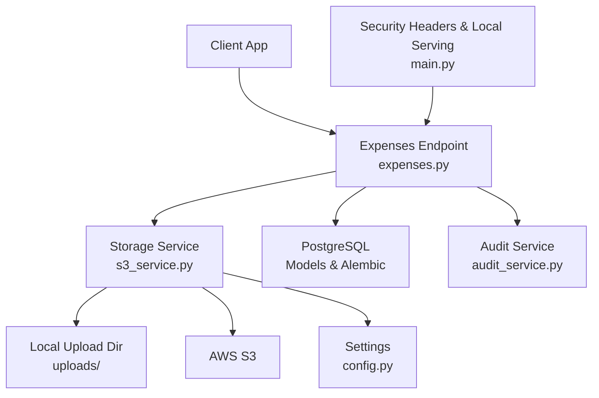
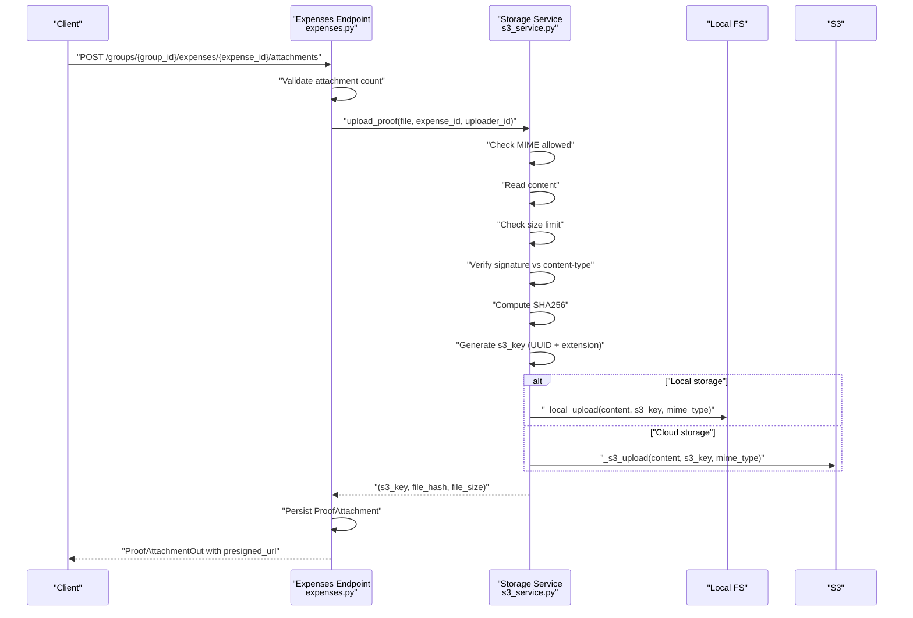
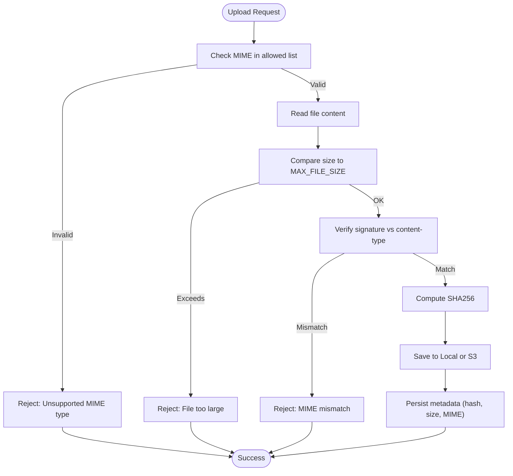
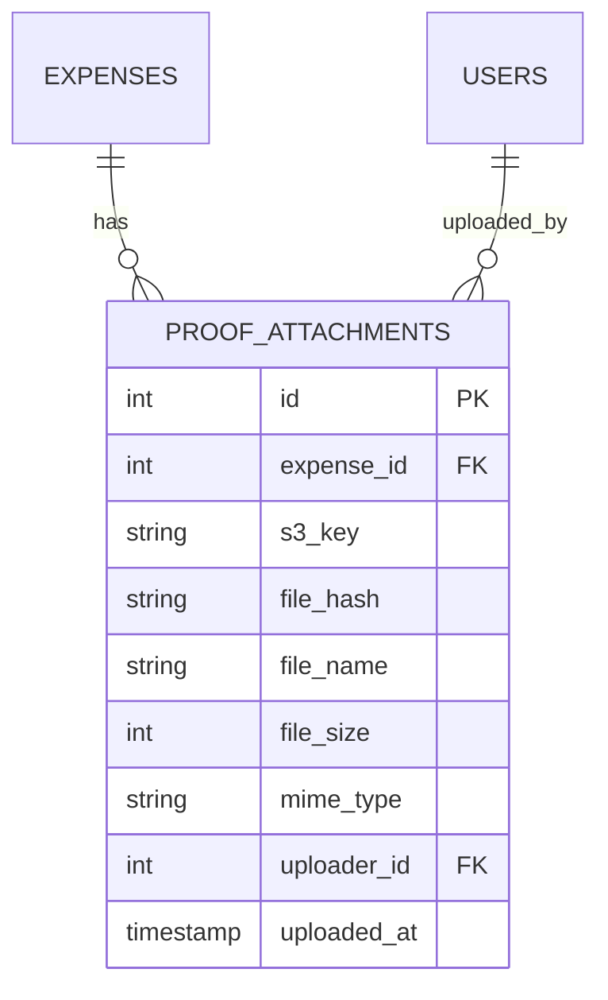
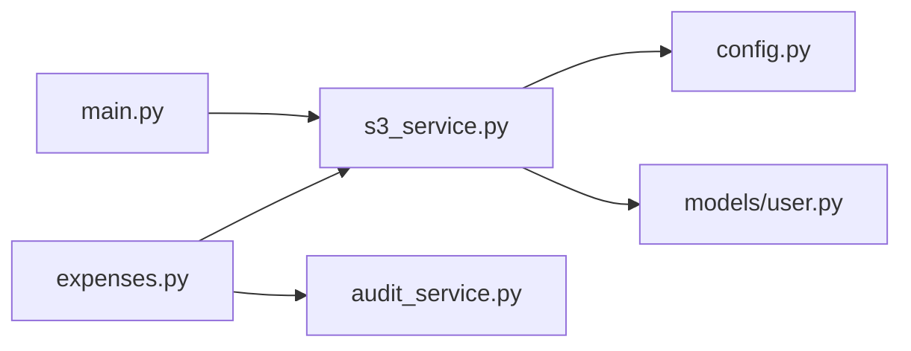

# File Security and Validation

<cite>
**Referenced Files in This Document**
- [config.py](file://backend/app/core/config.py)
- [s3_service.py](file://backend/app/services/s3_service.py)
- [expenses.py](file://backend/app/api/v1/endpoints/expenses.py)
- [user.py](file://backend/app/models/user.py)
- [schemas.py](file://backend/app/schemas/schemas.py)
- [main.py](file://backend/app/main.py)
- [audit_service.py](file://backend/app/services/audit_service.py)
- [001_initial.py](file://backend/alembic/versions/001_initial.py)
</cite>

## Table of Contents
1. [Introduction](#introduction)
2. [Project Structure](#project-structure)
3. [Core Components](#core-components)
4. [Architecture Overview](#architecture-overview)
5. [Detailed Component Analysis](#detailed-component-analysis)
6. [Dependency Analysis](#dependency-analysis)
7. [Performance Considerations](#performance-considerations)
8. [Troubleshooting Guide](#troubleshooting-guide)
9. [Conclusion](#conclusion)

## Introduction
This document explains the file security and validation mechanisms in SplitSure. It covers the multi-layered validation pipeline for uploaded proofs, including MIME type verification, file signature checking, content-type validation, size limits, and integrity checks using SHA256. It also documents the file naming strategy using UUID-based identifiers, structured directory organization, and security considerations such as path traversal prevention and malicious content detection. Examples of validation failures and best practices for secure file handling in both local and cloud storage environments are included.

## Project Structure
The file upload and validation logic is implemented in the backend service layer and API endpoints. Key components:
- Configuration defines storage mode, base URLs, and limits.
- The storage service handles local/cloud uploads, validates MIME/signatures, computes hashes, and constructs keys.
- The expenses endpoint enforces attachment quotas and persists metadata.
- Models define the persisted file metadata, including SHA256 hash.
- Middleware adds security headers and serves local files when enabled.

**Diagram sources**
- [expenses.py:352-395](file://backend/app/api/v1/endpoints/expenses.py#L352-L395)
- [s3_service.py:105-158](file://backend/app/services/s3_service.py#L105-L158)
- [config.py:16-28](file://backend/app/core/config.py#L16-L28)
- [user.py:202-218](file://backend/app/models/user.py#L202-L218)
- [audit_service.py:6-32](file://backend/app/services/audit_service.py#L6-L32)
- [main.py:25-55](file://backend/app/main.py#L25-L55)

**Section sources**
- [config.py:16-28](file://backend/app/core/config.py#L16-L28)
- [s3_service.py:105-158](file://backend/app/services/s3_service.py#L105-L158)
- [expenses.py:352-395](file://backend/app/api/v1/endpoints/expenses.py#L352-L395)
- [user.py:202-218](file://backend/app/models/user.py#L202-L218)
- [audit_service.py:6-32](file://backend/app/services/audit_service.py#L6-L32)
- [main.py:25-55](file://backend/app/main.py#L25-L55)

## Core Components
- Allowed file types: JPEG, PNG, PDF.
- Maximum file size: controlled by MAX_FILE_SIZE_MB configuration.
- Signature verification: checks file headers against declared MIME type.
- Integrity verification: SHA256 hash computed server-side and persisted.
- Naming strategy: UUID-based unique identifier with extension preserved; structured under a folder per expense.
- Storage modes: local filesystem (development) and AWS S3 (production).

**Section sources**
- [s3_service.py:20-28](file://backend/app/services/s3_service.py#L20-L28)
- [s3_service.py:114-126](file://backend/app/services/s3_service.py#L114-L126)
- [s3_service.py:128-129](file://backend/app/services/s3_service.py#L128-L129)
- [config.py:49](file://backend/app/core/config.py#L49)
- [expenses.py:368-370](file://backend/app/api/v1/endpoints/expenses.py#L368-L370)
- [user.py:207-208](file://backend/app/models/user.py#L207-L208)

## Architecture Overview
The upload flow validates the file client-side (MIME/content-type), reads the entire content, verifies the signature, computes the hash, assigns a UUID-based key, and stores either locally or in S3. The endpoint persists metadata and returns a signed or direct URL for retrieval.

**Diagram sources**
- [expenses.py:352-395](file://backend/app/api/v1/endpoints/expenses.py#L352-L395)
- [s3_service.py:105-136](file://backend/app/services/s3_service.py#L105-L136)
- [s3_service.py:45-50](file://backend/app/services/s3_service.py#L45-L50)
- [s3_service.py:76-88](file://backend/app/services/s3_service.py#L76-L88)

## Detailed Component Analysis

### Multi-Layered Validation Pipeline
- MIME type allowed list enforcement.
- Content-type header validation against allowed types.
- File signature verification using magic bytes.
- Size limit enforcement based on configuration.
- SHA256 integrity computation and persistence.

**Diagram sources**
- [s3_service.py:114-126](file://backend/app/services/s3_service.py#L114-L126)
- [s3_service.py:31-36](file://backend/app/services/s3_service.py#L31-L36)
- [s3_service.py:20-28](file://backend/app/services/s3_service.py#L20-L28)
- [config.py:49](file://backend/app/core/config.py#L49)

**Section sources**
- [s3_service.py:114-126](file://backend/app/services/s3_service.py#L114-L126)
- [s3_service.py:31-36](file://backend/app/services/s3_service.py#L31-L36)
- [config.py:49](file://backend/app/core/config.py#L49)

### Allowed File Types and Size Limits
- Allowed MIME types: image/jpeg, image/png, application/pdf.
- Maximum file size: MAX_FILE_SIZE_MB (default 5 MB).
- Attachment quota per expense: MAX_ATTACHMENTS_PER_EXPENSE (default 5).

**Section sources**
- [s3_service.py:20](file://backend/app/services/s3_service.py#L20)
- [config.py:49](file://backend/app/core/config.py#L49)
- [expenses.py:368-370](file://backend/app/api/v1/endpoints/expenses.py#L368-L370)

### File Hash Computation and Integrity Verification
- SHA256 hash is computed server-side from raw content and stored with the attachment.
- The hash enables tamper detection and integrity verification during retrieval or audit.

**Section sources**
- [s3_service.py:125-126](file://backend/app/services/s3_service.py#L125-L126)
- [user.py:207-208](file://backend/app/models/user.py#L207-L208)

### File Signature Verification System
- Signature map: JPEG, PNG, PDF magic bytes mapped to respective MIME types.
- The validator compares the beginning of the file content with known signatures and ensures it matches the declared content-type.

**Section sources**
- [s3_service.py:23-28](file://backend/app/services/s3_service.py#L23-L28)
- [s3_service.py:31-36](file://backend/app/services/s3_service.py#L31-L36)

### File Naming Strategy and Directory Organization
- s3_key pattern: proofs/expense_{expense_id}/{uuid64}.{ext}, preserving original extension.
- Local storage: files are written under LOCAL_UPLOAD_DIR with the s3_key path.
- Cloud storage: files are uploaded to S3 with the s3_key as the object key.

**Section sources**
- [s3_service.py:128-129](file://backend/app/services/s3_service.py#L128-L129)
- [s3_service.py:47-50](file://backend/app/services/s3_service.py#L47-L50)
- [config.py:16-21](file://backend/app/core/config.py#L16-L21)

### Storage Modes and Retrieval
- Local mode: mounted static route serves files under /uploads/.
- Cloud mode: pre-signed URLs are generated for secure retrieval.
- Delete behavior: local deletion; cloud retains files per audit policy.

**Section sources**
- [main.py:51-54](file://backend/app/main.py#L51-L54)
- [s3_service.py:139-147](file://backend/app/services/s3_service.py#L139-L147)
- [s3_service.py:150-158](file://backend/app/services/s3_service.py#L150-L158)

### Security Considerations
- Path traversal prevention: s3_key is derived from UUID and sanitized extension; local writes use safe Path construction.
- Malicious content detection: signature verification prevents type confusion attacks.
- Content-type validation: rejects unsupported or mismatched MIME types.
- Transport security: security headers middleware and optional HSTS in production.
- Access control: endpoints require authenticated membership; audit logs record sensitive actions.

**Section sources**
- [s3_service.py:128-129](file://backend/app/services/s3_service.py#L128-L129)
- [s3_service.py:31-36](file://backend/app/services/s3_service.py#L31-L36)
- [main.py:25-34](file://backend/app/main.py#L25-L34)
- [expenses.py:23-32](file://backend/app/api/v1/endpoints/expenses.py#L23-L32)
- [audit_service.py:6-32](file://backend/app/services/audit_service.py#L6-L32)

### Data Model for Proofs

**Diagram sources**
- [user.py:202-218](file://backend/app/models/user.py#L202-L218)
- [001_initial.py:128-141](file://backend/alembic/versions/001_initial.py#L128-L141)

**Section sources**
- [user.py:202-218](file://backend/app/models/user.py#L202-L218)
- [001_initial.py:128-141](file://backend/alembic/versions/001_initial.py#L128-L141)

## Dependency Analysis

**Diagram sources**
- [expenses.py:352-395](file://backend/app/api/v1/endpoints/expenses.py#L352-L395)
- [s3_service.py:105-158](file://backend/app/services/s3_service.py#L105-L158)
- [config.py:16-28](file://backend/app/core/config.py#L16-L28)
- [user.py:202-218](file://backend/app/models/user.py#L202-L218)
- [audit_service.py:6-32](file://backend/app/services/audit_service.py#L6-L32)
- [main.py:25-55](file://backend/app/main.py#L25-L55)

**Section sources**
- [expenses.py:352-395](file://backend/app/api/v1/endpoints/expenses.py#L352-L395)
- [s3_service.py:105-158](file://backend/app/services/s3_service.py#L105-L158)
- [config.py:16-28](file://backend/app/core/config.py#L16-L28)
- [user.py:202-218](file://backend/app/models/user.py#L202-L218)
- [audit_service.py:6-32](file://backend/app/services/audit_service.py#L6-L32)
- [main.py:25-55](file://backend/app/main.py#L25-L55)

## Performance Considerations
- Entire file content is read into memory for validation and hashing. For large files near the 5 MB limit, consider streaming signature checks and chunked hashing to reduce memory usage.
- Local storage writes are synchronous; for high throughput, consider asynchronous writes or buffering.
- S3 uploads incur network latency; pre-computing hashes avoids redundant uploads and supports retry strategies.

## Troubleshooting Guide
Common validation failures and resolutions:
- Unsupported file type
  - Cause: content-type not in allowed list.
  - Resolution: ensure client sends JPEG/PNG/PDF with correct MIME type.
  - Evidence: [s3_service.py:114-115](file://backend/app/services/s3_service.py#L114-L115)
- File too large
  - Cause: size exceeds MAX_FILE_SIZE_MB.
  - Resolution: compress or resize images; split PDFs if applicable.
  - Evidence: [s3_service.py:119-120](file://backend/app/services/s3_service.py#L119-L120), [config.py:49](file://backend/app/core/config.py#L49)
- MIME/type mismatch
  - Cause: declared content-type differs from actual signature.
  - Resolution: fix client’s content-type or ensure file integrity.
  - Evidence: [s3_service.py:122-123](file://backend/app/services/s3_service.py#L122-L123), [s3_service.py:31-36](file://backend/app/services/s3_service.py#L31-L36)
- Too many attachments per expense
  - Cause: exceeding MAX_ATTACHMENTS_PER_EXPENSE.
  - Resolution: remove old attachments or increase limit cautiously.
  - Evidence: [expenses.py:368-370](file://backend/app/api/v1/endpoints/expenses.py#L368-L370)
- Local serving not working
  - Cause: USE_LOCAL_STORAGE disabled or mount missing.
  - Resolution: enable local storage and ensure /uploads/ is mounted.
  - Evidence: [config.py:16-21](file://backend/app/core/config.py#L16-L21), [main.py:51-54](file://backend/app/main.py#L51-L54)

Best practices:
- Always validate and sanitize filenames; rely on UUID-based keys for storage paths.
- Store hashes alongside metadata for integrity checks.
- Prefer S3 in production with server-side encryption and pre-signed URLs for downloads.
- Enforce strict CORS and security headers in production.
- Log and audit file operations; maintain immutable audit trails.

## Conclusion
SplitSure implements a robust, multi-layered file validation pipeline that ensures allowed types, detects tampering via SHA256, and prevents type confusion through signature verification. The system enforces size limits, uses UUID-based naming with structured directories, and supports both local and cloud storage modes. By following the best practices and troubleshooting guidance, teams can maintain secure and reliable file handling in both development and production environments.