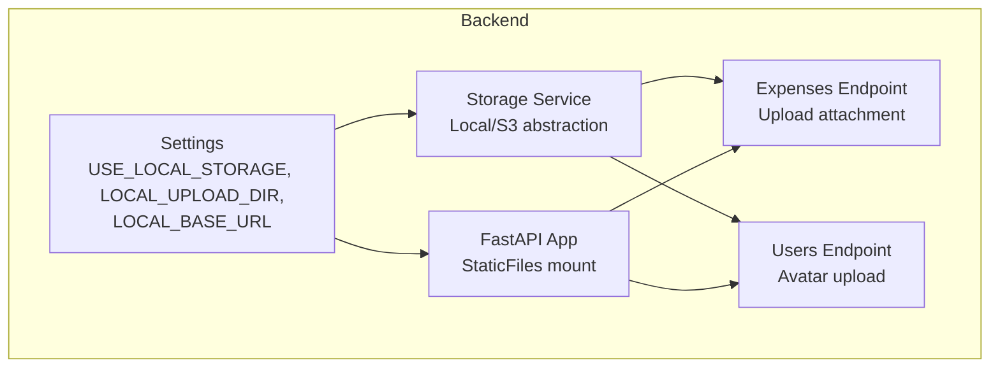
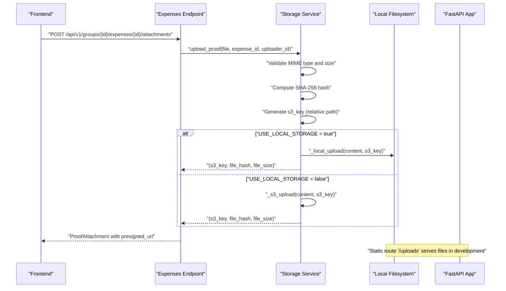
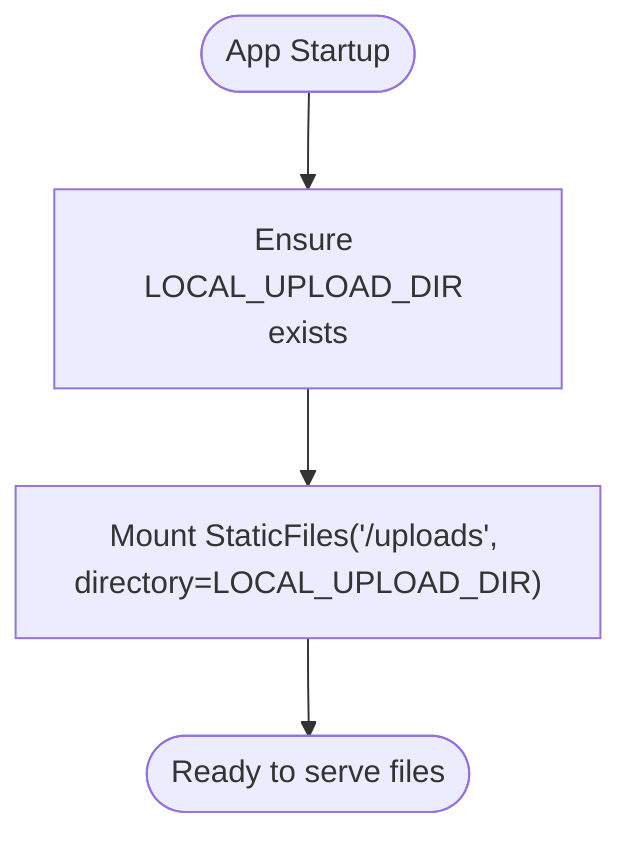
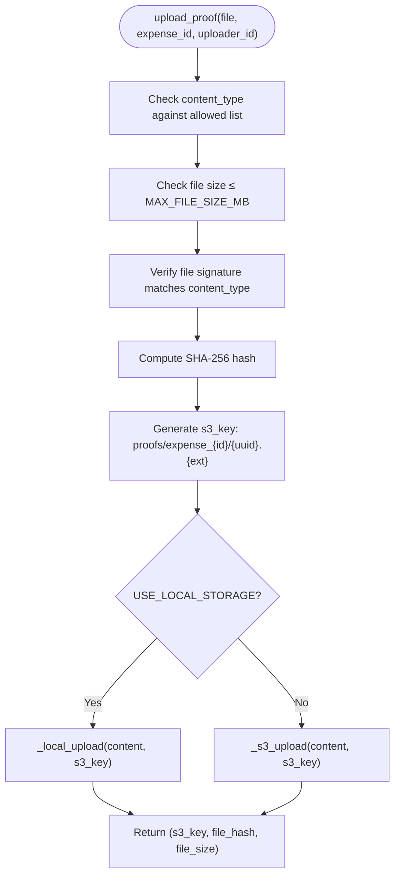
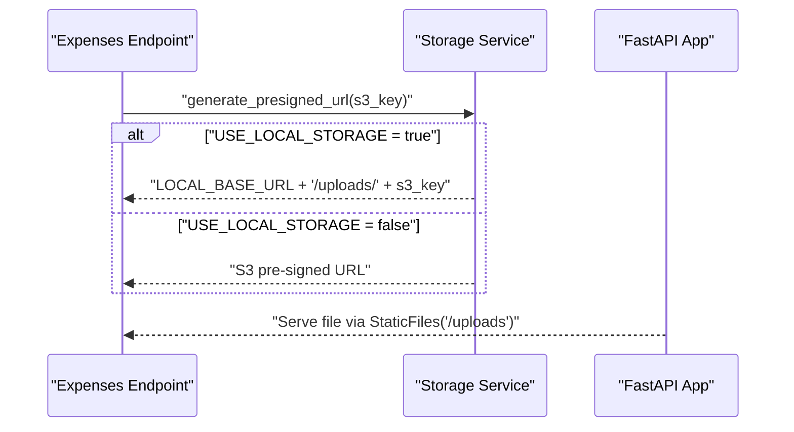
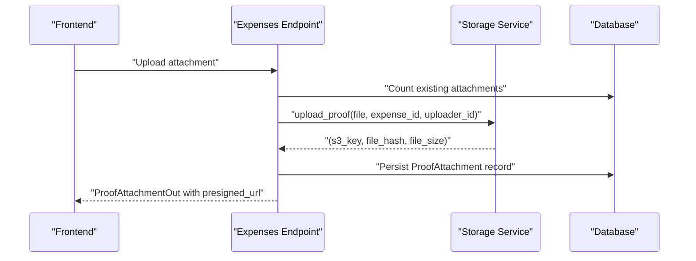
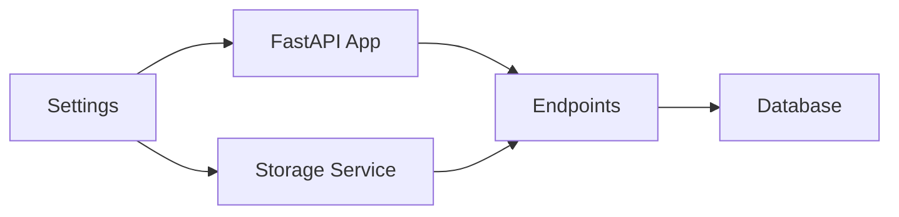

# Local Storage Configuration

<cite>
**Referenced Files in This Document**
- [config.py](file://backend/app/core/config.py)
- [main.py](file://backend/app/main.py)
- [s3_service.py](file://backend/app/services/s3_service.py)
- [expenses.py](file://backend/app/api/v1/endpoints/expenses.py)
- [users.py](file://backend/app/api/v1/endpoints/users.py)
- [README.md](file://README.md)
</cite>

## Table of Contents
1. [Introduction](#introduction)
2. [Project Structure](#project-structure)
3. [Core Components](#core-components)
4. [Architecture Overview](#architecture-overview)
5. [Detailed Component Analysis](#detailed-component-analysis)
6. [Dependency Analysis](#dependency-analysis)
7. [Performance Considerations](#performance-considerations)
8. [Troubleshooting Guide](#troubleshooting-guide)
9. [Conclusion](#conclusion)
10. [Appendices](#appendices)

## Introduction
This document explains the local storage configuration for SplitSure, focusing on the development-time file system storage implementation. It covers directory structure setup, upload path management, static file serving, configuration parameters, file upload validation and hashing, URL generation, cleanup strategies, and integration with the expense proof attachment system. It also provides troubleshooting guidance for common local storage issues.

## Project Structure
The local storage implementation spans three primary areas:
- Configuration: Centralized settings controlling local storage behavior
- Application bootstrap: Mounting static file serving for local uploads
- Services and endpoints: File upload pipeline, validation, hashing, and URL generation

**Diagram sources**
- [config.py:16-21](file://backend/app/core/config.py#L16-L21)
- [main.py:48-54](file://backend/app/main.py#L48-L54)
- [s3_service.py:105-136](file://backend/app/services/s3_service.py#L105-L136)
- [expenses.py:352-394](file://backend/app/api/v1/endpoints/expenses.py#L352-L394)
- [users.py:50-82](file://backend/app/api/v1/endpoints/users.py#L50-L82)

**Section sources**
- [config.py:16-21](file://backend/app/core/config.py#L16-L21)
- [main.py:48-54](file://backend/app/main.py#L48-L54)
- [s3_service.py:105-136](file://backend/app/services/s3_service.py#L105-L136)
- [expenses.py:352-394](file://backend/app/api/v1/endpoints/expenses.py#L352-L394)
- [users.py:50-82](file://backend/app/api/v1/endpoints/users.py#L50-L82)

## Core Components
- Settings: Defines USE_LOCAL_STORAGE, LOCAL_UPLOAD_DIR, and LOCAL_BASE_URL, plus file size limits and allowed MIME types.
- FastAPI StaticFiles: Mounts a static route for local uploads during development.
- Storage Service: Implements local file upload, hashing, URL generation, and optional deletion.
- Endpoints:
  - Expenses: Handles proof attachment uploads for expense records.
  - Users: Handles avatar uploads for user profiles.

Key responsibilities:
- Directory creation and static mounting for local development
- Content validation, MIME type checks, and file hashing
- Deterministic key generation for storage paths
- URL generation for local vs. S3 modes

**Section sources**
- [config.py:16-21](file://backend/app/core/config.py#L16-L21)
- [main.py:48-54](file://backend/app/main.py#L48-L54)
- [s3_service.py:105-136](file://backend/app/services/s3_service.py#L105-L136)
- [expenses.py:352-394](file://backend/app/api/v1/endpoints/expenses.py#L352-L394)
- [users.py:50-82](file://backend/app/api/v1/endpoints/users.py#L50-L82)

## Architecture Overview
The local storage architecture integrates configuration-driven behavior with FastAPI’s static file serving and a unified storage service interface.

**Diagram sources**
- [expenses.py:352-394](file://backend/app/api/v1/endpoints/expenses.py#L352-L394)
- [s3_service.py:105-136](file://backend/app/services/s3_service.py#L105-L136)
- [main.py:48-54](file://backend/app/main.py#L48-L54)

## Detailed Component Analysis

### Configuration Parameters
- USE_LOCAL_STORAGE: Enables local filesystem storage in development; disables S3 mode.
- LOCAL_UPLOAD_DIR: Root directory for storing uploaded files; created at startup if missing.
- LOCAL_BASE_URL: Base URL used to construct public download links for local files.

These parameters are defined centrally and consumed by the storage service and FastAPI app.

**Section sources**
- [config.py:16-21](file://backend/app/core/config.py#L16-L21)

### Directory Structure Setup and Static File Serving
- At startup, the application ensures the upload directory exists and mounts a static route for local development.
- The static route serves files under the configured upload directory at /uploads.

**Diagram sources**
- [main.py:48-54](file://backend/app/main.py#L48-L54)
- [s3_service.py:38-40](file://backend/app/services/s3_service.py#L38-L40)

**Section sources**
- [main.py:48-54](file://backend/app/main.py#L48-L54)
- [s3_service.py:38-40](file://backend/app/services/s3_service.py#L38-L40)

### File Upload Pipeline for Development
The upload pipeline validates content, computes hashes, generates deterministic keys, and writes files to disk when local storage is enabled.

**Diagram sources**
- [s3_service.py:105-136](file://backend/app/services/s3_service.py#L105-L136)
- [config.py:46-49](file://backend/app/core/config.py#L46-L49)

**Section sources**
- [s3_service.py:105-136](file://backend/app/services/s3_service.py#L105-L136)
- [config.py:46-49](file://backend/app/core/config.py#L46-L49)

### MIME Type Checking and Content Validation
- Allowed MIME types for proof attachments include JPEG, PNG, and PDF.
- A signature-based check verifies that the file’s raw bytes match the declared MIME type.
- File size is validated against a configurable maximum.

**Section sources**
- [s3_service.py:20](file://backend/app/services/s3_service.py#L20)
- [s3_service.py:23-28](file://backend/app/services/s3_service.py#L23-L28)
- [s3_service.py:114-123](file://backend/app/services/s3_service.py#L114-L123)
- [config.py:46-49](file://backend/app/core/config.py#L46-L49)

### File Hashing and Integrity
- Server-side SHA-256 hashing prevents tampering and supports integrity checks.
- Hashes are computed from the raw file content prior to upload.

**Section sources**
- [s3_service.py:126](file://backend/app/services/s3_service.py#L126)

### Local URL Generation and Static Serving
- When local storage is enabled, URLs are constructed using LOCAL_BASE_URL and the mounted /uploads route.
- The storage service returns a direct URL pointing to the static route.

**Diagram sources**
- [s3_service.py:139-147](file://backend/app/services/s3_service.py#L139-L147)
- [main.py:48-54](file://backend/app/main.py#L48-L54)

**Section sources**
- [s3_service.py:53-55](file://backend/app/services/s3_service.py#L53-L55)
- [s3_service.py:139-147](file://backend/app/services/s3_service.py#L139-L147)
- [main.py:48-54](file://backend/app/main.py#L48-L54)

### Cleanup Procedures and File Organization
- Local files persist on disk for auditability; explicit deletion is supported but not commonly used.
- Files are organized under LOCAL_UPLOAD_DIR with deterministic paths derived from s3_key.
- Avatar uploads follow a similar pattern under avatars/user_{id}.

**Section sources**
- [s3_service.py:58-62](file://backend/app/services/s3_service.py#L58-L62)
- [users.py:69-78](file://backend/app/api/v1/endpoints/users.py#L69-L78)

### Development Environment Setup
- Default configuration enables local storage for development.
- Static route mounting is conditional on USE_LOCAL_STORAGE.
- The README documents environment variables and local setup steps.

**Section sources**
- [config.py:16-21](file://backend/app/core/config.py#L16-L21)
- [main.py:48-54](file://backend/app/main.py#L48-L54)
- [README.md:71-86](file://README.md#L71-L86)

### Integration with Expense Proof Attachment System
- The expenses endpoint enforces attachment limits and delegates upload to the storage service.
- On success, it persists metadata and returns a presigned URL (or local URL in dev).

**Diagram sources**
- [expenses.py:352-394](file://backend/app/api/v1/endpoints/expenses.py#L352-L394)
- [s3_service.py:105-136](file://backend/app/services/s3_service.py#L105-L136)

**Section sources**
- [expenses.py:352-394](file://backend/app/api/v1/endpoints/expenses.py#L352-L394)

## Dependency Analysis
The local storage implementation depends on:
- Settings for configuration
- FastAPI StaticFiles for serving
- Storage service for validation, hashing, and persistence
- Endpoints for orchestrating uploads

**Diagram sources**
- [config.py:16-21](file://backend/app/core/config.py#L16-L21)
- [main.py:48-54](file://backend/app/main.py#L48-L54)
- [s3_service.py:105-136](file://backend/app/services/s3_service.py#L105-L136)
- [expenses.py:352-394](file://backend/app/api/v1/endpoints/expenses.py#L352-L394)

**Section sources**
- [config.py:16-21](file://backend/app/core/config.py#L16-L21)
- [main.py:48-54](file://backend/app/main.py#L48-L54)
- [s3_service.py:105-136](file://backend/app/services/s3_service.py#L105-L136)
- [expenses.py:352-394](file://backend/app/api/v1/endpoints/expenses.py#L352-L394)

## Performance Considerations
- Local storage avoids network latency typical of cloud storage, improving upload/download speeds in development.
- Disk I/O becomes the bottleneck; ensure sufficient disk space and appropriate permissions.
- Static file serving is efficient for small to medium-sized files; consider CDN or S3 for production-scale traffic.

## Troubleshooting Guide
Common issues and resolutions:
- Permission errors
  - Symptom: Upload fails with permission denied.
  - Resolution: Ensure the process has write permissions to LOCAL_UPLOAD_DIR and its parent directories.
  - Reference: Directory creation and write operations occur under the configured upload directory.
- Disk space limitations
  - Symptom: Uploads fail due to insufficient disk space.
  - Resolution: Monitor and manage disk usage; rotate or archive old files.
  - Reference: Files are written to disk under LOCAL_UPLOAD_DIR.
- File access problems
  - Symptom: Cannot access uploaded files via /uploads.
  - Resolution: Confirm USE_LOCAL_STORAGE is enabled and the static route is mounted; verify LOCAL_BASE_URL matches the server address.
  - Reference: Static route mounting and URL construction depend on these settings.
- MIME type mismatches
  - Symptom: Upload rejected due to unsupported or mismatched MIME type.
  - Resolution: Use JPEG, PNG, or PDF; ensure the file’s actual content matches the declared type.
  - Reference: Allowed MIME types and signature verification are enforced during upload.
- File size exceeded
  - Symptom: Upload rejected due to size limit.
  - Resolution: Reduce file size below the configured maximum.
  - Reference: Maximum file size is validated against a configurable limit.

**Section sources**
- [s3_service.py:20](file://backend/app/services/s3_service.py#L20)
- [s3_service.py:23-28](file://backend/app/services/s3_service.py#L23-L28)
- [s3_service.py:114-123](file://backend/app/services/s3_service.py#L114-L123)
- [config.py:46-49](file://backend/app/core/config.py#L46-L49)
- [main.py:48-54](file://backend/app/main.py#L48-L54)
- [s3_service.py:53-55](file://backend/app/services/s3_service.py#L53-L55)

## Conclusion
SplitSure’s local storage configuration provides a robust, development-friendly file system backend. By centralizing configuration, leveraging FastAPI’s static file serving, and implementing strict validation and hashing, the system ensures secure and reliable file handling during development. Production deployments should switch to S3 with pre-signed URLs for scalability and security.

## Appendices

### Configuration Examples
- Enable local storage and set upload directory and base URL:
  - USE_LOCAL_STORAGE=true
  - LOCAL_UPLOAD_DIR=uploads
  - LOCAL_BASE_URL=http://localhost:8000
- Reference: Settings definition and defaults.

**Section sources**
- [config.py:16-21](file://backend/app/core/config.py#L16-L21)

### Integration Notes
- Expense proof attachments:
  - Enforced attachment limits and delegated upload to the storage service.
  - Presigned/local URLs returned to clients.
- Avatars:
  - Similar flow applies with dedicated avatar paths and stricter size limits.
- Reference: Endpoints and storage service behavior.

**Section sources**
- [expenses.py:352-394](file://backend/app/api/v1/endpoints/expenses.py#L352-L394)
- [users.py:50-82](file://backend/app/api/v1/endpoints/users.py#L50-L82)
- [s3_service.py:105-136](file://backend/app/services/s3_service.py#L105-L136)