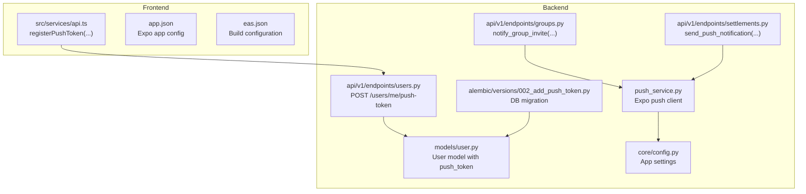
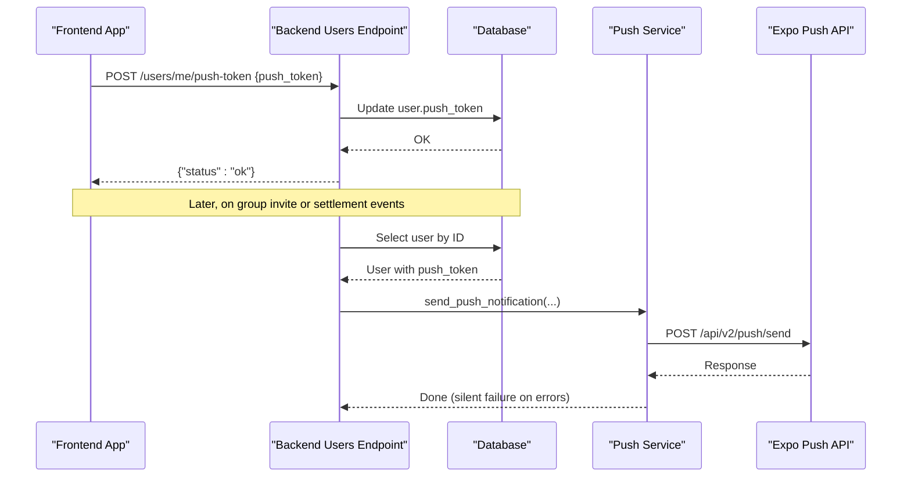
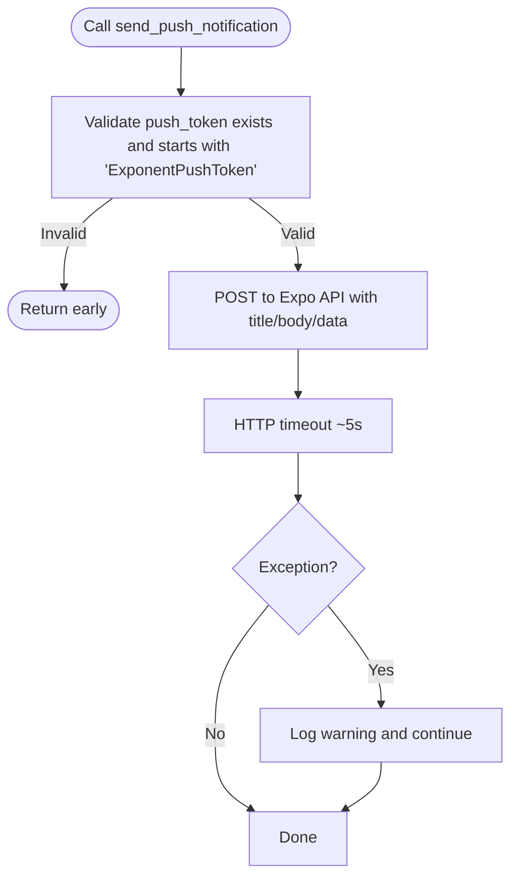
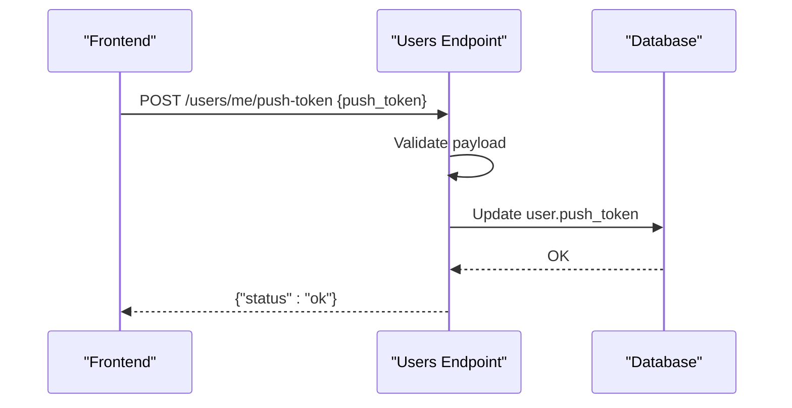
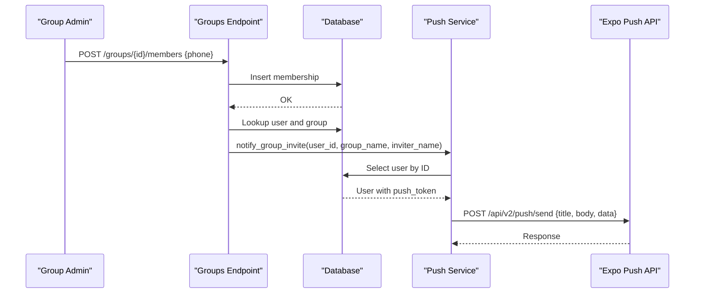
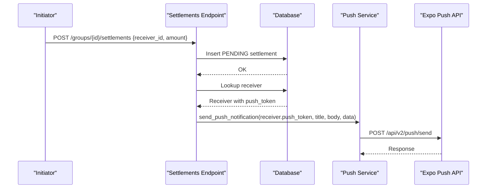
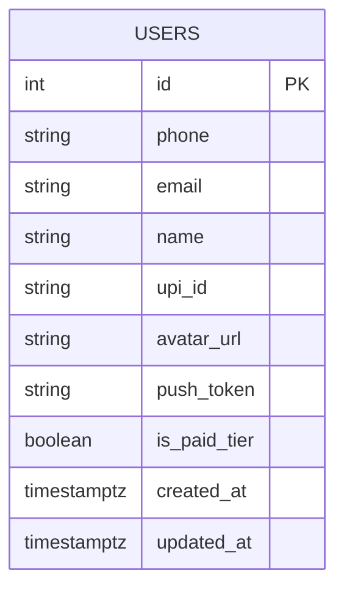
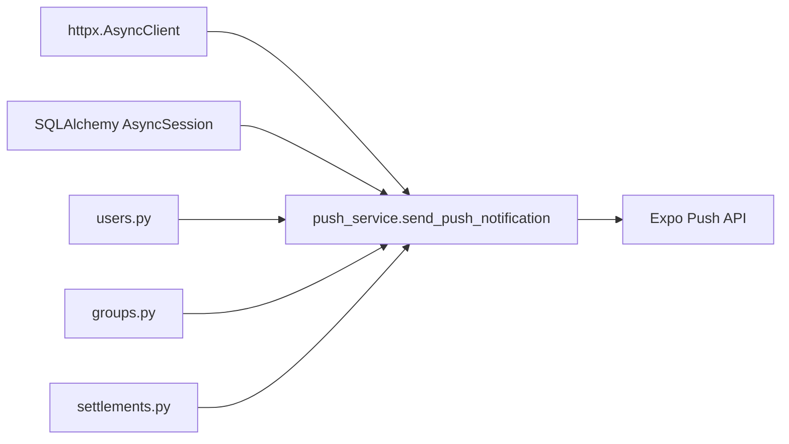

# Push Notification Service

<cite>
**Referenced Files in This Document**
- [push_service.py](file://backend/app/services/push_service.py)
- [user.py](file://backend/app/models/user.py)
- [users.py](file://backend/app/api/v1/endpoints/users.py)
- [groups.py](file://backend/app/api/v1/endpoints/groups.py)
- [settlements.py](file://backend/app/api/v1/endpoints/settlements.py)
- [002_add_push_token.py](file://backend/alembic/versions/002_add_push_token.py)
- [config.py](file://backend/app/core/config.py)
- [api.ts](file://frontend/src/services/api.ts)
- [app.json](file://frontend/app.json)
- [eas.json](file://frontend/eas.json)
</cite>

## Table of Contents
1. [Introduction](#introduction)
2. [Project Structure](#project-structure)
3. [Core Components](#core-components)
4. [Architecture Overview](#architecture-overview)
5. [Detailed Component Analysis](#detailed-component-analysis)
6. [Dependency Analysis](#dependency-analysis)
7. [Performance Considerations](#performance-considerations)
8. [Troubleshooting Guide](#troubleshooting-guide)
9. [Conclusion](#conclusion)

## Introduction
This document describes the push notification service integration with Expo in SplitSure. It covers token registration and validation, notification scheduling and delivery for expense updates, settlement alerts, and group activities, configuration of the push service, and error handling. It also documents the integration with user profiles and database storage, along with practical troubleshooting guidance for common issues such as token expiration and delivery failures.

## Project Structure
The push notification system spans backend services and endpoints, database models, and frontend API bindings. The backend exposes a dedicated endpoint for registering push tokens and integrates push notifications into group membership and settlement workflows. The frontend provides a typed API wrapper for token registration and other app features.

**Diagram sources**
- [push_service.py:16-72](file://backend/app/services/push_service.py#L16-L72)
- [user.py:51-63](file://backend/app/models/user.py#L51-L63)
- [users.py:86-99](file://backend/app/api/v1/endpoints/users.py#L86-L99)
- [groups.py:197-207](file://backend/app/api/v1/endpoints/groups.py#L197-L207)
- [settlements.py:288-298](file://backend/app/api/v1/endpoints/settlements.py#L288-L298)
- [002_add_push_token.py:17-22](file://backend/alembic/versions/002_add_push_token.py#L17-L22)
- [config.py:1-71](file://backend/app/core/config.py#L1-L71)
- [api.ts:180-181](file://frontend/src/services/api.ts#L180-L181)
- [app.json:1-32](file://frontend/app.json#L1-L32)
- [eas.json:1-25](file://frontend/eas.json#L1-L25)

**Section sources**
- [push_service.py:16-72](file://backend/app/services/push_service.py#L16-L72)
- [user.py:51-63](file://backend/app/models/user.py#L51-L63)
- [users.py:86-99](file://backend/app/api/v1/endpoints/users.py#L86-L99)
- [groups.py:197-207](file://backend/app/api/v1/endpoints/groups.py#L197-L207)
- [settlements.py:288-298](file://backend/app/api/v1/endpoints/settlements.py#L288-L298)
- [002_add_push_token.py:17-22](file://backend/alembic/versions/002_add_push_token.py#L17-L22)
- [config.py:1-71](file://backend/app/core/config.py#L1-L71)
- [api.ts:180-181](file://frontend/src/services/api.ts#L180-L181)
- [app.json:1-32](file://frontend/app.json#L1-L32)
- [eas.json:1-25](file://frontend/eas.json#L1-L25)

## Core Components
- Push client: Asynchronous HTTP client that posts to the Expo push API with a short timeout and suppresses exceptions.
- Token registration endpoint: Accepts a push token payload and stores it on the current user record.
- Notification triggers:
  - Group invites: Sends a push notification when a user is added to a group or joins via invite.
  - Settlement lifecycle: Sends notifications for initiation, confirmation, and disputes.
- Database model: User entity includes an optional push token column persisted via a migration.
- Frontend API binding: Provides a method to register the device push token with the backend.

Key implementation references:
- [send_push_notification:16-45](file://backend/app/services/push_service.py#L16-L45)
- [notify_group_invite:47-72](file://backend/app/services/push_service.py#L47-L72)
- [register_push_token:86-99](file://backend/app/api/v1/endpoints/users.py#L86-L99)
- [User.push_token:60-60](file://backend/app/models/user.py#L60-L60)
- [Alembic migration 002:17-22](file://backend/alembic/versions/002_add_push_token.py#L17-L22)
- [Frontend registerPushToken:180-181](file://frontend/src/services/api.ts#L180-L181)

**Section sources**
- [push_service.py:16-72](file://backend/app/services/push_service.py#L16-L72)
- [users.py:86-99](file://backend/app/api/v1/endpoints/users.py#L86-L99)
- [user.py:51-63](file://backend/app/models/user.py#L51-L63)
- [002_add_push_token.py:17-22](file://backend/alembic/versions/002_add_push_token.py#L17-L22)
- [api.ts:180-181](file://frontend/src/services/api.ts#L180-L181)

## Architecture Overview
The push notification flow is fire-and-forget and non-blocking. The frontend registers the device push token with the backend, which persists it on the user record. When events occur (group invite, settlement actions), the backend retrieves the user’s token and sends a push notification to the Expo API. Errors are logged but do not block the main request flow.

**Diagram sources**
- [users.py:86-99](file://backend/app/api/v1/endpoints/users.py#L86-L99)
- [push_service.py:16-45](file://backend/app/services/push_service.py#L16-L45)
- [user.py:51-63](file://backend/app/models/user.py#L51-L63)

## Detailed Component Analysis

### Push Service
The push service encapsulates all push-related logic:
- Validates token format and existence.
- Sends asynchronous HTTP requests to the Expo API with a short timeout.
- Suppresses exceptions and logs warnings for failures.
- Provides a convenience function to notify group invites.

**Diagram sources**
- [push_service.py:16-45](file://backend/app/services/push_service.py#L16-L45)

**Section sources**
- [push_service.py:16-45](file://backend/app/services/push_service.py#L16-L45)

### Token Registration and Validation
- Frontend: Calls the backend endpoint to register the device push token.
- Backend: Requires a non-empty push token and writes it to the current user’s record.
- Validation: The push service enforces a token prefix check before sending.

**Diagram sources**
- [users.py:86-99](file://backend/app/api/v1/endpoints/users.py#L86-L99)
- [api.ts:180-181](file://frontend/src/services/api.ts#L180-L181)

**Section sources**
- [users.py:86-99](file://backend/app/api/v1/endpoints/users.py#L86-L99)
- [api.ts:180-181](file://frontend/src/services/api.ts#L180-L181)

### Group Invite Notifications
- Trigger: When a user is added to a group or joins via invite, the backend attempts to notify the user.
- Delivery: Uses the push service to send a notification with a structured data payload indicating the event type and group context.

**Diagram sources**
- [groups.py:197-207](file://backend/app/api/v1/endpoints/groups.py#L197-L207)
- [push_service.py:47-72](file://backend/app/services/push_service.py#L47-L72)

**Section sources**
- [groups.py:197-207](file://backend/app/api/v1/endpoints/groups.py#L197-L207)
- [push_service.py:47-72](file://backend/app/services/push_service.py#L47-L72)

### Settlement Notifications
- Initiation: When a user initiates a settlement, the backend notifies the receiver.
- Confirmation: When the receiver confirms, the backend notifies the payer.
- Dispute: When a receiver disputes, the backend notifies group admins (excluding the disputer).

**Diagram sources**
- [settlements.py:288-298](file://backend/app/api/v1/endpoints/settlements.py#L288-L298)
- [push_service.py:16-45](file://backend/app/services/push_service.py#L16-L45)

**Section sources**
- [settlements.py:288-298](file://backend/app/api/v1/endpoints/settlements.py#L288-L298)
- [push_service.py:16-45](file://backend/app/services/push_service.py#L16-L45)

### Database Schema and Token Storage
- The User model includes an optional push token column.
- The Alembic migration adds the push_token column to the users table.

**Diagram sources**
- [user.py:51-63](file://backend/app/models/user.py#L51-L63)
- [002_add_push_token.py:17-22](file://backend/alembic/versions/002_add_push_token.py#L17-L22)

**Section sources**
- [user.py:51-63](file://backend/app/models/user.py#L51-L63)
- [002_add_push_token.py:17-22](file://backend/alembic/versions/002_add_push_token.py#L17-L22)

### Frontend Integration
- The frontend exposes a typed API method to register the push token with the backend.
- The app configuration defines the app identity and platform-specific settings.

References:
- [Frontend registerPushToken:180-181](file://frontend/src/services/api.ts#L180-L181)
- [Expo app.json:1-32](file://frontend/app.json#L1-L32)
- [Build configuration:1-25](file://frontend/eas.json#L1-L25)

**Section sources**
- [api.ts:180-181](file://frontend/src/services/api.ts#L180-L181)
- [app.json:1-32](file://frontend/app.json#L1-L32)
- [eas.json:1-25](file://frontend/eas.json#L1-L25)

## Dependency Analysis
- The push service depends on:
  - HTTPX for asynchronous HTTP requests.
  - SQLAlchemy for database access in notification triggers.
  - Logging for error reporting.
- The push service targets the Expo API endpoint for push delivery.
- The users endpoint depends on the User model and database session.
- The groups and settlements endpoints depend on the push service for notifications.

**Diagram sources**
- [push_service.py:5-45](file://backend/app/services/push_service.py#L5-L45)
- [users.py:1-14](file://backend/app/api/v1/endpoints/users.py#L1-L14)
- [groups.py:1-18](file://backend/app/api/v1/endpoints/groups.py#L1-L18)
- [settlements.py:1-28](file://backend/app/api/v1/endpoints/settlements.py#L1-L28)

**Section sources**
- [push_service.py:5-45](file://backend/app/services/push_service.py#L5-L45)
- [users.py:1-14](file://backend/app/api/v1/endpoints/users.py#L1-L14)
- [groups.py:1-18](file://backend/app/api/v1/endpoints/groups.py#L1-L18)
- [settlements.py:1-28](file://backend/app/api/v1/endpoints/settlements.py#L1-L28)

## Performance Considerations
- Non-blocking delivery: Push notifications are sent asynchronously and failures are suppressed to avoid blocking the main request flow.
- Short timeout: The HTTP client uses a short timeout to prevent slow push delivery from impacting API responsiveness.
- Minimal payload: Notifications carry essential fields (title, body, data) and rely on the client app to interpret event types.

Recommendations:
- Monitor push delivery logs for repeated failures and investigate token validity.
- Consider batching or retry policies at the client app level if persistent delivery is required.
- Ensure the Expo API endpoint and network connectivity remain stable.

[No sources needed since this section provides general guidance]

## Troubleshooting Guide

Common issues and resolutions:
- Token not registered
  - Verify the frontend called the registration endpoint and the backend returned success.
  - Confirm the user record contains a non-empty push token.
  - Reference: [users.py:86-99](file://backend/app/api/v1/endpoints/users.py#L86-L99), [user.py:51-63](file://backend/app/models/user.py#L51-L63)

- Invalid or malformed token
  - The push service validates tokens and ignores invalid ones. Ensure the token starts with the expected prefix.
  - Reference: [push_service.py:26-27](file://backend/app/services/push_service.py#L26-L27)

- Silent failures
  - Exceptions during push delivery are caught and logged as warnings. Investigate logs for underlying causes.
  - Reference: [push_service.py:43-44](file://backend/app/services/push_service.py#L43-L44)

- Delivery timeouts
  - The client uses a short timeout. Network issues or API latency may cause timeouts; retries should be handled by the client app.
  - Reference: [push_service.py:41-42](file://backend/app/services/push_service.py#L41-L42)

- Token expiration or invalidation
  - Tokens can become invalid if devices change or apps reinstall. Implement periodic re-registration in the client app.
  - Reference: [push_service.py:26-27](file://backend/app/services/push_service.py#L26-L27)

- Platform-specific considerations
  - Android and iOS have different notification behaviors. Configure platform-specific settings in the client app and review Expo documentation.
  - References: [app.json:1-32](file://frontend/app.json#L1-L32), [eas.json:1-25](file://frontend/eas.json#L1-L25)

**Section sources**
- [users.py:86-99](file://backend/app/api/v1/endpoints/users.py#L86-L99)
- [user.py:51-63](file://backend/app/models/user.py#L51-L63)
- [push_service.py:26-27](file://backend/app/services/push_service.py#L26-L27)
- [push_service.py:41-44](file://backend/app/services/push_service.py#L41-L44)
- [app.json:1-32](file://frontend/app.json#L1-L32)
- [eas.json:1-25](file://frontend/eas.json#L1-L25)

## Conclusion
SplitSure’s push notification system integrates Expo push delivery with a non-blocking, fire-and-forget design. Token registration is centralized, and notifications are triggered on key user actions such as group invites and settlement lifecycle events. The system prioritizes reliability by suppressing errors and using short timeouts, while still enabling timely user engagement. Proper client-side handling and monitoring are recommended to address delivery failures and token lifecycle concerns.