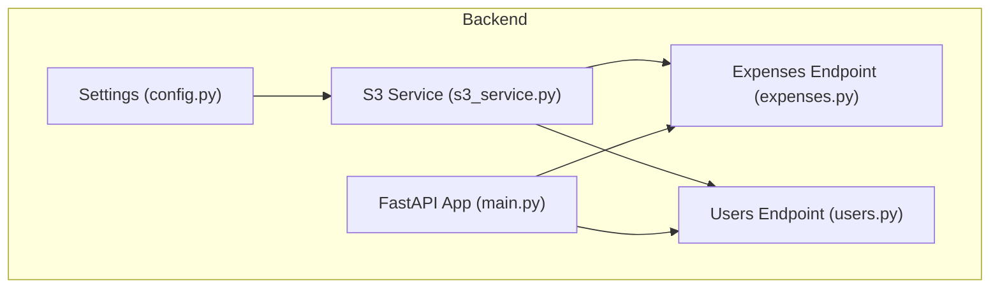
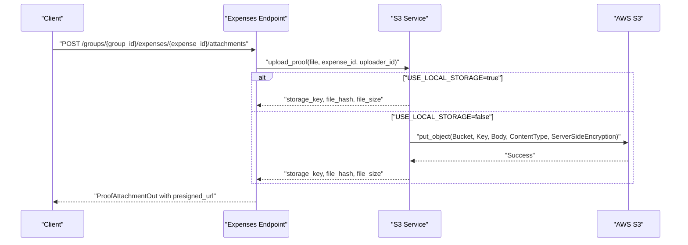
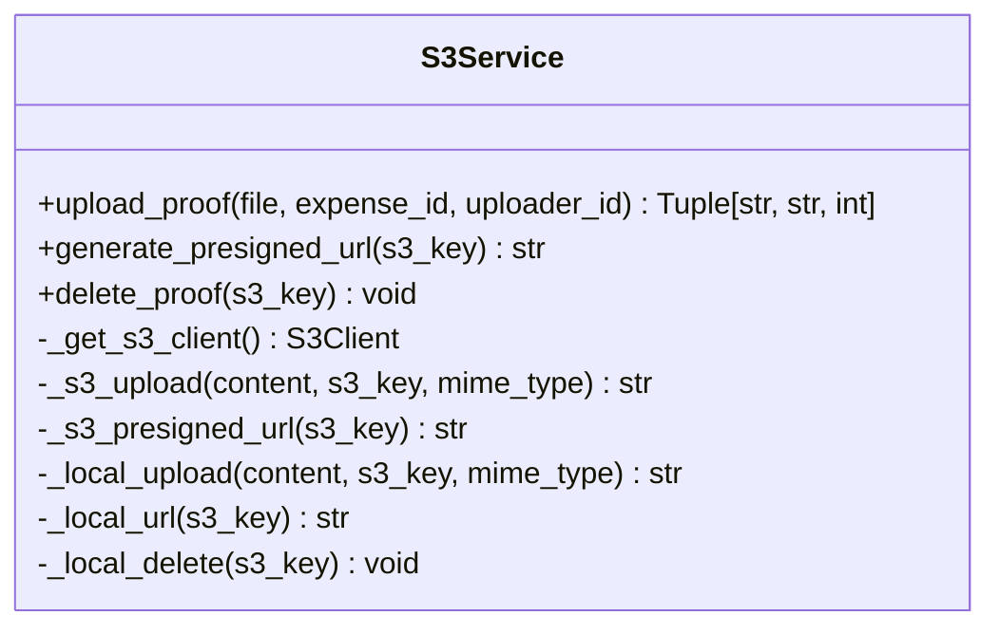
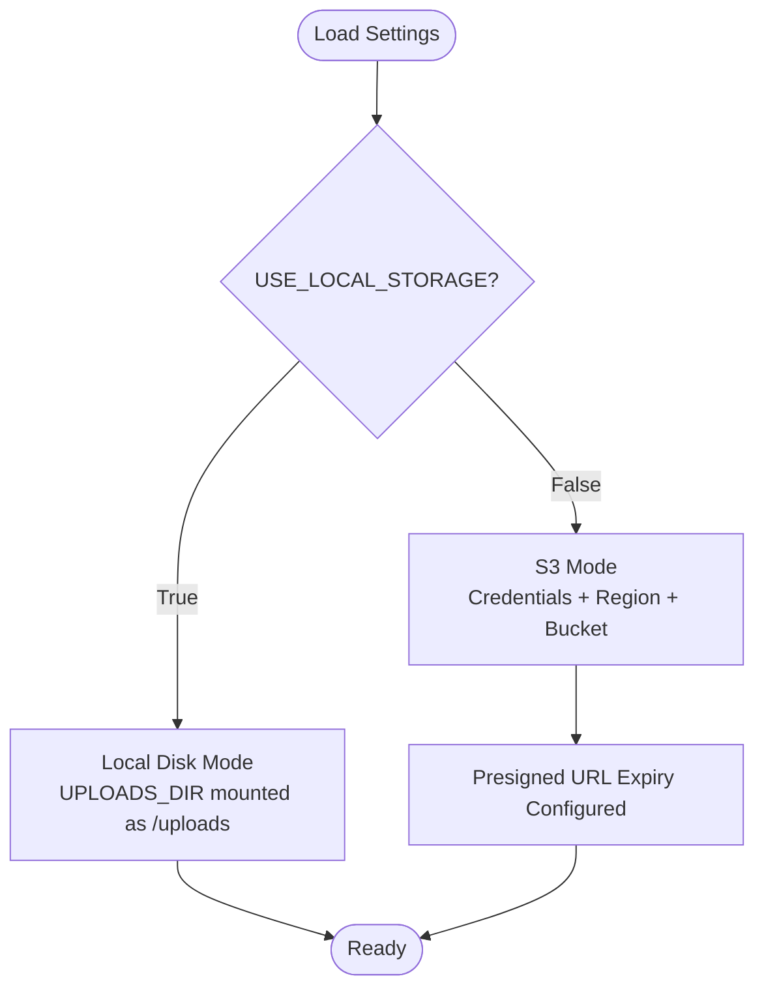
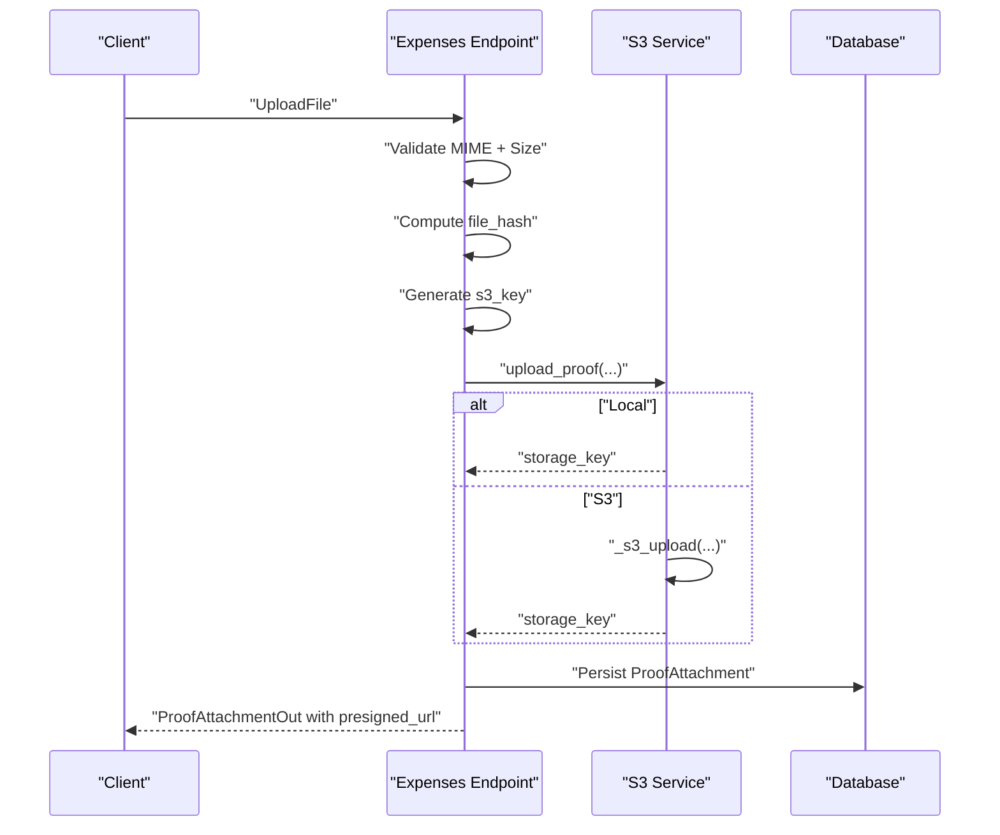
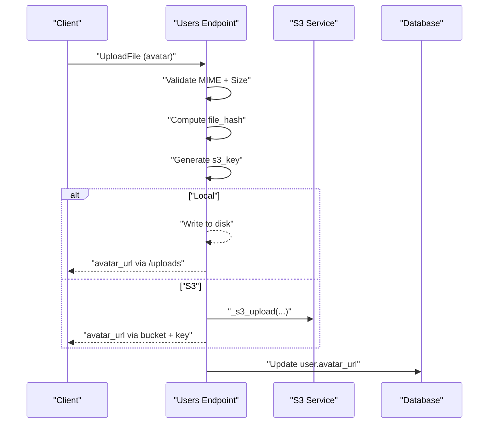
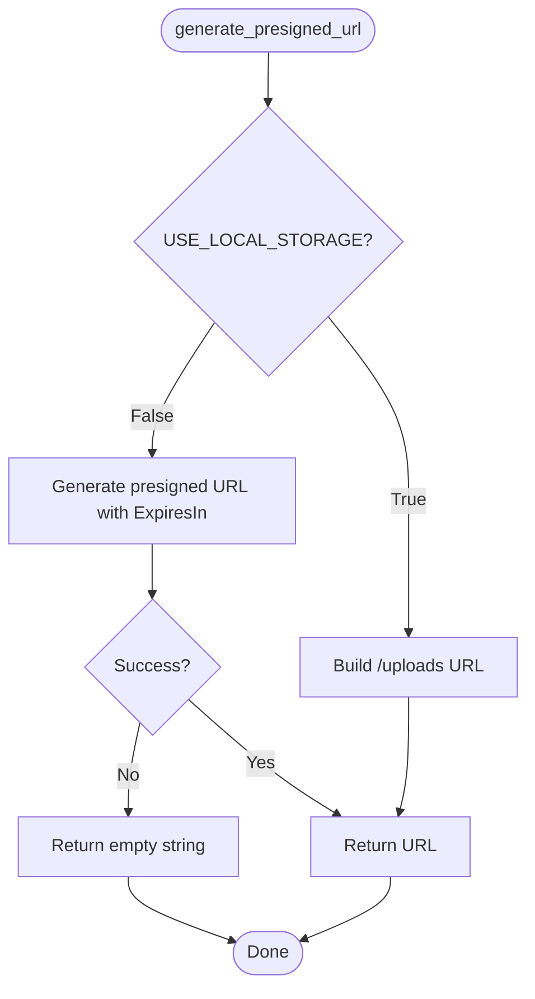
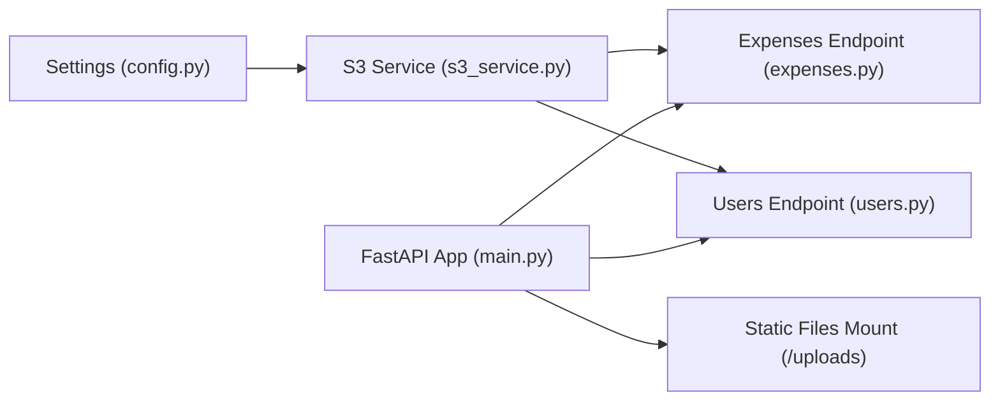

# S3 Cloud Integration

<cite>
**Referenced Files in This Document**
- [s3_service.py](file://backend/app/services/s3_service.py)
- [config.py](file://backend/app/core/config.py)
- [expenses.py](file://backend/app/api/v1/endpoints/expenses.py)
- [users.py](file://backend/app/api/v1/endpoints/users.py)
- [main.py](file://backend/app/main.py)
- [docker-compose.yml](file://docker-compose.yml)
- [README.md](file://README.md)
</cite>

## Table of Contents
1. [Introduction](#introduction)
2. [Project Structure](#project-structure)
3. [Core Components](#core-components)
4. [Architecture Overview](#architecture-overview)
5. [Detailed Component Analysis](#detailed-component-analysis)
6. [Dependency Analysis](#dependency-analysis)
7. [Performance Considerations](#performance-considerations)
8. [Troubleshooting Guide](#troubleshooting-guide)
9. [Conclusion](#conclusion)
10. [Appendices](#appendices)

## Introduction
This document describes the AWS S3 integration used by SplitSure in production. It covers client configuration, bucket setup, region configuration, presigned URL generation, upload mechanics, encryption, content-type handling, error management, access control, fallback behavior, cost optimization, and troubleshooting guidance. The system supports a seamless switch between local disk storage (development) and S3 (production) via configuration.

## Project Structure
The S3 integration spans configuration, a dedicated storage service, and API endpoints that orchestrate uploads and URL generation.

**Diagram sources**
- [config.py:6-71](file://backend/app/core/config.py#L6-L71)
- [s3_service.py:66-158](file://backend/app/services/s3_service.py#L66-L158)
- [expenses.py:18-395](file://backend/app/api/v1/endpoints/expenses.py#L18-L395)
- [users.py:51-83](file://backend/app/api/v1/endpoints/users.py#L51-L83)
- [main.py:16-96](file://backend/app/main.py#L16-L96)

**Section sources**
- [config.py:6-71](file://backend/app/core/config.py#L6-L71)
- [s3_service.py:66-158](file://backend/app/services/s3_service.py#L66-L158)
- [expenses.py:18-395](file://backend/app/api/v1/endpoints/expenses.py#L18-L395)
- [users.py:51-83](file://backend/app/api/v1/endpoints/users.py#L51-L83)
- [main.py:16-96](file://backend/app/main.py#L16-L96)

## Core Components
- Settings and configuration for AWS and local storage
- S3 service with upload, presigned URL generation, and local fallback
- API endpoints that integrate S3 for expense proofs and user avatars
- Application bootstrap that mounts local static files during development

Key responsibilities:
- Centralized configuration for AWS credentials, region, bucket, and presigned URL expiry
- Validation and hashing of uploaded content
- Server-side encryption for S3 uploads
- Presigned URL generation with configurable expiry
- Local storage fallback for development

**Section sources**
- [config.py:6-71](file://backend/app/core/config.py#L6-L71)
- [s3_service.py:66-158](file://backend/app/services/s3_service.py#L66-L158)
- [expenses.py:352-395](file://backend/app/api/v1/endpoints/expenses.py#L352-L395)
- [users.py:51-83](file://backend/app/api/v1/endpoints/users.py#L51-L83)
- [main.py:48-56](file://backend/app/main.py#L48-L56)

## Architecture Overview
The system routes uploads and URL generation through the S3 service. In production, uploads go to S3 with server-side encryption and presigned URLs are generated for temporary access. In development, uploads are saved to disk and served via a static route.

**Diagram sources**
- [expenses.py:352-395](file://backend/app/api/v1/endpoints/expenses.py#L352-L395)
- [s3_service.py:105-137](file://backend/app/services/s3_service.py#L105-L137)
- [s3_service.py:76-88](file://backend/app/services/s3_service.py#L76-L88)

**Section sources**
- [expenses.py:352-395](file://backend/app/api/v1/endpoints/expenses.py#L352-L395)
- [s3_service.py:105-137](file://backend/app/services/s3_service.py#L105-L137)
- [s3_service.py:76-88](file://backend/app/services/s3_service.py#L76-L88)

## Detailed Component Analysis

### S3 Service
The S3 service encapsulates:
- Client initialization with AWS credentials and region
- Upload with server-side encryption (AES256)
- Presigned URL generation with configurable expiry
- Local storage fallback for development
- Content validation and hashing

**Diagram sources**
- [s3_service.py:66-158](file://backend/app/services/s3_service.py#L66-L158)

Implementation highlights:
- Credentials and region are read from settings for client construction.
- Upload sets ContentType and ServerSideEncryption to AES256.
- Presigned URL expiry is configurable via settings.
- Local mode writes files to disk and serves them via a static route.

**Section sources**
- [s3_service.py:66-158](file://backend/app/services/s3_service.py#L66-L158)
- [config.py:23-28](file://backend/app/core/config.py#L23-L28)

### Configuration and Environment
Settings define AWS and local storage behavior:
- AWS_ACCESS_KEY_ID, AWS_SECRET_ACCESS_KEY, AWS_REGION, S3_BUCKET_NAME
- S3_PRESIGNED_URL_EXPIRY
- USE_LOCAL_STORAGE, LOCAL_UPLOAD_DIR, LOCAL_BASE_URL

**Diagram sources**
- [config.py:16-28](file://backend/app/core/config.py#L16-L28)
- [main.py:48-56](file://backend/app/main.py#L48-L56)

**Section sources**
- [config.py:16-28](file://backend/app/core/config.py#L16-L28)
- [main.py:48-56](file://backend/app/main.py#L48-L56)

### Expense Attachments Workflow
The expenses endpoint integrates S3 for proof attachments:
- Validates allowed MIME types and file size
- Computes a file hash for integrity
- Generates a unique S3 key under a structured path
- Calls the S3 service to upload or save locally
- Attaches a presigned URL for retrieval

**Diagram sources**
- [expenses.py:352-395](file://backend/app/api/v1/endpoints/expenses.py#L352-L395)
- [s3_service.py:105-137](file://backend/app/services/s3_service.py#L105-L137)

**Section sources**
- [expenses.py:352-395](file://backend/app/api/v1/endpoints/expenses.py#L352-L395)
- [s3_service.py:105-137](file://backend/app/services/s3_service.py#L105-L137)

### User Avatar Upload
The users endpoint handles avatar uploads:
- Validates allowed image types and size
- Computes a file hash and constructs a key
- Saves locally or uploads to S3
- Builds a direct URL or a presigned URL depending on mode

**Diagram sources**
- [users.py:51-83](file://backend/app/api/v1/endpoints/users.py#L51-L83)
- [s3_service.py:76-88](file://backend/app/services/s3_service.py#L76-L88)

**Section sources**
- [users.py:51-83](file://backend/app/api/v1/endpoints/users.py#L51-L83)
- [s3_service.py:76-88](file://backend/app/services/s3_service.py#L76-L88)

### Presigned URL Generation
Presigned URLs are generated for temporary access to S3 objects:
- Uses the configured bucket and expiry
- Returns an empty string on client errors (fallback behavior)

**Diagram sources**
- [s3_service.py:139-148](file://backend/app/services/s3_service.py#L139-L148)
- [s3_service.py:91-101](file://backend/app/services/s3_service.py#L91-L101)

**Section sources**
- [s3_service.py:139-148](file://backend/app/services/s3_service.py#L139-L148)
- [s3_service.py:91-101](file://backend/app/services/s3_service.py#L91-L101)

## Dependency Analysis
- The S3 service depends on settings for credentials, region, bucket, and expiry.
- API endpoints depend on the S3 service for uploads and URL generation.
- The application mounts a static directory for local development when enabled.

**Diagram sources**
- [config.py:6-71](file://backend/app/core/config.py#L6-L71)
- [s3_service.py:66-158](file://backend/app/services/s3_service.py#L66-L158)
- [expenses.py:18-395](file://backend/app/api/v1/endpoints/expenses.py#L18-L395)
- [users.py:51-83](file://backend/app/api/v1/endpoints/users.py#L51-L83)
- [main.py:48-56](file://backend/app/main.py#L48-L56)

**Section sources**
- [config.py:6-71](file://backend/app/core/config.py#L6-L71)
- [s3_service.py:66-158](file://backend/app/services/s3_service.py#L66-L158)
- [expenses.py:18-395](file://backend/app/api/v1/endpoints/expenses.py#L18-L395)
- [users.py:51-83](file://backend/app/api/v1/endpoints/users.py#L51-L83)
- [main.py:48-56](file://backend/app/main.py#L48-L56)

## Performance Considerations
- Upload size limits reduce memory pressure and improve reliability.
- Server-side encryption is applied at upload time; consider compression for large images to reduce transfer time.
- Presigned URL expiry should balance convenience and security; shorter expirations reduce exposure windows.
- Local development mode avoids network overhead but stores files on disk; ensure adequate disk space and persistence.

[No sources needed since this section provides general guidance]

## Troubleshooting Guide
Common issues and resolutions:
- Authentication failures
  - Verify AWS credentials and region are set when using S3.
  - Confirm environment variables are correctly passed to the service.
- Network connectivity problems
  - Check outbound access to S3 endpoints from the deployment environment.
  - Validate DNS resolution and firewall rules.
- Bucket permission errors
  - Ensure the IAM principal has permissions to put objects and generate presigned URLs.
  - Confirm bucket policies allow access from the principal.
- Upload failures
  - Review S3 upload error handling; the service raises HTTP 500 on client errors.
  - Validate allowed MIME types and file size limits.
- Presigned URL failures
  - If presigned URL generation fails, the service returns an empty string; handle gracefully in clients.

**Section sources**
- [s3_service.py:76-88](file://backend/app/services/s3_service.py#L76-L88)
- [s3_service.py:91-101](file://backend/app/services/s3_service.py#L91-L101)
- [README.md:71-86](file://README.md#L71-L86)

## Conclusion
SplitSure’s S3 integration provides a secure, scalable, and configurable solution for storing and retrieving user-uploaded proofs and avatars. By centralizing configuration, validating content, encrypting data at rest, and generating time-limited access URLs, the system balances usability, security, and cost-effectiveness. The same configuration enables a smooth transition from local development to production-grade S3.

[No sources needed since this section summarizes without analyzing specific files]

## Appendices

### Configuration Examples
- Development (local storage)
  - Set USE_LOCAL_STORAGE=true and configure LOCAL_UPLOAD_DIR and LOCAL_BASE_URL.
  - Static route /uploads serves files during development.
- Production (S3)
  - Set USE_LOCAL_STORAGE=false and provide AWS_ACCESS_KEY_ID, AWS_SECRET_ACCESS_KEY, AWS_REGION, S3_BUCKET_NAME.
  - Presigned URLs expire after S3_PRESIGNED_URL_EXPIRY seconds.

**Section sources**
- [config.py:16-28](file://backend/app/core/config.py#L16-L28)
- [main.py:48-56](file://backend/app/main.py#L48-L56)
- [docker-compose.yml:46-56](file://docker-compose.yml#L46-L56)

### Security and Access Control
- Server-side encryption: AES256 is applied on upload.
- Presigned URLs: Limit exposure with short expiry.
- Audit and retention: Files are retained per audit policy; soft-deletion is default.

**Section sources**
- [s3_service.py:76-88](file://backend/app/services/s3_service.py#L76-L88)
- [s3_service.py:150-158](file://backend/app/services/s3_service.py#L150-L158)

### Cost Optimization
- Storage class selection: Choose appropriate S3 storage classes based on access patterns.
- Lifecycle policies: Transition infrequent objects to cheaper tiers and apply expiration rules aligned with audit requirements.

[No sources needed since this section provides general guidance]