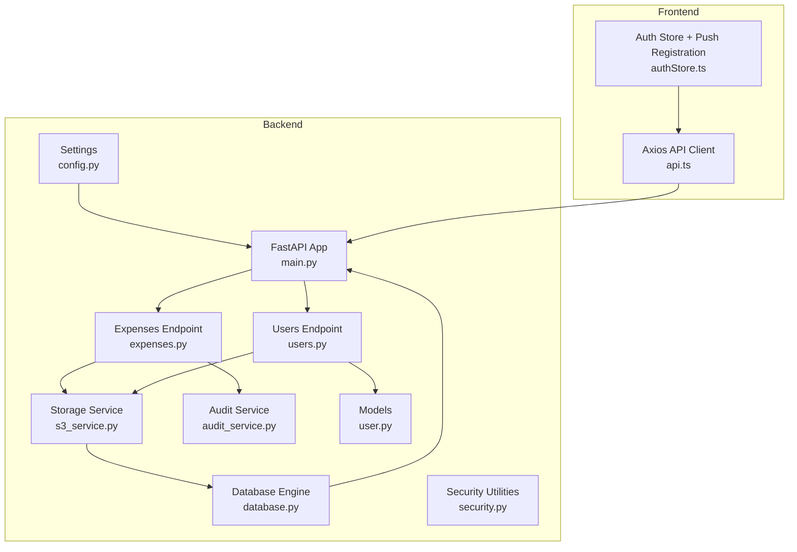
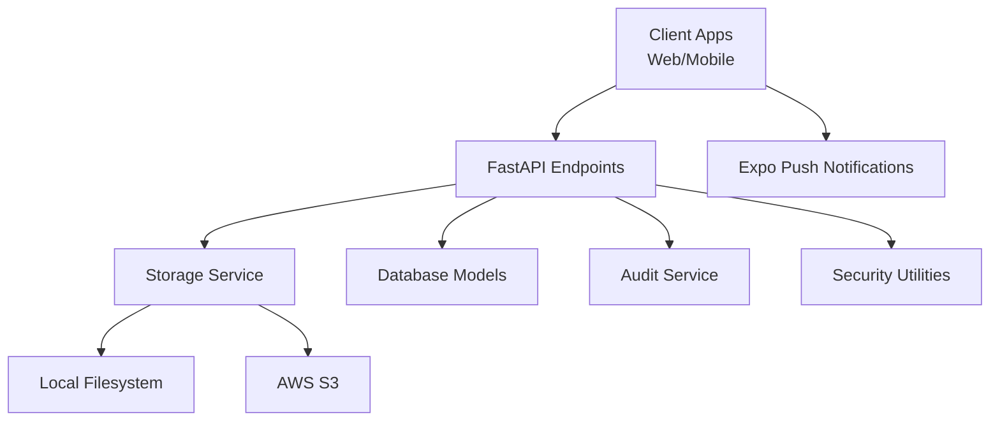
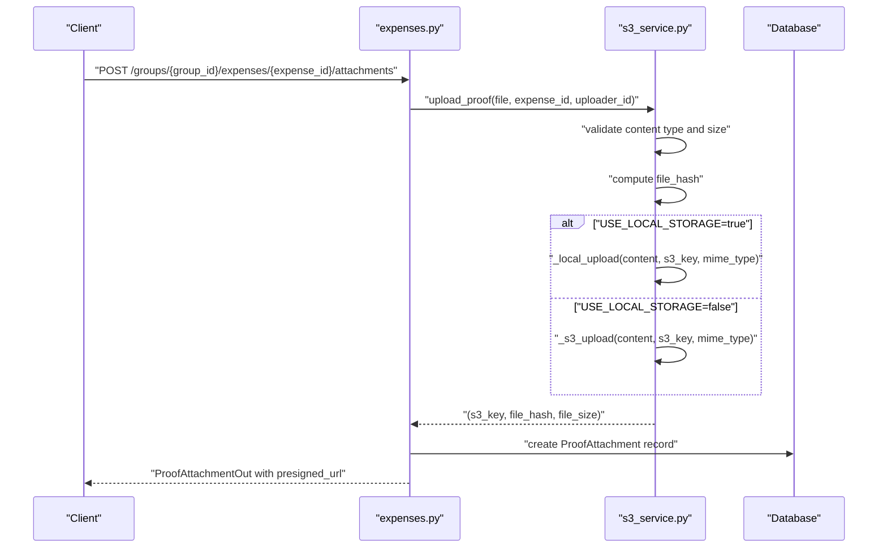
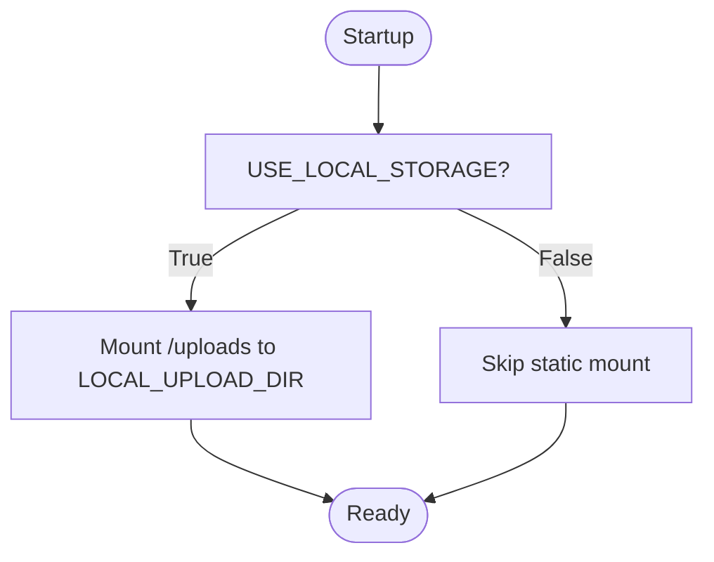
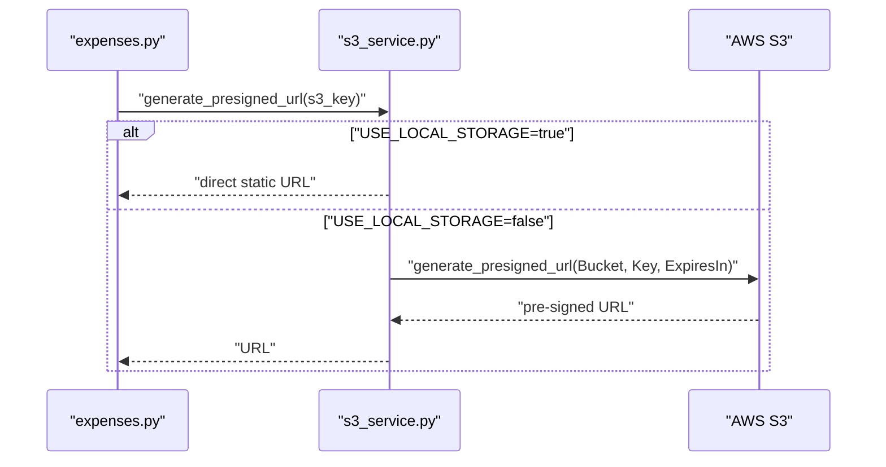
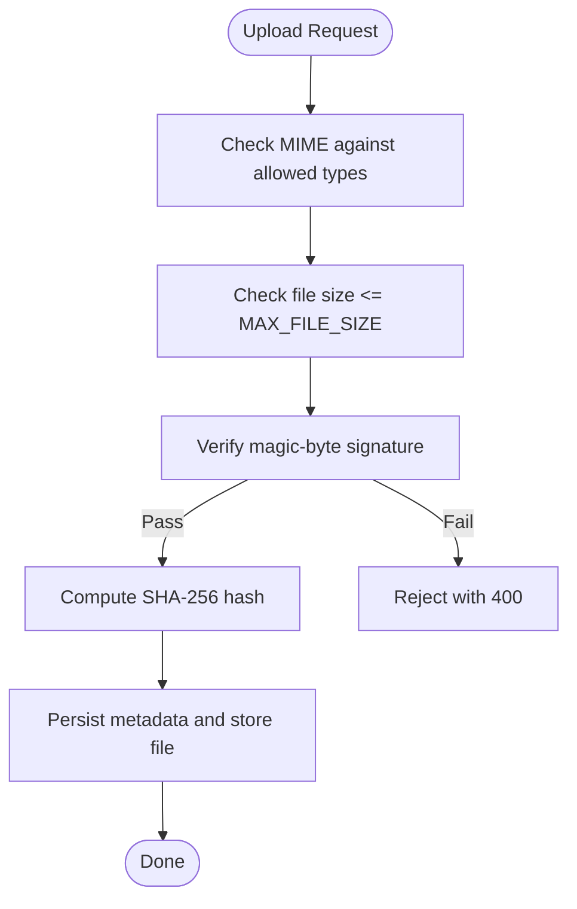
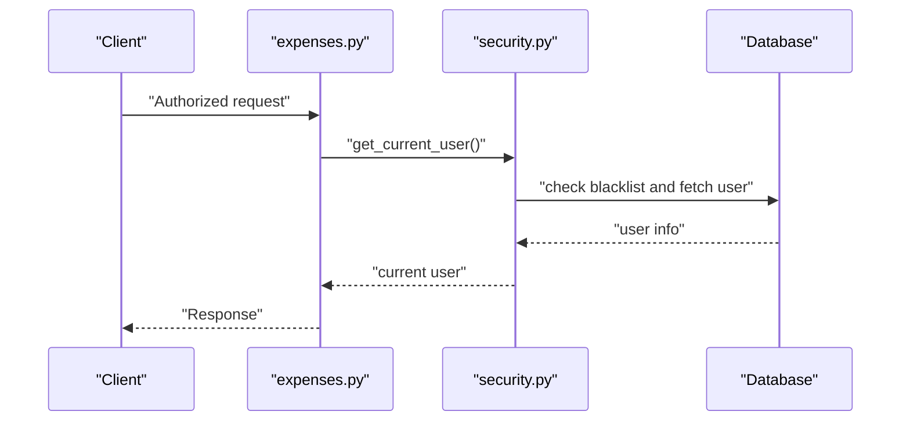
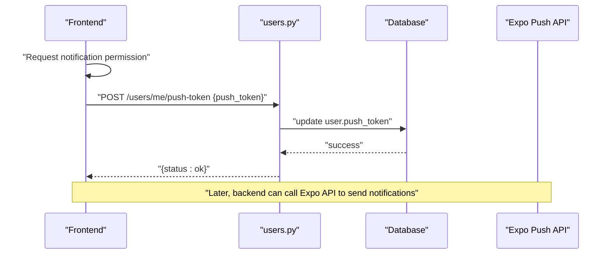
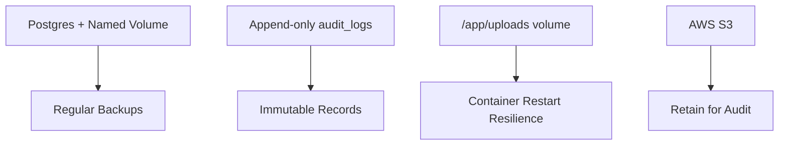
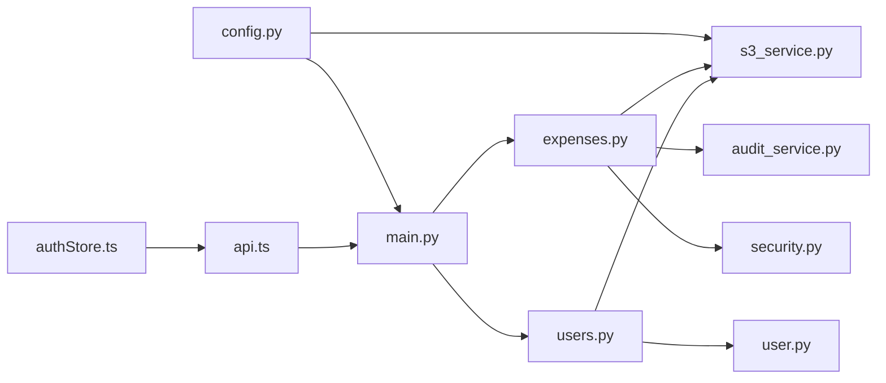

# Storage and File Management

<cite>
**Referenced Files in This Document**
- [config.py](file://backend/app/core/config.py)
- [database.py](file://backend/app/core/database.py)
- [main.py](file://backend/app/main.py)
- [s3_service.py](file://backend/app/services/s3_service.py)
- [expenses.py](file://backend/app/api/v1/endpoints/expenses.py)
- [users.py](file://backend/app/api/v1/endpoints/users.py)
- [user.py](file://backend/app/models/user.py)
- [audit_service.py](file://backend/app/services/audit_service.py)
- [security.py](file://backend/app/core/security.py)
- [requirements.txt](file://backend/requirements.txt)
- [Dockerfile](file://backend/Dockerfile)
- [docker-compose.yml](file://docker-compose.yml)
- [api.ts](file://frontend/src/services/api.ts)
- [authStore.ts](file://frontend/src/store/authStore.ts)
</cite>

## Table of Contents
1. [Introduction](#introduction)
2. [Project Structure](#project-structure)
3. [Core Components](#core-components)
4. [Architecture Overview](#architecture-overview)
5. [Detailed Component Analysis](#detailed-component-analysis)
6. [Dependency Analysis](#dependency-analysis)
7. [Performance Considerations](#performance-considerations)
8. [Troubleshooting Guide](#troubleshooting-guide)
9. [Conclusion](#conclusion)
10. [Appendices](#appendices)

## Introduction
This document explains the SplitSure storage and file management system, focusing on local and cloud storage integration, file upload handling, validation and sanitization, access control, cleanup procedures, S3 integration with AWS SDK, presigned URL generation, error handling and retry strategies, security measures, push notification service integration with Expo, storage abstraction patterns, backup and recovery, data retention and archival strategies, performance optimization, CDN integration, and troubleshooting guidance.

## Project Structure
The storage and file management system spans backend services and models, FastAPI endpoints, configuration, and optional frontend integration for push notifications.

**Diagram sources**
- [config.py:1-71](file://backend/app/core/config.py#L1-L71)
- [database.py:1-29](file://backend/app/core/database.py#L1-L29)
- [main.py:1-96](file://backend/app/main.py#L1-L96)
- [s3_service.py:1-158](file://backend/app/services/s3_service.py#L1-L158)
- [expenses.py:1-395](file://backend/app/api/v1/endpoints/expenses.py#L1-L395)
- [users.py:1-99](file://backend/app/api/v1/endpoints/users.py#L1-L99)
- [audit_service.py:1-32](file://backend/app/services/audit_service.py#L1-L32)
- [security.py:1-96](file://backend/app/core/security.py#L1-L96)
- [user.py:1-234](file://backend/app/models/user.py#L1-L234)
- [api.ts:1-269](file://frontend/src/services/api.ts#L1-L269)
- [authStore.ts:1-116](file://frontend/src/store/authStore.ts#L1-L116)

**Section sources**
- [config.py:1-71](file://backend/app/core/config.py#L1-L71)
- [database.py:1-29](file://backend/app/core/database.py#L1-L29)
- [main.py:1-96](file://backend/app/main.py#L1-L96)
- [s3_service.py:1-158](file://backend/app/services/s3_service.py#L1-L158)
- [expenses.py:1-395](file://backend/app/api/v1/endpoints/expenses.py#L1-L395)
- [users.py:1-99](file://backend/app/api/v1/endpoints/users.py#L1-L99)
- [audit_service.py:1-32](file://backend/app/services/audit_service.py#L1-L32)
- [security.py:1-96](file://backend/app/core/security.py#L1-L96)
- [user.py:1-234](file://backend/app/models/user.py#L1-L234)
- [api.ts:1-269](file://frontend/src/services/api.ts#L1-L269)
- [authStore.ts:1-116](file://frontend/src/store/authStore.ts#L1-L116)

## Core Components
- Settings and configuration for local/cloud storage, limits, and CORS.
- Storage abstraction service that supports local filesystem and AWS S3.
- FastAPI endpoints for uploading proof attachments and avatars.
- Database models for storing metadata about uploaded files.
- Audit logging for immutable records.
- Security utilities for tokens and blacklisting.
- Frontend API client and push notification registration via Expo.

**Section sources**
- [config.py:1-71](file://backend/app/core/config.py#L1-L71)
- [s3_service.py:1-158](file://backend/app/services/s3_service.py#L1-L158)
- [expenses.py:352-395](file://backend/app/api/v1/endpoints/expenses.py#L352-L395)
- [users.py:50-82](file://backend/app/api/v1/endpoints/users.py#L50-L82)
- [user.py:202-218](file://backend/app/models/user.py#L202-L218)
- [audit_service.py:6-31](file://backend/app/services/audit_service.py#L6-L31)
- [security.py:72-96](file://backend/app/core/security.py#L72-L96)
- [api.ts:176-182](file://frontend/src/services/api.ts#L176-L182)
- [authStore.ts:87-110](file://frontend/src/store/authStore.ts#L87-L110)

## Architecture Overview
The system provides a unified storage interface that switches between local filesystem and AWS S3 based on configuration. Uploads compute a server-side hash, enforce content-type and size checks, and persist metadata to the database. Access URLs are generated either as direct static paths (local) or time-limited presigned URLs (S3). Audit logs capture immutable events for compliance.

**Diagram sources**
- [expenses.py:352-395](file://backend/app/api/v1/endpoints/expenses.py#L352-L395)
- [users.py:50-82](file://backend/app/api/v1/endpoints/users.py#L50-L82)
- [s3_service.py:105-158](file://backend/app/services/s3_service.py#L105-L158)
- [user.py:202-218](file://backend/app/models/user.py#L202-L218)
- [audit_service.py:6-31](file://backend/app/services/audit_service.py#L6-L31)
- [security.py:72-96](file://backend/app/core/security.py#L72-L96)
- [api.ts:176-182](file://frontend/src/services/api.ts#L176-L182)
- [authStore.ts:87-110](file://frontend/src/store/authStore.ts#L87-L110)

## Detailed Component Analysis

### Storage Abstraction and File Upload Pipeline
The storage abstraction encapsulates local and S3 operations behind a single API. It validates content type via magic-byte checks, enforces size limits, computes a server-side hash, constructs a stable S3 key, and returns both the key and file metadata.

**Diagram sources**
- [expenses.py:352-395](file://backend/app/api/v1/endpoints/expenses.py#L352-L395)
- [s3_service.py:105-137](file://backend/app/services/s3_service.py#L105-L137)

**Section sources**
- [s3_service.py:105-137](file://backend/app/services/s3_service.py#L105-L137)
- [expenses.py:352-395](file://backend/app/api/v1/endpoints/expenses.py#L352-L395)
- [user.py:202-218](file://backend/app/models/user.py#L202-L218)

### Local Storage Configuration and Cleanup
- Local storage is enabled by default for development.
- Uploaded files are stored under a configurable directory and served via a static route mounted at runtime.
- Cleanup procedures for development include removing the uploads directory or the named volume to reset state.

**Diagram sources**
- [main.py:51-54](file://backend/app/main.py#L51-L54)
- [config.py:16-21](file://backend/app/core/config.py#L16-L21)

**Section sources**
- [main.py:51-54](file://backend/app/main.py#L51-L54)
- [config.py:16-21](file://backend/app/core/config.py#L16-L21)
- [docker-compose.yml:76-77](file://docker-compose.yml#L76-L77)

### S3 Integration with AWS SDK
- S3 client is created using configured credentials and region.
- Files are uploaded with server-side encryption.
- Presigned URLs are generated with configurable expiry.
- Error handling maps AWS client errors to HTTP exceptions.

**Diagram sources**
- [expenses.py:98-105](file://backend/app/api/v1/endpoints/expenses.py#L98-L105)
- [s3_service.py:139-147](file://backend/app/services/s3_service.py#L139-L147)
- [s3_service.py:91-101](file://backend/app/services/s3_service.py#L91-L101)

**Section sources**
- [s3_service.py:66-101](file://backend/app/services/s3_service.py#L66-L101)
- [config.py:23-28](file://backend/app/core/config.py#L23-L28)

### Validation, Sanitization, and Security Measures
- Content type validation uses magic-byte signatures to ensure file integrity.
- Size limits enforced via configuration.
- Server-side hashing prevents tampering and supports integrity checks.
- Access control relies on JWT bearer tokens and membership checks.
- Security headers middleware enhances transport and browser security.
- Audit logs are append-only to preserve immutability.

**Diagram sources**
- [s3_service.py:114-123](file://backend/app/services/s3_service.py#L114-L123)
- [config.py:46-51](file://backend/app/core/config.py#L46-L51)

**Section sources**
- [s3_service.py:114-123](file://backend/app/services/s3_service.py#L114-L123)
- [config.py:20-28](file://backend/app/core/config.py#L20-L28)
- [main.py:25-34](file://backend/app/main.py#L25-L34)
- [audit_service.py:6-31](file://backend/app/services/audit_service.py#L6-L31)

### Access Control and Token Management
- Authentication uses bearer tokens validated by the security utilities.
- Refresh tokens are supported; expired or invalid tokens are rejected.
- Blacklisted tokens are tracked to prevent reuse after revocation.
- Membership checks ensure users can only access group-related resources.

**Diagram sources**
- [expenses.py:23-32](file://backend/app/api/v1/endpoints/expenses.py#L23-L32)
- [security.py:72-96](file://backend/app/core/security.py#L72-L96)

**Section sources**
- [security.py:72-96](file://backend/app/core/security.py#L72-L96)
- [expenses.py:23-32](file://backend/app/api/v1/endpoints/expenses.py#L23-L32)

### Push Notification Service Integration with Expo
- The frontend registers push tokens after successful login.
- The backend endpoint stores the token on the user record.
- Push notifications are sent via Expo’s API asynchronously and non-blockingly.

**Diagram sources**
- [users.py:85-99](file://backend/app/api/v1/endpoints/users.py#L85-L99)
- [authStore.ts:87-110](file://frontend/src/store/authStore.ts#L87-L110)
- [push_service.py:14-43](file://backend/app/services/push_service.py#L14-L43)

**Section sources**
- [users.py:85-99](file://backend/app/api/v1/endpoints/users.py#L85-L99)
- [authStore.ts:87-110](file://frontend/src/store/authStore.ts#L87-L110)
- [push_service.py:14-43](file://backend/app/services/push_service.py#L14-L43)

### Backup and Recovery, Data Retention, and Archival Strategies
- Database backups rely on external Postgres tooling and persistent volumes.
- Audit logs are append-only to support immutable history.
- Local storage files persist in a named volume for continuity across container restarts.
- S3 retains files per audit policy; explicit hard deletion is not performed by the service.

**Diagram sources**
- [docker-compose.yml:79-82](file://docker-compose.yml#L79-L82)
- [audit_service.py:6-31](file://backend/app/services/audit_service.py#L6-L31)
- [s3_service.py:150-158](file://backend/app/services/s3_service.py#L150-L158)

**Section sources**
- [docker-compose.yml:79-82](file://docker-compose.yml#L79-L82)
- [audit_service.py:6-31](file://backend/app/services/audit_service.py#L6-L31)
- [s3_service.py:150-158](file://backend/app/services/s3_service.py#L150-L158)

## Dependency Analysis
- The storage service depends on configuration for provider selection and limits.
- Endpoints depend on the storage service and database models.
- Audit service depends on database models and is invoked by endpoints.
- Security utilities depend on database models and JWT configuration.
- Frontend depends on API client and Expo SDK for push registration.

**Diagram sources**
- [config.py:1-71](file://backend/app/core/config.py#L1-L71)
- [main.py:1-96](file://backend/app/main.py#L1-L96)
- [s3_service.py:1-158](file://backend/app/services/s3_service.py#L1-L158)
- [expenses.py:1-395](file://backend/app/api/v1/endpoints/expenses.py#L1-L395)
- [users.py:1-99](file://backend/app/api/v1/endpoints/users.py#L1-L99)
- [audit_service.py:1-32](file://backend/app/services/audit_service.py#L1-L32)
- [security.py:1-96](file://backend/app/core/security.py#L1-L96)
- [user.py:1-234](file://backend/app/models/user.py#L1-L234)
- [api.ts:1-269](file://frontend/src/services/api.ts#L1-L269)
- [authStore.ts:1-116](file://frontend/src/store/authStore.ts#L1-L116)

**Section sources**
- [config.py:1-71](file://backend/app/core/config.py#L1-L71)
- [main.py:1-96](file://backend/app/main.py#L1-L96)
- [s3_service.py:1-158](file://backend/app/services/s3_service.py#L1-L158)
- [expenses.py:1-395](file://backend/app/api/v1/endpoints/expenses.py#L1-L395)
- [users.py:1-99](file://backend/app/api/v1/endpoints/users.py#L1-L99)
- [audit_service.py:1-32](file://backend/app/services/audit_service.py#L1-L32)
- [security.py:1-96](file://backend/app/core/security.py#L1-L96)
- [user.py:1-234](file://backend/app/models/user.py#L1-L234)
- [api.ts:1-269](file://frontend/src/services/api.ts#L1-L269)
- [authStore.ts:1-116](file://frontend/src/store/authStore.ts#L1-L116)

## Performance Considerations
- Use presigned URLs for S3 to offload traffic from the API server.
- Tune database connection pooling and consider read replicas for reporting-heavy workloads.
- Enable CDN in front of S3 for global distribution and reduced latency.
- Compress images and enforce maximum dimensions to reduce bandwidth.
- Cache frequently accessed metadata and leverage database indexes for audit queries.

[No sources needed since this section provides general guidance]

## Troubleshooting Guide
- Local storage not serving files:
  - Verify static mount is active when local storage is enabled.
  - Confirm the uploads directory exists and is writable.
- S3 upload failures:
  - Check AWS credentials and bucket permissions.
  - Validate region and bucket name configuration.
  - Inspect client errors and adjust retry logic.
- File validation errors:
  - Ensure declared content type matches magic-byte signature.
  - Confirm file size does not exceed configured limit.
- Token and access issues:
  - Validate JWT secret and algorithm.
  - Check blacklist entries and expiration.
- Push notifications:
  - Ensure push token registration succeeds and device permissions are granted.
  - Confirm Expo API availability and rate limits.

**Section sources**
- [main.py:51-54](file://backend/app/main.py#L51-L54)
- [s3_service.py:76-88](file://backend/app/services/s3_service.py#L76-L88)
- [s3_service.py:114-123](file://backend/app/services/s3_service.py#L114-L123)
- [security.py:72-96](file://backend/app/core/security.py#L72-L96)
- [authStore.ts:87-110](file://frontend/src/store/authStore.ts#L87-L110)

## Conclusion
SplitSure’s storage and file management system provides a robust abstraction over local and cloud storage, ensuring secure, auditable, and scalable file handling. With strict validation, immutable audit logs, and flexible provider switching, the system supports both development and production needs. Integrations with AWS S3, security headers, and Expo push notifications round out a comprehensive solution for modern expense sharing applications.

[No sources needed since this section summarizes without analyzing specific files]

## Appendices

### Configuration Options Relevant to Storage and Security
- Local storage toggles and base URL.
- S3 credentials, region, bucket, and presigned URL expiry.
- Limits for attachments and file sizes.
- CORS origins and security headers behavior.

**Section sources**
- [config.py:16-51](file://backend/app/core/config.py#L16-L51)

### Deployment and Runtime Notes
- Dockerfile installs Python dependencies and exposes port 8000.
- docker-compose sets environment variables for local/cloud storage and persists uploads.
- Requirements indicate boto3 is optional for S3 usage.

**Section sources**
- [Dockerfile:1-15](file://backend/Dockerfile#L1-L15)
- [docker-compose.yml:46-66](file://docker-compose.yml#L46-L66)
- [requirements.txt:17-19](file://backend/requirements.txt#L17-L19)