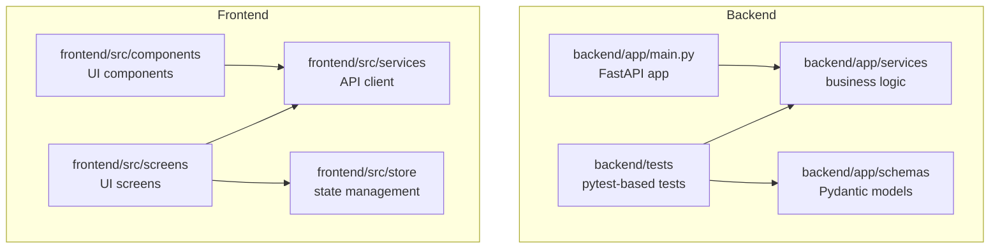
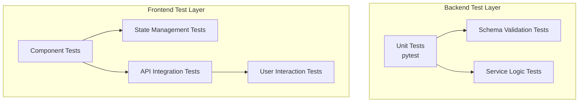
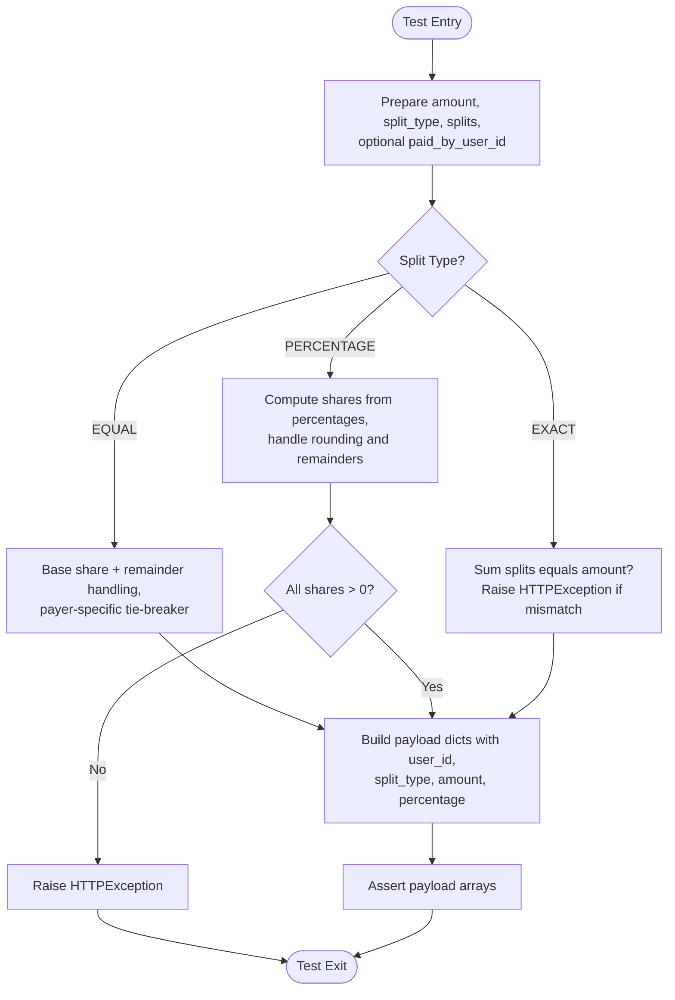
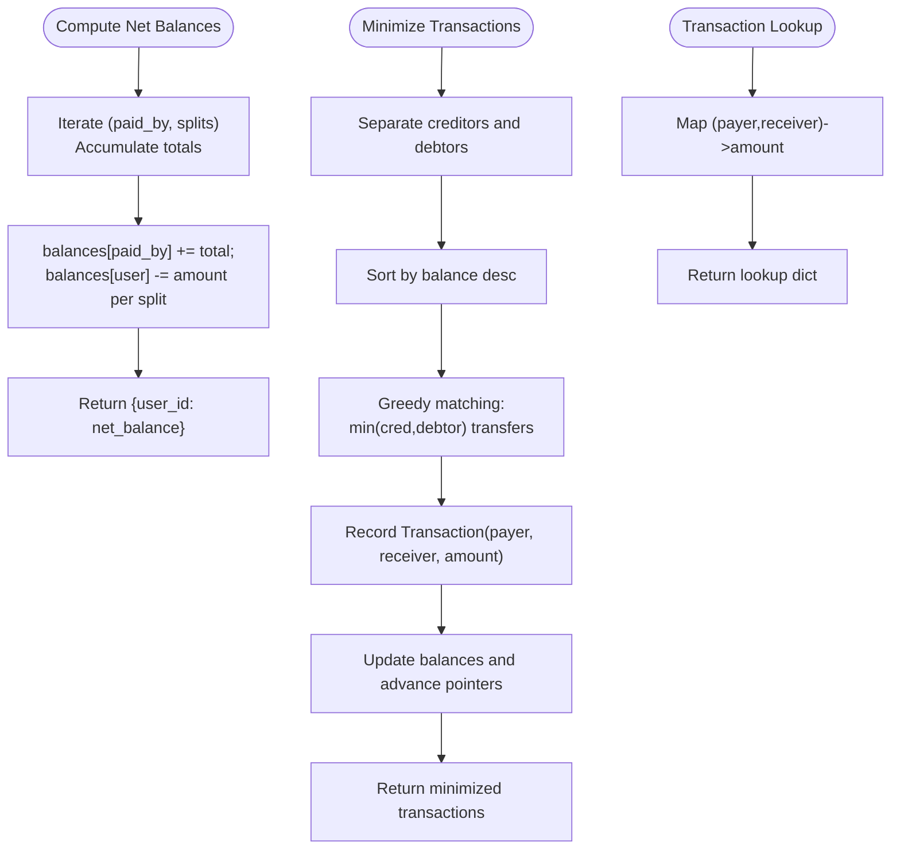
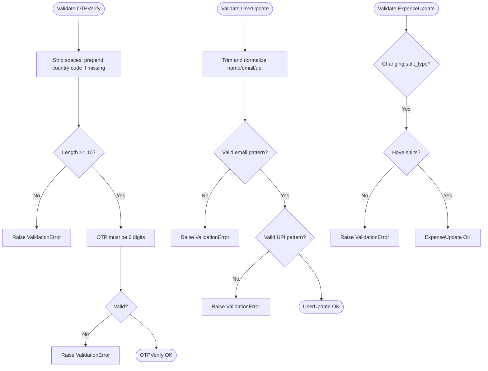
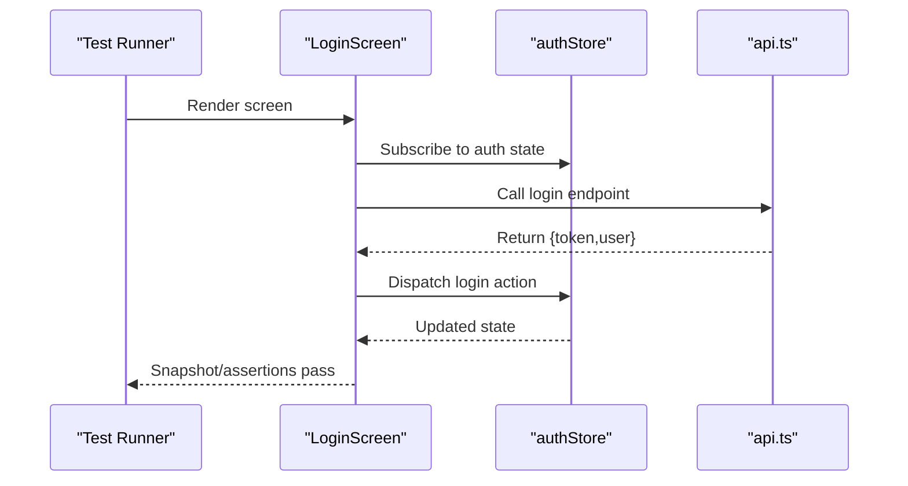
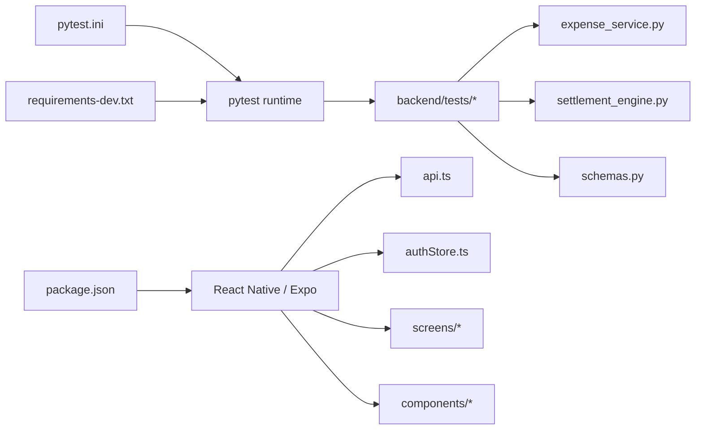

# Testing Strategy

<cite>
**Referenced Files in This Document**
- [pytest.ini](file://backend/pytest.ini)
- [requirements-dev.txt](file://backend/requirements-dev.txt)
- [test_expense_service.py](file://backend/tests/test_expense_service.py)
- [test_settlement_engine.py](file://backend/tests/test_settlement_engine.py)
- [test_schema_validation.py](file://backend/tests/test_schema_validation.py)
- [expense_service.py](file://backend/app/services/expense_service.py)
- [settlement_engine.py](file://backend/app/services/settlement_engine.py)
- [schemas.py](file://backend/app/schemas/schemas.py)
- [package.json](file://frontend/package.json)
- [tsconfig.json](file://frontend/tsconfig.json)
- [api.ts](file://frontend/src/services/api.ts)
- [authStore.ts](file://frontend/src/store/authStore.ts)
- [AddExpenseScreen.tsx](file://frontend/src/screens/AddExpenseScreen.tsx)
- [GroupsScreen.tsx](file://frontend/src/screens/GroupsScreen.tsx)
- [LoginScreen.tsx](file://frontend/src/screens/LoginScreen.tsx)
- [HomeScreen.tsx](file://frontend/src/screens/HomeScreen.tsx)
- [ExpenseDetailScreen.tsx](file://frontend/src/screens/ExpenseDetailScreen.tsx)
- [SettlementsScreen.tsx](file://frontend/src/screens/SettlementsScreen.tsx)
- [chrome.tsx](file://frontend/src/components/chrome.tsx)
- [ui.tsx](file://frontend/src/components/ui.tsx)
- [docker-compose.yml](file://docker-compose.yml)
</cite>

## Table of Contents
1. [Introduction](#introduction)
2. [Project Structure](#project-structure)
3. [Core Components](#core-components)
4. [Architecture Overview](#architecture-overview)
5. [Detailed Component Analysis](#detailed-component-analysis)
6. [Dependency Analysis](#dependency-analysis)
7. [Performance Considerations](#performance-considerations)
8. [Troubleshooting Guide](#troubleshooting-guide)
9. [Conclusion](#conclusion)
10. [Appendices](#appendices)

## Introduction
This document defines a comprehensive testing strategy for the SplitSure application, covering backend unit and integration testing, schema validation testing, and frontend component, state management, API integration, and user interaction testing. It also outlines test automation, CI/CD integration, performance testing, security scanning, coverage metrics, mocking strategies, test data management, debugging/logging/error tracking, type checking, linting, code quality gates, and guidelines for effective test organization and continuous integration workflows.

## Project Structure
The repository is organized into a backend (Python/FastAPI) and a frontend (React Native/Expo). Backend tests reside under backend/tests and use pytest. Frontend dependencies and scripts are defined in frontend/package.json. Type checking is configured via frontend/tsconfig.json.

**Diagram sources**
- [pytest.ini:1-4](file://backend/pytest.ini#L1-L4)
- [requirements-dev.txt:1-3](file://backend/requirements-dev.txt#L1-L3)
- [expense_service.py:1-79](file://backend/app/services/expense_service.py#L1-L79)
- [settlement_engine.py:1-106](file://backend/app/services/settlement_engine.py#L1-L106)
- [schemas.py:1-412](file://backend/app/schemas/schemas.py#L1-L412)
- [api.ts](file://frontend/src/services/api.ts)
- [authStore.ts](file://frontend/src/store/authStore.ts)
- [AddExpenseScreen.tsx](file://frontend/src/screens/AddExpenseScreen.tsx)
- [GroupsScreen.tsx](file://frontend/src/screens/GroupsScreen.tsx)
- [LoginScreen.tsx](file://frontend/src/screens/LoginScreen.tsx)
- [HomeScreen.tsx](file://frontend/src/screens/HomeScreen.tsx)
- [ExpenseDetailScreen.tsx](file://frontend/src/screens/ExpenseDetailScreen.tsx)
- [SettlementsScreen.tsx](file://frontend/src/screens/SettlementsScreen.tsx)
- [chrome.tsx](file://frontend/src/components/chrome.tsx)
- [ui.tsx](file://frontend/src/components/ui.tsx)

**Section sources**
- [pytest.ini:1-4](file://backend/pytest.ini#L1-L4)
- [requirements-dev.txt:1-3](file://backend/requirements-dev.txt#L1-L3)
- [package.json:1-62](file://frontend/package.json#L1-L62)
- [tsconfig.json:1-9](file://frontend/tsconfig.json#L1-L9)

## Core Components
- Backend unit tests:
  - Expense service tests validate split payload construction and user validation logic.
  - Settlement engine tests validate net balance computation, transaction minimization, and lookup consistency.
  - Schema validation tests validate Pydantic model normalization and validation rules.
- Frontend testing components:
  - Screens for user journeys (login, add/edit expense, groups, balances, settlements).
  - Store for state management (authentication state).
  - Services for API integration.
  - UI components for rendering and interaction.

**Section sources**
- [test_expense_service.py:1-65](file://backend/tests/test_expense_service.py#L1-L65)
- [test_settlement_engine.py:1-35](file://backend/tests/test_settlement_engine.py#L1-L35)
- [test_schema_validation.py:1-30](file://backend/tests/test_schema_validation.py#L1-L30)
- [expense_service.py:1-79](file://backend/app/services/expense_service.py#L1-L79)
- [settlement_engine.py:1-106](file://backend/app/services/settlement_engine.py#L1-L106)
- [schemas.py:1-412](file://backend/app/schemas/schemas.py#L1-L412)
- [api.ts](file://frontend/src/services/api.ts)
- [authStore.ts](file://frontend/src/store/authStore.ts)
- [AddExpenseScreen.tsx](file://frontend/src/screens/AddExpenseScreen.tsx)
- [GroupsScreen.tsx](file://frontend/src/screens/GroupsScreen.tsx)
- [LoginScreen.tsx](file://frontend/src/screens/LoginScreen.tsx)
- [HomeScreen.tsx](file://frontend/src/screens/HomeScreen.tsx)
- [ExpenseDetailScreen.tsx](file://frontend/src/screens/ExpenseDetailScreen.tsx)
- [SettlementsScreen.tsx](file://frontend/src/screens/SettlementsScreen.tsx)
- [chrome.tsx](file://frontend/src/components/chrome.tsx)
- [ui.tsx](file://frontend/src/components/ui.tsx)

## Architecture Overview
The testing architecture separates concerns across unit, integration, and end-to-end categories. Backend unit tests exercise pure functions and data models. Frontend tests target UI components, stores, and API integrations. CI/CD can orchestrate backend pytest runs and frontend build/test scripts.

[No sources needed since this diagram shows conceptual workflow, not actual code structure]

## Detailed Component Analysis

### Backend Unit Testing: Expense Service
- Coverage areas:
  - User validation for duplicates and membership checks.
  - Split payload construction for EQUAL, EXACT, and PERCENTAGE modes.
  - Remainder distribution and fallback payer logic.
- Test patterns:
  - Positive assertions for computed payloads.
  - Negative assertions using HTTPException for invalid inputs.
- Implementation references:
  - Validation and payload builders.
  - Test scenarios for remainder distribution and total mismatches.

**Diagram sources**
- [expense_service.py:7-79](file://backend/app/services/expense_service.py#L7-L79)
- [test_expense_service.py:9-65](file://backend/tests/test_expense_service.py#L9-L65)

**Section sources**
- [expense_service.py:1-79](file://backend/app/services/expense_service.py#L1-L79)
- [test_expense_service.py:1-65](file://backend/tests/test_expense_service.py#L1-L65)

### Backend Unit Testing: Settlement Engine
- Coverage areas:
  - Net balance computation from expense records.
  - Transaction minimization using greedy algorithm.
  - Applying confirmed settlements and transaction lookup consistency.
- Test patterns:
  - Deterministic assertions on balance dictionaries and transaction lists.
  - Consistency checks between minimization and lookup outputs.

**Diagram sources**
- [settlement_engine.py:23-97](file://backend/app/services/settlement_engine.py#L23-L97)
- [test_settlement_engine.py:10-35](file://backend/tests/test_settlement_engine.py#L10-L35)

**Section sources**
- [settlement_engine.py:1-106](file://backend/app/services/settlement_engine.py#L1-L106)
- [test_settlement_engine.py:1-35](file://backend/tests/test_settlement_engine.py#L1-L35)

### Backend Unit Testing: Schema Validation
- Coverage areas:
  - Phone normalization and OTP length validation.
  - User update normalization (trimming, lowercasing, UPI ID format).
  - Expense update validation requiring splits when changing split type.
- Test patterns:
  - Positive validations for normalized fields.
  - Negative validations raising Pydantic ValidationError.

**Diagram sources**
- [schemas.py:24-44](file://backend/app/schemas/schemas.py#L24-L44)
- [schemas.py:60-99](file://backend/app/schemas/schemas.py#L60-L99)
- [schemas.py:238-268](file://backend/app/schemas/schemas.py#L238-L268)
- [test_schema_validation.py:7-29](file://backend/tests/test_schema_validation.py#L7-L29)

**Section sources**
- [schemas.py:1-412](file://backend/app/schemas/schemas.py#L1-L412)
- [test_schema_validation.py:1-30](file://backend/tests/test_schema_validation.py#L1-L30)

### Frontend Testing Patterns
- Component testing:
  - UI components (chrome, ui) should be tested for rendering correctness and prop handling.
- State management testing:
  - authStore should be unit-tested for state transitions and derived values.
- API integration testing:
  - api.ts should be tested with mocked HTTP responses to verify request composition and response parsing.
- User interaction testing:
  - Screens (login, add/edit expense, groups, balances, settlements) should be covered by integration tests simulating realistic flows.

[No sources needed since this diagram shows conceptual workflow, not actual code structure]

**Section sources**
- [api.ts](file://frontend/src/services/api.ts)
- [authStore.ts](file://frontend/src/store/authStore.ts)
- [LoginScreen.tsx](file://frontend/src/screens/LoginScreen.tsx)
- [AddExpenseScreen.tsx](file://frontend/src/screens/AddExpenseScreen.tsx)
- [GroupsScreen.tsx](file://frontend/src/screens/GroupsScreen.tsx)
- [HomeScreen.tsx](file://frontend/src/screens/HomeScreen.tsx)
- [ExpenseDetailScreen.tsx](file://frontend/src/screens/ExpenseDetailScreen.tsx)
- [SettlementsScreen.tsx](file://frontend/src/screens/SettlementsScreen.tsx)
- [chrome.tsx](file://frontend/src/components/chrome.tsx)
- [ui.tsx](file://frontend/src/components/ui.tsx)

## Dependency Analysis
- Backend test dependencies:
  - pytest configuration and dev requirements define the test runner and environment.
- Frontend dependencies:
  - React Native, Expo, axios, zustand, and TypeScript form the runtime and testing stack.
- Containerization:
  - docker-compose.yml orchestrates backend and database containers for integration testing.

**Diagram sources**
- [pytest.ini:1-4](file://backend/pytest.ini#L1-L4)
- [requirements-dev.txt:1-3](file://backend/requirements-dev.txt#L1-L3)
- [expense_service.py:1-79](file://backend/app/services/expense_service.py#L1-L79)
- [settlement_engine.py:1-106](file://backend/app/services/settlement_engine.py#L1-L106)
- [schemas.py:1-412](file://backend/app/schemas/schemas.py#L1-L412)
- [package.json:1-62](file://frontend/package.json#L1-L62)
- [api.ts](file://frontend/src/services/api.ts)
- [authStore.ts](file://frontend/src/store/authStore.ts)

**Section sources**
- [pytest.ini:1-4](file://backend/pytest.ini#L1-L4)
- [requirements-dev.txt:1-3](file://backend/requirements-dev.txt#L1-L3)
- [package.json:1-62](file://frontend/package.json#L1-L62)
- [docker-compose.yml](file://docker-compose.yml)

## Performance Considerations
- Backend:
  - Use pytest markers and parametrize tests to cover boundary conditions efficiently.
  - Benchmark heavy computations (e.g., settlement minimization) with pytest-benchmark if integrated.
- Frontend:
  - Prefer snapshot testing and deterministic UI assertions to reduce flakiness.
  - Mock network requests to isolate UI performance from network variability.
- Load and scalability:
  - Compose backend and database containers for integration tests.
  - Simulate concurrent users at the API level to uncover contention and bottlenecks.

[No sources needed since this section provides general guidance]

## Troubleshooting Guide
- Backend:
  - Use pytest’s verbose output and add print statements or logging around failing assertions.
  - Validate database fixtures and transaction rollbacks in integration tests.
- Frontend:
  - Isolate failing tests, mock external services, and verify store state updates.
  - Use React DevTools and Flipper for runtime inspection during test runs.
- Logging and error tracking:
  - Centralize logging in backend services and capture logs in CI artifacts.
  - For frontend, integrate error reporting libraries and capture test failures with screenshots/logs.

**Section sources**
- [pytest.ini:1-4](file://backend/pytest.ini#L1-L4)
- [package.json:1-62](file://frontend/package.json#L1-L62)

## Conclusion
This testing strategy establishes a robust foundation for ensuring correctness, reliability, and maintainability across SplitSure’s backend and frontend. By combining unit tests, schema validation, service logic tests, component/state/API tests, and integration workflows, teams can ship confidently with strong quality gates and observability.

[No sources needed since this section summarizes without analyzing specific files]

## Appendices

### Backend Testing Setup and Execution
- Install development dependencies and run tests:
  - Use the pinned pytest version declared in requirements-dev.txt.
  - Configure pytest discovery via pytest.ini to target backend/tests.
- Test execution:
  - Run pytest to execute all backend unit and validation tests.
  - Add coverage collection and report generation as part of CI.

**Section sources**
- [requirements-dev.txt:1-3](file://backend/requirements-dev.txt#L1-L3)
- [pytest.ini:1-4](file://backend/pytest.ini#L1-L4)

### Frontend Testing Setup and Execution
- Dependencies:
  - TypeScript strict mode enabled via tsconfig.json.
  - React Native/Expo ecosystem supports component and integration testing.
- Scripts:
  - Use npm/yarn scripts to build and run the app; extend with test scripts as needed.

**Section sources**
- [tsconfig.json:1-9](file://frontend/tsconfig.json#L1-L9)
- [package.json:1-62](file://frontend/package.json#L1-L62)

### CI/CD Integration and Automation
- Orchestration:
  - Compose backend and database containers for integration tests.
  - Run backend pytest suite and frontend build/test steps in parallel.
- Quality gates:
  - Enforce type checking (TypeScript), linting, and minimum coverage thresholds before merging.
- Security scanning:
  - Integrate SAST/SBOM scans for backend Python dependencies and frontend NPM packages.

**Section sources**
- [docker-compose.yml](file://docker-compose.yml)
- [requirements-dev.txt:1-3](file://backend/requirements-dev.txt#L1-L3)
- [package.json:1-62](file://frontend/package.json#L1-L62)

### Test Coverage Metrics and Reporting
- Backend:
  - Enable coverage collection with pytest-cov and publish reports to CI artifacts.
- Frontend:
  - Use Jest or React Native testing libraries with coverage reporting.
- Thresholds:
  - Define minimum coverage percentages for critical modules (services, stores, schemas).

[No sources needed since this section provides general guidance]

### Mocking Strategies
- Backend:
  - Mock external services (e.g., payment providers) and database connections in unit tests.
- Frontend:
  - Mock axios adapter and Zustand store selectors for isolated component tests.
  - Use deterministic stubs for date/time-sensitive logic.

[No sources needed since this section provides general guidance]

### Test Data Management
- Backend:
  - Use factories or Pydantic models to construct test data consistently.
  - Manage database fixtures with explicit teardown to keep tests idempotent.
- Frontend:
  - Maintain reusable test datasets for forms, lists, and state transitions.
  - Snapshot test baselines should be reviewed and updated with intentional changes.

[No sources needed since this section provides general guidance]

### Debugging Techniques and Observability
- Backend:
  - Add structured logs around critical paths; capture exceptions and stack traces.
- Frontend:
  - Capture device logs and test artifacts; correlate UI failures with network responses.
- Error tracking:
  - Integrate error reporting libraries in test environments to surface regressions.

[No sources needed since this section provides general guidance]

### Type Checking and Linting
- Backend:
  - Use mypy/linters to enforce type safety and code quality in services and schemas.
- Frontend:
  - Leverage TypeScript strict mode and ESLint/Prettier for consistent code quality.

[No sources needed since this section provides general guidance]

### Guidelines for Writing Effective Tests
- Keep tests focused and deterministic; avoid cross-test dependencies.
- Use descriptive test names and clear assertions.
- Prefer property-based tests for numeric invariants (e.g., totals, balances).
- Maintain a clear separation between unit, integration, and end-to-end tests.

[No sources needed since this section provides general guidance]