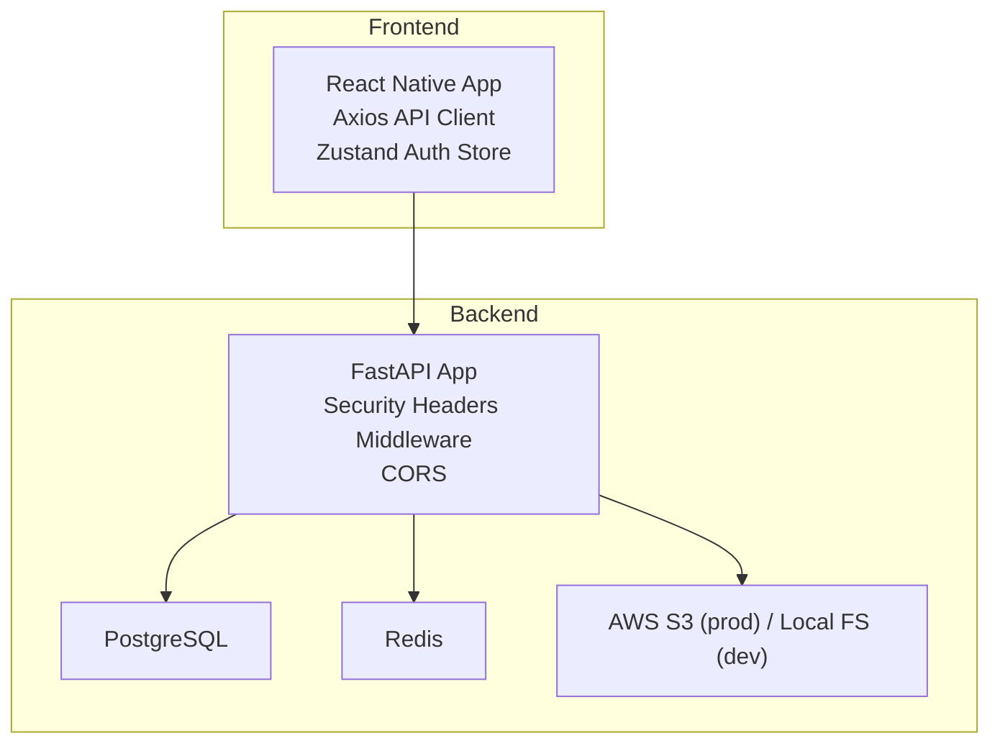
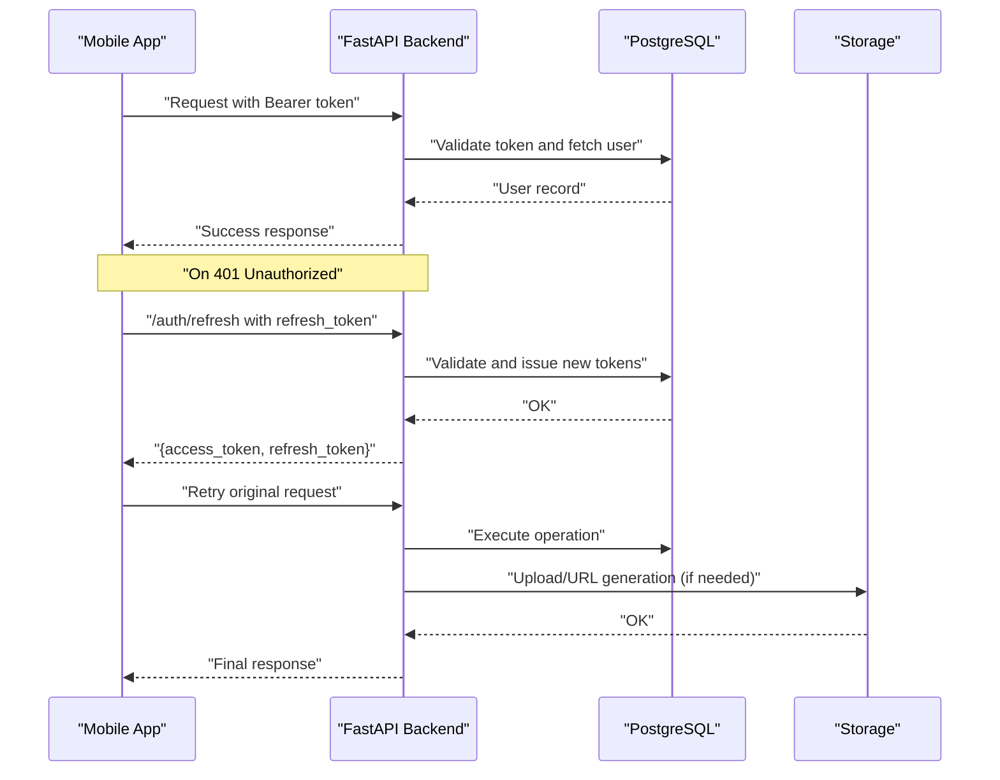
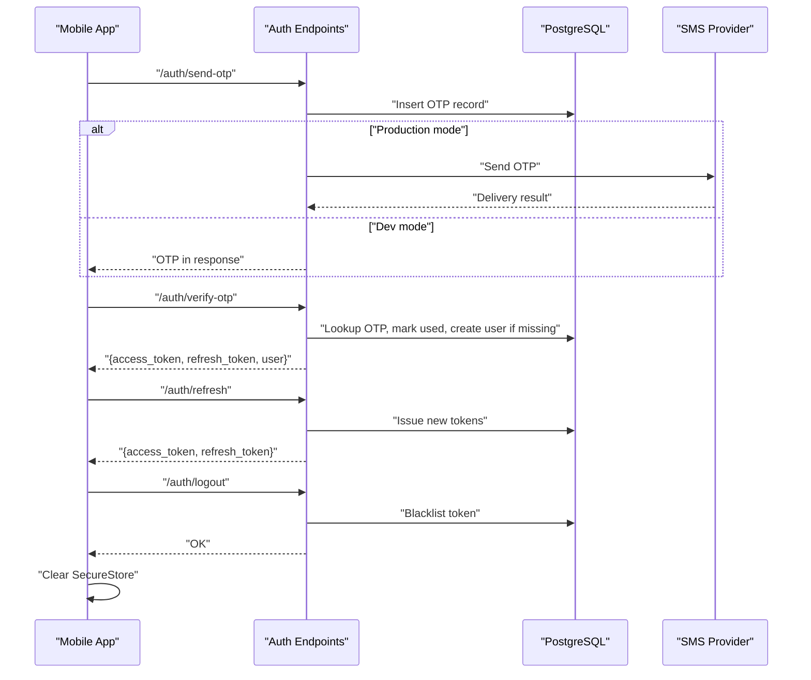
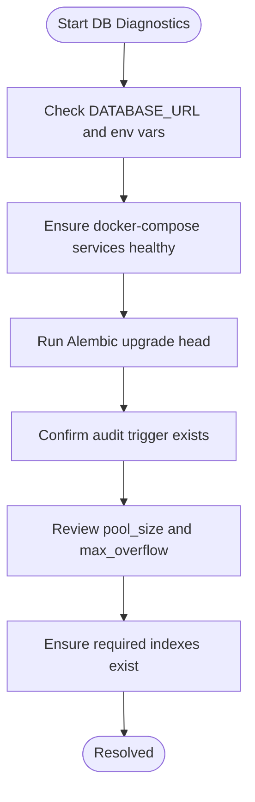
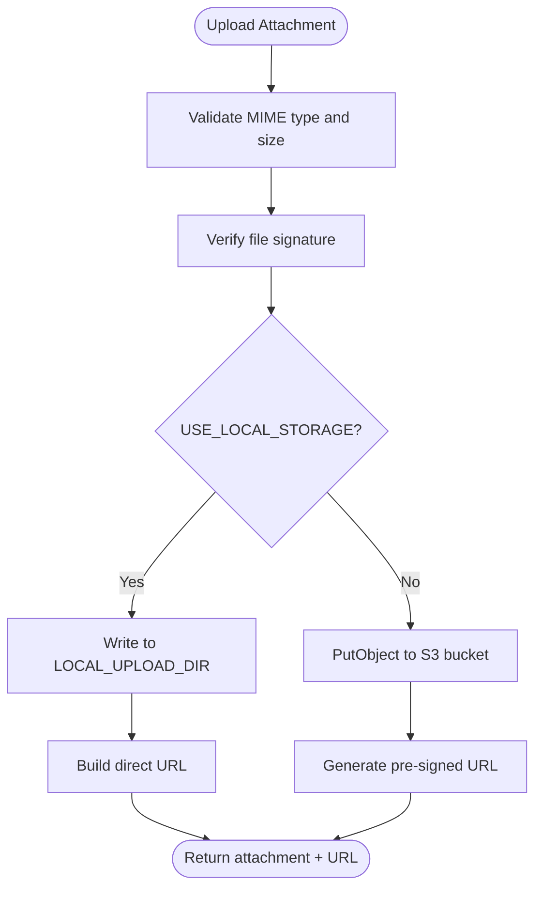
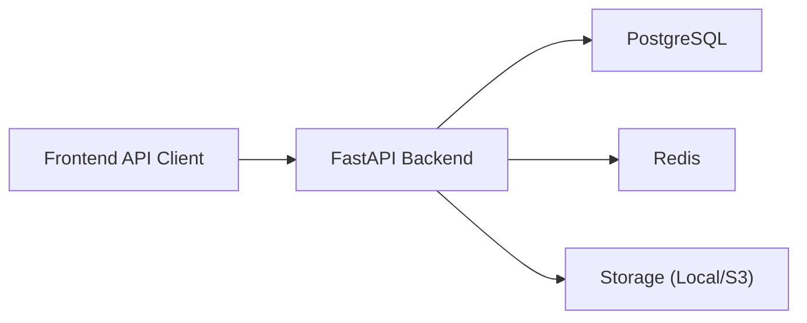

# Troubleshooting and FAQ

<cite>
**Referenced Files in This Document**
- [README.md](file://README.md)
- [docker-compose.yml](file://docker-compose.yml)
- [backend/app/main.py](file://backend/app/main.py)
- [backend/app/core/config.py](file://backend/app/core/config.py)
- [backend/app/core/database.py](file://backend/app/core/database.py)
- [backend/app/core/security.py](file://backend/app/core/security.py)
- [backend/app/api/v1/endpoints/auth.py](file://backend/app/api/v1/endpoints/auth.py)
- [backend/app/api/v1/endpoints/users.py](file://backend/app/api/v1/endpoints/users.py)
- [backend/app/api/v1/endpoints/expenses.py](file://backend/app/api/v1/endpoints/expenses.py)
- [backend/app/services/s3_service.py](file://backend/app/services/s3_service.py)
- [backend/alembic/versions/001_initial.py](file://backend/alembic/versions/001_initial.py)
- [backend/alembic/versions/002_add_push_token.py](file://backend/alembic/versions/002_add_push_token.py)
- [frontend/src/services/api.ts](file://frontend/src/services/api.ts)
- [frontend/src/store/authStore.ts](file://frontend/src/store/authStore.ts)
- [frontend/package.json](file://frontend/package.json)
</cite>

## Table of Contents
1. [Introduction](#introduction)
2. [Project Structure](#project-structure)
3. [Core Components](#core-components)
4. [Architecture Overview](#architecture-overview)
5. [Detailed Component Analysis](#detailed-component-analysis)
6. [Dependency Analysis](#dependency-analysis)
7. [Performance Considerations](#performance-considerations)
8. [Troubleshooting Guide](#troubleshooting-guide)
9. [Conclusion](#conclusion)
10. [Appendices](#appendices)

## Introduction
This document provides comprehensive troubleshooting and FAQ guidance for the SplitSure application. It covers common authentication issues (OTP delivery failures, token expiration, session management), database connectivity and migration problems, file upload/storage/cloud service issues, performance bottlenecks, debugging techniques for backend and frontend, maintenance procedures, and step-by-step resolution guides. The goal is to help both developers and support teams quickly diagnose and resolve incidents with actionable steps.

## Project Structure
SplitSure consists of:
- Backend: FastAPI application with asynchronous SQLAlchemy ORM, Alembic migrations, and modular endpoint packages.
- Frontend: Expo Router-based React Native app with secure token storage, Axios-based API client, and Zustand state management.
- Infrastructure: Docker Compose orchestration for Postgres, Redis, and the API service.

**Diagram sources**
- [docker-compose.yml:1-82](file://docker-compose.yml#L1-L82)
- [backend/app/main.py:1-96](file://backend/app/main.py#L1-L96)
- [backend/app/services/s3_service.py:1-158](file://backend/app/services/s3_service.py#L1-L158)

**Section sources**
- [README.md:1-162](file://README.md#L1-L162)
- [docker-compose.yml:1-82](file://docker-compose.yml#L1-L82)

## Core Components
- Authentication and sessions: OTP generation/verification, JWT access/refresh tokens, token blacklisting, and logout.
- Data persistence: Async SQLAlchemy ORM with PostgreSQL, Alembic migrations, and audit-triggered immutability.
- Storage: Local filesystem in development, S3 in production, with pre-signed URL generation.
- Frontend API client: Axios interceptors for token injection and automatic refresh, plus Android emulator network normalization.

**Section sources**
- [backend/app/api/v1/endpoints/auth.py:1-147](file://backend/app/api/v1/endpoints/auth.py#L1-L147)
- [backend/app/core/security.py:1-96](file://backend/app/core/security.py#L1-L96)
- [backend/app/core/database.py:1-29](file://backend/app/core/database.py#L1-L29)
- [backend/app/services/s3_service.py:1-158](file://backend/app/services/s3_service.py#L1-L158)
- [frontend/src/services/api.ts:1-269](file://frontend/src/services/api.ts#L1-L269)
- [frontend/src/store/authStore.ts:1-116](file://frontend/src/store/authStore.ts#L1-L116)

## Architecture Overview
High-level runtime flow:
- Frontend sends requests with Authorization header containing access token.
- On 401 Unauthorized, the client attempts a refresh using the stored refresh token.
- On success, the client retries the original request; otherwise, it clears session state.
- Backend validates tokens, enforces membership for group-scoped endpoints, and performs domain operations (expenses, settlements, audit).

**Diagram sources**
- [frontend/src/services/api.ts:76-140](file://frontend/src/services/api.ts#L76-L140)
- [backend/app/api/v1/endpoints/auth.py:118-136](file://backend/app/api/v1/endpoints/auth.py#L118-L136)
- [backend/app/core/security.py:72-96](file://backend/app/core/security.py#L72-L96)
- [backend/app/services/s3_service.py:105-147](file://backend/app/services/s3_service.py#L105-L147)

## Detailed Component Analysis

### Authentication and Session Management
Common issues:
- OTP delivery failures (SMS provider).
- OTP rate limiting exceeded.
- Expired or invalid tokens.
- Logout not clearing session state.

Resolution steps:
- Verify OTP provider credentials and environment variables.
- Confirm rate-limit configuration and recent usage.
- Check token expiry and blacklisting logic.
- Ensure logout invokes token blacklisting and client-side session cleanup.

**Diagram sources**
- [backend/app/api/v1/endpoints/auth.py:58-147](file://backend/app/api/v1/endpoints/auth.py#L58-L147)
- [backend/app/core/security.py:47-96](file://backend/app/core/security.py#L47-L96)
- [frontend/src/services/api.ts:143-169](file://frontend/src/services/api.ts#L143-L169)
- [frontend/src/store/authStore.ts:49-60](file://frontend/src/store/authStore.ts#L49-L60)

**Section sources**
- [backend/app/api/v1/endpoints/auth.py:1-147](file://backend/app/api/v1/endpoints/auth.py#L1-L147)
- [backend/app/core/security.py:1-96](file://backend/app/core/security.py#L1-L96)
- [frontend/src/services/api.ts:143-169](file://frontend/src/services/api.ts#L143-L169)
- [frontend/src/store/authStore.ts:1-116](file://frontend/src/store/authStore.ts#L1-L116)

### Database Connectivity, Migrations, and Data Access
Common issues:
- Connection refused or invalid credentials.
- Alembic upgrade/downgrade failures.
- Audit log immutability violations.
- Slow queries or deadlocks.

Resolution steps:
- Validate DATABASE_URL and container health checks.
- Run migrations inside the API container.
- Review audit trigger behavior and avoid mutating audit_logs.
- Use connection pooling and appropriate indexes.

**Diagram sources**
- [backend/app/core/database.py:5-16](file://backend/app/core/database.py#L5-L16)
- [backend/app/main.py:68-86](file://backend/app/main.py#L68-L86)
- [backend/alembic/versions/001_initial.py:156-169](file://backend/alembic/versions/001_initial.py#L156-L169)
- [docker-compose.yml:14-18](file://docker-compose.yml#L14-L18)

**Section sources**
- [backend/app/core/database.py:1-29](file://backend/app/core/database.py#L1-L29)
- [backend/app/main.py:68-86](file://backend/app/main.py#L68-L86)
- [backend/alembic/versions/001_initial.py:1-185](file://backend/alembic/versions/001_initial.py#L1-L185)
- [backend/alembic/versions/002_add_push_token.py:1-23](file://backend/alembic/versions/002_add_push_token.py#L1-L23)
- [docker-compose.yml:1-82](file://docker-compose.yml#L1-L82)

### File Uploads, Storage, and Cloud Connectivity
Common issues:
- Unsupported file type or size mismatch.
- MIME signature mismatch after upload.
- Local storage permission or path issues.
- S3 upload failures or pre-signed URL generation errors.

Resolution steps:
- Confirm allowed MIME types and file size limits.
- Validate file signatures against declared content type.
- Ensure local upload directory exists and is writable.
- Verify S3 credentials and bucket permissions.

**Diagram sources**
- [backend/app/services/s3_service.py:105-147](file://backend/app/services/s3_service.py#L105-L147)
- [backend/app/api/v1/endpoints/expenses.py:352-395](file://backend/app/api/v1/endpoints/expenses.py#L352-L395)

**Section sources**
- [backend/app/services/s3_service.py:1-158](file://backend/app/services/s3_service.py#L1-L158)
- [backend/app/api/v1/endpoints/expenses.py:352-395](file://backend/app/api/v1/endpoints/expenses.py#L352-L395)

### Frontend API Client and State Management
Common issues:
- Network errors and transient failures.
- 401 Unauthorized without automatic refresh.
- Android emulator cannot reach localhost.
- Push notifications not registering.

Resolution steps:
- Use Axios interceptors for token injection and refresh.
- Normalize base URL for Android emulator.
- Ensure auth failure handler clears session.
- Handle push token registration gracefully.

**Section sources**
- [frontend/src/services/api.ts:1-269](file://frontend/src/services/api.ts#L1-L269)
- [frontend/src/store/authStore.ts:1-116](file://frontend/src/store/authStore.ts#L1-L116)

## Dependency Analysis
- Backend depends on PostgreSQL for persistence, Redis for token blacklist/caching, and optional S3 for storage.
- Frontend depends on Axios for HTTP, Expo Secure Store for tokens, and Expo Notifications for push tokens.

**Diagram sources**
- [docker-compose.yml:1-82](file://docker-compose.yml#L1-L82)
- [backend/app/main.py:1-96](file://backend/app/main.py#L1-L96)
- [backend/app/services/s3_service.py:1-158](file://backend/app/services/s3_service.py#L1-L158)

**Section sources**
- [docker-compose.yml:1-82](file://docker-compose.yml#L1-L82)
- [frontend/package.json:1-62](file://frontend/package.json#L1-L62)

## Performance Considerations
- Backend:
  - Connection pooling: tune pool_size and max_overflow for workload.
  - Queries: use selectinload for related entities to reduce N+1 queries.
  - Caching: leverage Redis for token blacklist and short-lived caches.
- Frontend:
  - Debounce network calls and batch updates.
  - Avoid unnecessary re-renders; use stable selectors with Zustand.
  - Minimize large file uploads; compress images where possible.

[No sources needed since this section provides general guidance]

## Troubleshooting Guide

### Authentication and Session Issues
- Symptom: OTP not received.
  - Steps:
    - Confirm USE_DEV_OTP vs production provider.
    - Verify MSG91 credentials and template ID.
    - Check rate limit and OTP expiry settings.
  - Related code paths:
    - [backend/app/api/v1/endpoints/auth.py:58-80](file://backend/app/api/v1/endpoints/auth.py#L58-L80)
    - [backend/app/core/config.py:30-37](file://backend/app/core/config.py#L30-L37)

- Symptom: 401 Unauthorized repeatedly.
  - Steps:
    - Confirm refresh token availability and validity.
    - Inspect token type and blacklist status.
    - Ensure auth failure handler clears session.
  - Related code paths:
    - [frontend/src/services/api.ts:85-140](file://frontend/src/services/api.ts#L85-L140)
    - [backend/app/core/security.py:72-96](file://backend/app/core/security.py#L72-L96)
    - [frontend/src/store/authStore.ts:113-115](file://frontend/src/store/authStore.ts#L113-L115)

- Symptom: Logout does not clear session.
  - Steps:
    - Verify logout endpoint and blacklist invocation.
    - Ensure client deletes tokens from SecureStore.
  - Related code paths:
    - [backend/app/api/v1/endpoints/auth.py:139-147](file://backend/app/api/v1/endpoints/auth.py#L139-L147)
    - [frontend/src/store/authStore.ts:49-60](file://frontend/src/store/authStore.ts#L49-L60)

### Database Connectivity and Migration Failures
- Symptom: Cannot connect to database.
  - Steps:
    - Check DATABASE_URL and container health.
    - Confirm Postgres service is healthy.
  - Related code paths:
    - [backend/app/core/database.py:5-10](file://backend/app/core/database.py#L5-L10)
    - [docker-compose.yml:14-18](file://docker-compose.yml#L14-L18)

- Symptom: Alembic upgrade fails.
  - Steps:
    - Enter the API container and run upgrade head.
    - Review migration scripts for correctness.
  - Related code paths:
    - [backend/alembic/versions/001_initial.py:1-185](file://backend/alembic/versions/001_initial.py#L1-L185)
    - [backend/alembic/versions/002_add_push_token.py:1-23](file://backend/alembic/versions/002_add_push_token.py#L1-L23)

- Symptom: Mutating audit logs fails.
  - Steps:
    - Understand the immutable trigger behavior.
    - Do not attempt to update or delete audit_logs.
  - Related code paths:
    - [backend/app/main.py:68-86](file://backend/app/main.py#L68-L86)
    - [backend/alembic/versions/001_initial.py:156-169](file://backend/alembic/versions/001_initial.py#L156-L169)

### File Upload and Storage Problems
- Symptom: Unsupported file type or size.
  - Steps:
    - Confirm allowed MIME types and size limits.
    - Validate file signature detection.
  - Related code paths:
    - [backend/app/services/s3_service.py:105-136](file://backend/app/services/s3_service.py#L105-L136)

- Symptom: Local storage write fails.
  - Steps:
    - Ensure LOCAL_UPLOAD_DIR exists and is writable.
    - Confirm mounted volume persists across restarts.
  - Related code paths:
    - [backend/app/services/s3_service.py:38-41](file://backend/app/services/s3_service.py#L38-L41)
    - [docker-compose.yml:74-77](file://docker-compose.yml#L74-L77)

- Symptom: S3 upload fails.
  - Steps:
    - Verify AWS credentials and bucket permissions.
    - Check S3_PRESIGNED_URL_EXPIRY and region.
  - Related code paths:
    - [backend/app/services/s3_service.py:76-88](file://backend/app/services/s3_service.py#L76-L88)
    - [backend/app/core/config.py:23-28](file://backend/app/core/config.py#L23-L28)

### Frontend Network and UX Issues
- Symptom: Cannot reach backend on Android emulator.
  - Steps:
    - Normalize base URL to replace localhost with 10.0.2.2.
  - Related code paths:
    - [frontend/src/services/api.ts:29-36](file://frontend/src/services/api.ts#L29-L36)

- Symptom: Transient network errors during auth.
  - Steps:
    - Retry with healthcheck and ensure backend awake.
  - Related code paths:
    - [frontend/src/services/api.ts:60-74](file://frontend/src/services/api.ts#L60-L74)
    - [frontend/src/services/api.ts:144-165](file://frontend/src/services/api.ts#L144-L165)

- Symptom: Push notifications not registering.
  - Steps:
    - Check permissions and token availability.
    - Ensure non-fatal failures do not block UX.
  - Related code paths:
    - [frontend/src/store/authStore.ts:87-110](file://frontend/src/store/authStore.ts#L87-L110)

### Debugging Techniques
- Backend:
  - Enable logging and review startup warnings.
  - Use health endpoint to verify service status.
  - Inspect security headers and CORS configuration.
- Frontend:
  - Log Axios request/response errors.
  - Inspect SecureStore for tokens.
  - Monitor network tab for timeouts and retries.

**Section sources**
- [backend/app/main.py:59-96](file://backend/app/main.py#L59-L96)
- [frontend/src/services/api.ts:1-269](file://frontend/src/services/api.ts#L1-L269)
- [frontend/src/store/authStore.ts:1-116](file://frontend/src/store/authStore.ts#L1-L116)

### Maintenance Procedures
- Database maintenance:
  - Regularly back up Postgres data volume.
  - Keep migrations minimal and reversible.
- Backup and recovery:
  - Persist uploads volume for local storage.
  - For S3, rely on object retention policies.
- Security updates:
  - Rotate SECRET_KEY and disable dev OTP in production.
  - Use HTTPS and strict transport security headers.
- Performance monitoring:
  - Observe API latency and error rates.
  - Tune connection pool and Redis cache.

**Section sources**
- [README.md:144-153](file://README.md#L144-L153)
- [docker-compose.yml:74-82](file://docker-compose.yml#L74-L82)
- [backend/app/main.py:25-34](file://backend/app/main.py#L25-L34)

### Step-by-Step Troubleshooting Guides

- OTP Delivery Failure (Production)
  1. Confirm provider credentials and template ID.
  2. Check rate limit and OTP expiry settings.
  3. Validate SMS provider response logs.
  4. Optionally switch to dev OTP for testing.
  - Related code paths:
    - [backend/app/api/v1/endpoints/auth.py:39-56](file://backend/app/api/v1/endpoints/auth.py#L39-L56)
    - [backend/app/core/config.py:30-37](file://backend/app/core/config.py#L30-L37)

- Token Expiration or Blacklist Issue
  1. Verify access token type and expiry.
  2. Check blacklist entries and cleanup logic.
  3. Attempt refresh; if it fails, clear session.
  4. Ensure logout invokes blacklist and client cleanup.
  - Related code paths:
    - [backend/app/core/security.py:33-96](file://backend/app/core/security.py#L33-L96)
    - [frontend/src/services/api.ts:85-140](file://frontend/src/services/api.ts#L85-L140)
    - [frontend/src/store/authStore.ts:113-115](file://frontend/src/store/authStore.ts#L113-L115)

- Database Connection Failure
  1. Verify DATABASE_URL and environment variables.
  2. Confirm Postgres health and container logs.
  3. Run Alembic upgrade inside the API container.
  - Related code paths:
    - [backend/app/core/database.py:5-10](file://backend/app/core/database.py#L5-L10)
    - [docker-compose.yml:14-18](file://docker-compose.yml#L14-L18)

- Migration Failure
  1. Enter API container and run Alembic upgrade head.
  2. Review migration script logs for errors.
  3. Downgrade and re-apply if necessary.
  - Related code paths:
    - [backend/alembic/versions/001_initial.py:1-185](file://backend/alembic/versions/001_initial.py#L1-L185)
    - [backend/alembic/versions/002_add_push_token.py:1-23](file://backend/alembic/versions/002_add_push_token.py#L1-L23)

- Audit Log Mutation Error
  1. Do not attempt to update or delete audit_logs.
  2. Use the immutable trigger behavior to your advantage.
  - Related code paths:
    - [backend/app/main.py:68-86](file://backend/app/main.py#L68-L86)
    - [backend/alembic/versions/001_initial.py:156-169](file://backend/alembic/versions/001_initial.py#L156-L169)

- File Upload Failure
  1. Check allowed MIME types and size limits.
  2. Validate file signature detection.
  3. For local storage, ensure directory exists and is writable.
  4. For S3, verify credentials and bucket permissions.
  - Related code paths:
    - [backend/app/services/s3_service.py:105-147](file://backend/app/services/s3_service.py#L105-L147)

- Frontend Cannot Reach Backend (Android)
  1. Normalize base URL to replace localhost with 10.0.2.2.
  2. Confirm API is reachable from device/emulator.
  - Related code paths:
    - [frontend/src/services/api.ts:29-36](file://frontend/src/services/api.ts#L29-L36)

### Escalation Procedures and Support Resources
- Escalation:
  - Collect backend logs, database health status, and migration logs.
  - Capture frontend Axios error traces and token state.
- Support resources:
  - Use health endpoint for quick status checks.
  - Review environment variable configurations for correctness.

**Section sources**
- [backend/app/main.py:88-96](file://backend/app/main.py#L88-L96)
- [README.md:40-45](file://README.md#L40-L45)

## Conclusion
This guide consolidates practical troubleshooting steps for SplitSure across authentication, database, storage, and frontend concerns. By following the diagnostics and resolutions outlined here, teams can efficiently isolate issues, apply targeted fixes, and maintain a robust platform.

[No sources needed since this section summarizes without analyzing specific files]

## Appendices

### Frequently Asked Questions (FAQ)
- How do I switch from dev OTP to a real SMS provider?
  - Set USE_DEV_OTP to false and configure provider credentials.
  - Related code paths:
    - [backend/app/core/config.py:30-37](file://backend/app/core/config.py#L30-L37)
    - [backend/app/api/v1/endpoints/auth.py:70-79](file://backend/app/api/v1/endpoints/auth.py#L70-L79)

- Why am I seeing audit log mutation errors?
  - The audit_logs table is append-only by design.
  - Related code paths:
    - [backend/app/main.py:68-86](file://backend/app/main.py#L68-L86)
    - [backend/alembic/versions/001_initial.py:156-169](file://backend/alembic/versions/001_initial.py#L156-L169)

- How do I enable S3 in production?
  - Disable local storage and provide AWS credentials.
  - Related code paths:
    - [backend/app/core/config.py:16-28](file://backend/app/core/config.py#L16-L28)
    - [backend/app/services/s3_service.py:66-101](file://backend/app/services/s3_service.py#L66-L101)

- How do I reset my development environment?
  - Recreate containers and re-run migrations.
  - Related code paths:
    - [README.md:32-38](file://README.md#L32-L38)
    - [docker-compose.yml:1-82](file://docker-compose.yml#L1-L82)

- How do I increase file upload limits?
  - Adjust MAX_FILE_SIZE_MB and related limits.
  - Related code paths:
    - [backend/app/core/config.py:46-51](file://backend/app/core/config.py#L46-L51)
    - [backend/app/services/s3_service.py:20-21](file://backend/app/services/s3_service.py#L20-L21)